## 讲解

### 是什么

块状固体通常用镊子，粉末通常用药匙或纸槽；不得用手接触实验试剂。未指定用量时按本书最少量原则，具体实验优先遵照规定。剩余试剂进入指定容器，避免污染原瓶。

### 怎么来的

块状固体直接从竖直试管口落下会撞击底部，所以先横放再慢慢竖立使其沿壁滑下；粉末易黏在上部管壁，所以用纸槽或药匙送近底部再落下。不同步骤是在解决不同形态带来的问题。

### 什么时候能用

动作要轻，工具要符合试剂性质；腐蚀性、易潮解固体称量要选适当玻璃器皿，不能把一般试剂垫纸规则无条件套上。

## 例题

### 原固体试剂取用步骤

> 来源ID Q01-22；第一单元走进化学世界；1-50/full.md 第851–887行。原答案与解析定位：1-50/full.md 第853–887行。

# (1) 固体试剂的取用

# ①块状试剂的取用

一横  

二放  
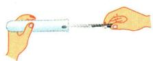

三慢竖  
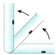

把试管横放 $\rightarrow$

用镊子把块状试剂放在试管口

慢慢把试管竖立起来，使块状试剂缓缓地沿试管壁滑到底部(防止打破试管)

# ②粉末状试剂的取用

一横  
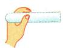

二送  
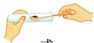

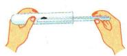

三竖立  
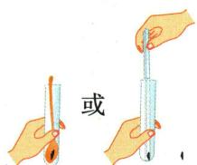

把试管横放 $\rightarrow$ 用药匙(或纸槽)将试剂
小心地送至试管底部(防
止试剂沾在试管壁上)
竖立试管，使试剂
全部落入试管底部

**原资料答案与解析：**

原说明：块状固体缓缓沿试管壁滑到底部，防止打破试管；粉末送至试管底部，防止试剂沾在试管壁上。

**展开解析（依据原详解补足理由与步骤）：**

本组保留原操作示例，不改造成新题。块状固体用镊子，试管先横放，放到口部，再慢慢竖起，使块状固体沿壁滑下，减小撞击管底的风险。粉末用药匙或纸槽，先横放，把粉末送近底部，再竖起，减少粉末留在上部管壁。两者共用“先横放”，但块状强调缓慢滑入，粉末强调送近底部；不能拿“一横二放三竖”替代各步原因。

### 配制NaOH溶液的称量图

> 来源ID Q01-18；第一单元走进化学世界；1-50/full.md 第1124–1136行。原答案与解析定位：1-50/full.md 第1160–1162行。

例5 (2024 江苏宿迁中考)下列配制 100 g 溶质质量分数为 10% 的氢氧化钠溶液的系列操作中, 错误的是 ( )

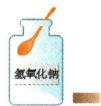  
A. 取用药品

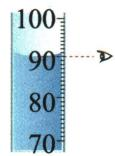  
B.读取水量

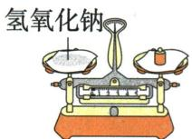  
C.称取药品

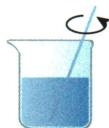  
D. 加速溶解

**原资料答案与解析：**

例5 解析 A(√) 氢氧化钠是固体试剂, 用药匙取用且瓶塞倒放; B(√) 用量筒量取液体, 读数时视线应与液体凹液面的最低处保持水平; C(×) 氢氧化钠固体易潮解, 具有腐蚀性, 应放在玻璃器皿中称量; D(√) 用玻璃棒搅拌可加速溶解。

答案 C

**展开解析（依据原详解补足理由与步骤）：**

A药匙取固体且瓶塞倒放，正确。B量筒平放、平视凹液面最低处，正确。C原图把氢氧化钠固体放在纸上称量，因它易潮解且有腐蚀性，应放入适宜玻璃器皿中称量，错误。D玻璃棒搅拌帮助溶解，正确。本题选错误项，故C。这里原条件100g、10%保留，用来解释器皿选取；未把它改造成新配液计算题。

### 附录示意-取用固体试剂

> 来源ID Q17-03；附录常见实验仪器及实验操作；1-50/full.md 第365–365行。原答案与解析定位：1-50/full.md 第365–365行。

原附录操作名称：取用固体试剂。

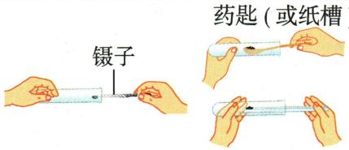

这是一幅原操作示意，不是独立考试题。

**原资料答案与解析：**

原附录仅列操作名称和示意图，没有独立答案或文字详解。下方步骤与理由由学科规范补写；不为原图编制选项或改成新题。

**展开解析（依据原详解补足理由与步骤）：**

原图块状用镊子送入横放试管口再慢慢竖起，使块滑到底，防直接坠落砸裂；粉末用药匙或纸槽送近底部，避免粘壁。不是因同为固体便用同取法。取多余试剂不倒回原瓶，按教师要求处置。

## 易错

- 块状固体直接丢入：易撞破试管底。
- 氢氧化钠放纸上称量：原题图对应器皿选择错误。
