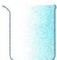
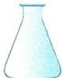
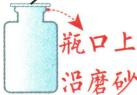
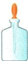
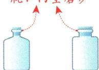
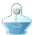
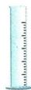
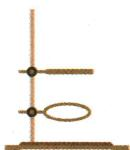
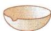

## 讲解

### 是什么

反应容器、量具、滴加工具、夹持工具的作用不同。试管用于少量反应可直接加热；烧杯、锥形瓶通常垫陶土网加热；量筒、集气瓶和试剂瓶不能当加热容器。玻璃棒可搅拌、引流、转移或蘸液。

### 怎么来的

用途决定结构要求：量具需要适合读刻度，反应容器需要适合反应条件，夹持工具需稳定保护玻璃。较大平底容器垫网让受热均匀，热玻璃骤冷则因不同部位温差易破裂。不能看到都由玻璃制成就互相替代。

### 什么时候能用

体积限制依仪器及操作：试管加热液体不超过约1/3，原烧杯约1/2，蒸发皿约2/3。此为本书实验模型，真实使用还看仪器说明和具体任务。胶头滴管配套滴瓶与通用滴管的清洗要求不同。

## 例题

### 原常用仪器用途与加热边界

> 来源ID Q01-24；第一单元走进化学世界；1-50/full.md 第764–766；798–798行。原答案与解析定位：1-50/full.md 第798–798行。

# 2. 常用仪器的主要用途及注意事项

| 常用仪器 | 主要用途 | 注意事项 |
| --- | --- | --- |
| 试管 | 1用作少量试剂的反应容器2制取或收集少量气体3溶解少量物质或配制少量溶液 | 1夹持试管时,用试管夹夹在距试管口1/4~1/3处(也可说夹在试管中上部)2加热前试管外壁要擦干,先预热后固定加热,不要碰触酒精灯的灯芯3加热时,液体体积不超过试管容积的1/3,试管口不要对着自己或他人4加热后不能骤冷,防止炸裂 |

| 常用仪器 | 主要用途 | 注意事项 |
| --- | --- | --- |
| 烧杯 | 1配制溶液2作较大量试剂的反应容器 | 1加热前应擦干烧杯外壁并垫陶土网,使其受热均匀2用玻璃棒搅拌时玻璃棒不能接触器壁和杯底3加热时烧杯内液体的体积不能超过烧杯容积的 $1/2$ |
| 锥形瓶 | 用作较大量试剂的反应容器 | 加热时垫陶土网,以防受热不均而炸裂 |
| 毛玻璃片集气瓶4 | 1收集或储存少量气体2用作有关气体反应的容器 | 1不允许加热,防止受热破裂2进行物质和气体的放热反应实验时,集气瓶内要放入少量水或细沙,以防炸裂 |
| 胶头滴管滴瓶 | 胶头滴管用于吸取和滴加少量液体滴瓶用于储存和取用液体试剂 | 1取液时,先将胶头滴管中的空气挤出2滴加液体时,胶头滴管应竖直悬空于容器口的正上方,不要伸入容器内或接触容器壁3不要将液体吸入胶帽内,取液后不要把滴管放在实验台上,且滴管不能平放或倒置,应保持橡胶帽在上4胶头滴管使用后立即用清水洗净,但滴瓶上的滴管与滴瓶配套使用,该滴管用完不要用水清洗 |
| 瓶口内壁磨砂细口瓶 广口瓶 | 细口瓶贮存液体试剂,广口瓶贮存固体试剂 | 1不能加热2见光易分解的试剂放在棕色瓶中3细口瓶盛放碱性溶液时不宜用玻璃塞,应使用橡胶塞,以免瓶塞跟瓶体黏在一起 |
| 酒精灯 | 加热5 | 详见P11酒精灯的使用 |
| 量筒 | 量取一定体积的液体或间接测量气体的体积 | 1不可加热或量取热溶液,不可用于配制溶液、稀释试剂或作反应容器2量筒没有零刻度线,其刻度值由下而上依次增大, $10\ mL$ 量筒能精确到 $0.1\ mL$ 3通常情况下,所选量筒量程应等于或略大于所需液体体积4读数时,量筒必须放平,视线应与量筒内液体凹液面的最低处保持水平 |
| 铁架台(带铁夹、铁圈) | 固定和夹持各种仪器 | 1铁圈、铁夹方向应与铁架台底盘同侧2铁夹夹在试管中上部3夹持玻璃仪器时,勿过松或过紧,应恰好使玻璃仪器不能移动,以防仪器脱落或被夹碎 |
| 试管夹 | 夹持试管 | 1从试管底部套上、取下,夹在距试管口1/4~1/3处实验操作易错点2使用时,手握试管夹长柄,拇指不能按在短柄上 |
| 玻璃棒 | 搅拌、引流、转移、蘸取液体 | 1搅拌时切勿撞击器壁,以免碰破容器2注意随时洗涤、擦净3过滤时,使液体沿玻璃棒流下,防止液体洒出或溅出 |
| 蒸发皿6 | 用于少量溶液的蒸发、浓缩或结晶 | 1加热后不能骤冷,以防炸裂2取放蒸发皿时要用坩埚钳夹取,蒸发皿一般与带铁圈的铁架台配套使用3蒸发皿中的液体不能超过其容积的2/3,加热时要用玻璃棒不断搅拌4热的蒸发皿不能直接放在实验台上,要垫上陶土网 |

**原资料答案与解析：**

原表明确：试管液体不超过容积1/3；烧杯加热液体不超过容积1/2并垫陶土网；蒸发皿液体不超过容积2/3；量筒不能加热，也不能作反应容器；胶头滴管应竖直悬空、不要触壁。

**展开解析（依据原详解补足理由与步骤）：**

本组为原仪器对照资料。先按目的区分容器、量具、加液和夹持工具，再看能否受热：试管可直接加热但要先均匀预热；烧杯、锥形瓶需要陶土网使受热均匀；量筒、试剂瓶、集气瓶不能充当加热容器。玻璃棒可搅拌、引流、转移或蘸液，功能由具体操作决定。量筒粗测体积不负责反应与配液；蒸发皿适合蒸发浓缩，热时使用坩埚钳。各体积分数限制来自不同仪器的使用条件，不能把试管三分之一、烧杯二分之一、蒸发皿三分之二互换。

### 附录九类常见实验仪器

> 来源ID Q17-01；附录常见实验仪器及实验操作；1-50/full.md 第332–359行。原答案与解析定位：1-50/full.md 第332–359行。

# 一、常见实验仪器

1 可直接加热的反应容器  

2 可间接加热的反应容器  

3 存放试剂的仪器  

4 取用仪器  

5 计量仪器  

6 夹持固定仪器  

7) 加热仪器  

8 分离仪器  

9 其他仪器  

**原资料答案与解析：**

原资料以分类名称和仪器图示呈现，没有独立题目、文字答案或详解；图名和分类按原图保留，下面的用途解释为学科规范补写。

**展开解析（依据原详解补足理由与步骤）：**

原图名称与用途类别：直接加热图有试管、燃烧匙、坩埚；间接加热图有烧杯、烧瓶、锥形瓶，按合适均匀加热条件用。存放类区分广口瓶存常见固体、细口瓶存常见液体、滴瓶小量滴加、集气瓶集气；取用类药匙取粉末、镊子夹块、滴管取少液。量筒量体积、天平称质量、温度计测温度，不能互代。夹持类按大小温度选试管夹、铁架台、坩埚钳；酒精灯/酒精喷灯热源条件不同。普通漏斗过滤、分液漏斗在题给用途下分液或控制滴加，蒸发皿蒸发、研钵研碎。图中陶瓷坩埚能直接加热，但适用温度和物质相容性仍按器材规定；不能把所有同名容器都当同材质耐热。此组是原附录分类示意，书中无独立题干或答案。

## 易错

- 烧杯有刻度就替代量筒精确量取：粗略刻度不满足相同精度。
- 所有玻璃容器都加热：量筒等不合用途。
