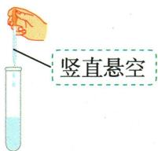
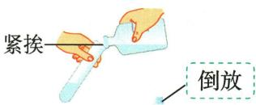

## 讲解

### 是什么

较多量液体可直接倾倒，少量滴加用胶头滴管，指定体积配合量筒。瓶塞倒放、标签朝手心；滴管竖直悬空于容器口上方，不接触内壁，不让液体进入橡胶帽。

### 怎么来的

瓶塞接触试剂的一面朝上可减少桌面杂质沾入；标签朝手心减少洒液腐蚀标签。滴管触壁会带回杂质，平放或倒置会让液体流入胶帽。通用滴管更换试剂前清洗，专用滴瓶滴管不随意清洗或互换以免稀释污染。

### 什么时候能用

规则服务于防污染和正确滴加，不能把少量滴管当准确量具。剩余试剂不倒回原瓶；原书闻气味用轻扇法，不把鼻子贴瓶口，也不尝试剂。

## 例题

### 滴加倾倒加热读数四图

> 来源ID Q01-17；第一单元走进化学世界；1-50/full.md 第1110–1122行。原答案与解析定位：1-50/full.md 第1156–1158行。

例4（2024山东枣庄中考）规范操作是实验成功和安全的保障。下列实验操作规范的是 （）

  
A.滴加液体

  
B. 倾倒液体

  
C.加热液体

  
D. 液体读数

**原资料答案与解析：**

例4 解析 B(×) 倾倒液体时, 试管应倾斜, 且瓶塞应倒放在桌面上; C(×) 加热液体时, 试管内液体的体积不可超过试管容积的 1/3, 应用外焰加热; D(×) 使用量筒量取液体, 读数时视线应与量筒内液体凹液面的最低处保持水平。

答案 A

**展开解析（依据原详解补足理由与步骤）：**

对照原图逐项检查。A滴管竖直，尖端悬空于试管口上方且不触壁，符合滴加要求。B瓶塞正放、试管没有恰当倾斜，易污染或洒液，错。C液体过多且加热部位不合原教材外焰要求，错。D视线低于凹液面最低处，是仰视，错。答案A。图中的动作而非选项名称“滴加”“加热”决定对错。

### 闻气味加热读数取蒸发皿四图

> 来源ID Q01-19；第一单元走进化学世界；1-50/full.md 第1138–1150行。原答案与解析定位：1-50/full.md 第1164–1166行。

例6 (2024 四川自贡中考)规范的实验操作是实验成功和安全的重要保证。下列实验操作正确的是 ( )

  
A. 闻气体气味

  
B.加热液体

  
C.读取液体体积

  
D.移走蒸发皿

**原资料答案与解析：**

例6 解析 A(×) 应用手在瓶口轻轻地扇动, 使极少量的气体飘进鼻孔; B(×) 加热试管中的液体时, 液体不超过试管容积的 1/3; D(×) 不能用手直接拿热的蒸发皿, 应用坩埚钳夹取。

答案 C

**展开解析（依据原详解补足理由与步骤）：**

A鼻子直接靠近瓶口，错误；需按教材轻扇少量气体的方法闻，不能直接深吸。B试管中液体超过规定的约三分之一，错误。C原图量筒放平、视线与凹液面最低处齐平，正确。D用手直接取热蒸发皿，错误，应使用坩埚钳。故选C。操作图没有温度数字，依据其“正在加热”的情境判断器皿已热，不能擅自补温度。

### 附录示意-取用少量液体

> 来源ID Q17-04；附录常见实验仪器及实验操作；1-50/full.md 第365–365行。原答案与解析定位：1-50/full.md 第365–365行。

原附录操作名称：取用少量液体。

这是一幅原操作示意，不是独立考试题。

**原资料答案与解析：**

原附录仅列操作名称和示意图，没有独立答案或文字详解。下方步骤与理由由学科规范补写；不为原图编制选项或改成新题。

**展开解析（依据原详解补足理由与步骤）：**

原图胶头滴管竖直悬空，不把一般滴管插进试管或碰壁，防污染；吸液时先在液外挤气，再吸入，不能将吸满液的滴管倒置令液接触胶头。滴瓶配套滴管按专用管理，不把本规则机械当所有移液器操作。

### 附录示意-取用较多液体

> 来源ID Q17-11；附录常见实验仪器及实验操作；1-50/full.md 第367–367行。原答案与解析定位：1-50/full.md 第367–367行。

原附录操作名称：取用较多液体。

这是一幅原操作示意，不是独立考试题。

**原资料答案与解析：**

原附录仅列操作名称和示意图，没有独立答案或文字详解。下方步骤与理由由学科规范补写；不为原图编制选项或改成新题。

**展开解析（依据原详解补足理由与步骤）：**

原图瓶塞倒放、瓶口紧挨受液管口，缓慢倾倒。标签向掌心以减少流下试剂腐蚀字迹；不把瓶塞内面接触桌面后再污染瓶中试剂。倒完及时盖好，不把取出多余试剂倒回原瓶。

## 易错

- 瓶塞正放桌面：接触试剂面被污染。
- 滴管尖端深入容器：可能触壁带回杂质。
