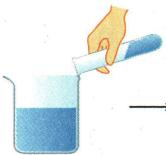
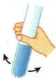
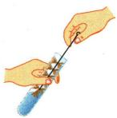
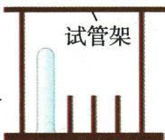
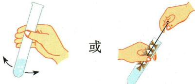

## 讲解

### 是什么

洗净的一般玻璃仪器内壁上的水应能较均匀附着，既不聚成明显水滴，也不成股流下。透明不等于没有污染；洗涤要先按废液规则处理，再用水与必要的刷洗清除附着物。

### 怎么来的

油污会改变水在玻璃表面的分布，水容易聚集成滴或条流，原书据此作为洗净判据。污物性质不同，处理方法不同；原资料油污可用热纯碱溶液，水垢可用稀盐酸，然后再冲洗。

### 什么时候能用

这是本书一般玻璃仪器的观察标准，不证明痕量分析所需的所有污染物完全为零。使用试管刷动作轻，热玻璃先适当冷却，不能骤冷或猛撞管底。

## 例题

### 原玻璃仪器洗涤与洗净判据

> 来源ID Q01-23；第一单元走进化学世界；1-50/full.md 第1007–1009行。原答案与解析定位：1-50/full.md 第996–999行；1-50/full.md 第1009–1009行。

# 3.玻璃仪器的洗涤 15

| 洗涤方法 |   或  → 废液倒入 加入半试管水振 转动刷洗或上下 洗净后倒扣指定容器 荡洗涤后把水倒 移动刷洗 在试管架上掉,重复几次 |   或  → 废液倒入 加入半试管水振 转动刷洗或上下 洗净后倒扣指定容器 荡洗涤后把水倒 移动刷洗 在试管架上掉,重复几次 |   或  → 废液倒入 加入半试管水振 转动刷洗或上下 洗净后倒扣指定容器 荡洗涤后把水倒 移动刷洗 在试管架上掉,重复几次 |   或  → 废液倒入 加入半试管水振 转动刷洗或上下 洗净后倒扣指定容器 荡洗涤后把水倒 移动刷洗 在试管架上掉,重复几次 |
| --- | --- | --- | --- | --- |
| 洗净标准 | 玻璃仪器内壁附着的水既不聚成水滴,也不成股流下 | 玻璃仪器内壁附着的水既不聚成水滴,也不成股流下 | 玻璃仪器内壁附着的水既不聚成水滴,也不成股流下 | 玻璃仪器内壁附着的水既不聚成水滴,也不成股流下 |

**原资料答案与解析：**

原洗净标准：玻璃仪器内壁附着的水既不聚成水滴，也不成股流下。原举例：内壁油污可用热的纯碱溶液洗涤，水垢可用稀盐酸洗涤。

**展开解析（依据原详解补足理由与步骤）：**

本组是原洗涤示例。废液进入指定容器，再用适量水振荡冲洗；附着物需要时用试管刷轻转或上下移动，避免用力撞击管底。洗后水能均匀附着内壁，既不成明显水滴，也不成股流下，是本书一般玻璃仪器的洗净判据。油污会使水分布不均；“看起来透明”不能保证洗净。原资料油污用热纯碱溶液、水垢用稀盐酸，是按污物性质处理，使用后仍需适当冲洗，不把几种废液随意混合。

### 附录示意-洗涤试管

> 来源ID Q17-15；附录常见实验仪器及实验操作；1-50/full.md 第367–367行。原答案与解析定位：1-50/full.md 第367–367行。

原附录操作名称：洗涤试管。

这是一幅原操作示意，不是独立考试题。

**原资料答案与解析：**

原附录仅列操作名称和示意图，没有独立答案或文字详解。下方步骤与理由由学科规范补写；不为原图编制选项或改成新题。

**展开解析（依据原详解补足理由与步骤）：**

原图少水振荡冲洗，必要时用试管刷转动刷洗，不猛烈撞底。洗净后内壁水成均匀薄膜，不聚成滴、不成股流下；若有顽固残留按教师指定洗法，不任意混用清洁剂。热玻璃需先冷却，不直接骤冷。

## 易错

- 看起来透明就直接用：检查水在内壁的分布。
- 用力刷到管底：可能破裂；废液不能随意混倒。
