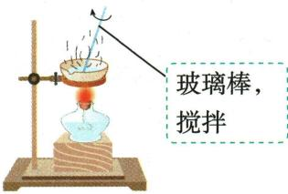

## 讲解

### 是什么

用蒸发皿加热溶液以蒸去溶剂；取得不易受热分解的溶质时，可在较多固体出现后利用器皿余热完成后段蒸发。

### 怎么来的

玻璃棒搅拌使受热较均匀，降低局部沸腾飞溅导致的物料损失。较多晶体出现后液体少，继续强热易飞溅或损坏；停止加热后器皿和固体仍有热量可继续蒸去少量溶剂。热皿需夹持并置耐热处，避免烫伤和骤冷。

### 什么时候能用

蒸发与蒸馏目的不同；前者通常保溶质，后者可回收蒸出的液体。混液的其它非挥发可溶盐也可能留下，故蒸发不保证纯度；若目标受热分解或需降温析晶，应按其性质另选工艺。

## 例题

### 附录示意-蒸发

> 来源ID Q17-16；附录常见实验仪器及实验操作；1-50/full.md 第367–367行。原答案与解析定位：1-50/full.md 第367–367行。

原附录操作名称：蒸发。

这是一幅原操作示意，不是独立考试题。

**原资料答案与解析：**

原附录仅列操作名称和示意图，没有独立答案或文字详解。下方步骤与理由由学科规范补写；不为原图编制选项或改成新题。

**展开解析（依据原详解补足理由与步骤）：**

原图蒸发皿加热且玻璃棒持续搅拌，使热量和液体分散、防局部过热喷溅。出现较多固体时停火用余热继续蒸发，不等全干仍猛烧；热皿用坩埚钳夹持，置合适耐热处。该操作蒸去溶剂，不能单凭它除掉所有非挥发可溶杂质。

## 易错

不等完全干燥仍继续猛烧，也不徒手拿热皿。
