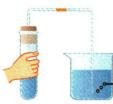
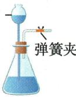
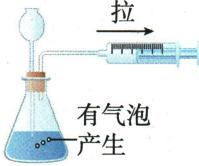
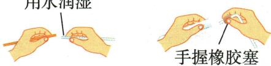
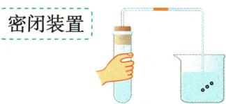

## 讲解

### 是什么

装置气密性良好指连接及封闭处不明显漏气，使设计通道内气体按实验要求进出。一般在连接装置后、加入试剂前检查。观察气泡或水柱必须同时说明产生压差的操作和封闭条件。

### 怎么来的

升温使内部气体膨胀，降温使气压下降；注水或抽气同样可建立压差。压差能维持且气体只经预设通道通过，支持装置密闭；若未液封或出口未夹闭，空气可自由出入，即使连接完好也不能用水柱作判断。

### 什么时候能用

温差法、注水法、抽气法按装置结构选。要保证液封、正确夹闭和适当温度变化；“不冒泡”可能是没有压差，不能直接等同漏气。连接玻璃导管先用水润湿、轻转插入，避免强压破玻璃。

## 例题

### 原气密性三法对照表

> 来源ID Q01-21；第一单元走进化学世界；1-50/full.md 第1003–1005行。原答案与解析定位：1-50/full.md 第991–995行；1-50/full.md 第1005–1005行。

# 2. 检查装置的气密性 14 一般在装置连接好之后，装入试剂之前

|  | 温差法 | 注水法 | 抽气法 |
| --- | --- | --- | --- |
| 图示 |  有气泡  - 冒出 形成稳定水柱 | 观察液面变化 |  |
| 操作 | 把导管的一端浸入水中,用手紧握试管,如果水中的导管口有气泡冒出,松开手一段时间后,导管中形成一小段稳定的水柱,证明装置气密性良好 | 夹紧弹簧夹,通过长颈漏斗向锥形瓶中注水至形成液封,继续加水,若在长颈漏斗中形成一段稳定的水柱,证明气密性良好 | 向锥形瓶中加入适量水形成液封,然后缓缓向外拉注射器的活塞,若看到锥形瓶中有气泡冒出,证明装置气密性良好 |

**原资料答案与解析：**

原表说明：温差法要观察加热出气泡及冷却后稳定水柱；注水法需夹闭导管、形成液封并保持稳定水柱；抽气法需先形成液封，外拉注射器时观察瓶中气泡。检查安排在连接装置之后、装入试剂之前。

**展开解析（依据原详解补足理由与步骤）：**

本组是原装置与操作对照示例。温差法先将导管口浸水，手握加热时内部空气膨胀而产生气泡；松手冷却后气压下降，水进入导管形成并保持水柱，两阶段一起支持密闭性。注水法先夹闭气体出口并形成长颈漏斗液封，继续加水产生压差，水柱持续稳定才支持密闭。抽气法先用水液封长颈漏斗下端，向外拉注射器降低瓶内气压，外界空气经漏斗进入形成气泡；看见气泡还应检查连接处及液封条件。必须先使除观察通道外的通路封闭，未形成压差时“没气泡”不能直接说漏气。

### 附录示意-连接仪器

> 来源ID Q17-07；附录常见实验仪器及实验操作；1-50/full.md 第365–365行。原答案与解析定位：1-50/full.md 第365–365行。

原附录操作名称：连接仪器。

这是一幅原操作示意，不是独立考试题。

**原资料答案与解析：**

原附录仅列操作名称和示意图，没有独立答案或文字详解。下方步骤与理由由学科规范补写；不为原图编制选项或改成新题。

**展开解析（依据原详解补足理由与步骤）：**

原图玻璃管端用水润湿，轻转插入胶管或橡胶塞；手握近连接端，减少过长力臂导致折断，不强压。给试管塞塞子要握住试管再轻转塞入，不把底部抵桌强按。连接后装药前再查气密，连接动作本身不证明密闭。

### 附录示意-检查装置气密性

> 来源ID Q17-14；附录常见实验仪器及实验操作；1-50/full.md 第367–367行。原答案与解析定位：1-50/full.md 第367–367行。

原附录操作名称：检查装置气密性。

这是一幅原操作示意，不是独立考试题。

**原资料答案与解析：**

原附录仅列操作名称和示意图，没有独立答案或文字详解。下方步骤与理由由学科规范补写；不为原图编制选项或改成新题。

**展开解析（依据原详解补足理由与步骤）：**

原图导管末端入水，手握试管使空气升温膨胀排出气泡，松手冷却应见一段稳定水柱，两阶段联合支持气密。除观察口外须封闭；未液封、无温差时没泡不能立即断为漏气。检查在装置接好、加试剂之前。

## 易错

- 忘记液封便观察：装置没有形成待检密闭体系。
- 只看一次气泡不看水柱稳定：可能只是短暂气体运动。
