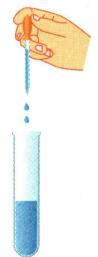
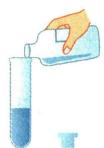
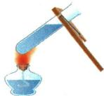
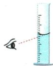
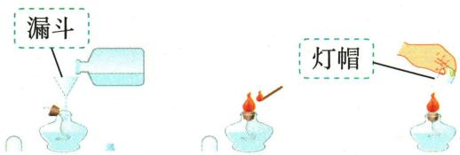
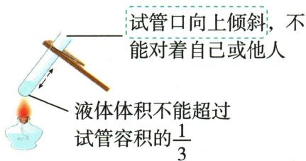
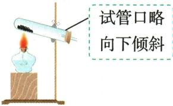

## 讲解

### 是什么

本书酒精灯火焰分外焰、内焰、焰心，通常用外焰加热。用火柴点燃，用灯帽盖灭；不可用燃着的灯互引，也不可向燃着的灯加酒精。玻璃器皿加热需检查外壁干燥、装液量及夹持位置。

### 怎么来的

外焰与空气接触较充分，教材据此用来加热。先预热使各部位逐渐受热，减少局部温差；热试管不能骤冷。液体留出空间可减少沸腾溅出；加热固体时试管口略向下，使冷凝水不倒流到热处。水浴能更均匀地控制较低温度，不能给普通水浴任意超过水的沸点的任务。

### 什么时候能用

试管液体不超过约1/3，口不对人，夹在上部适当位置；烧杯、锥形瓶按原书垫陶土网。热蒸发皿用坩埚钳，不能徒手取；火焰亮度不直接等于温度，实验观察与温度判断需分清。

## 例题

### 灯帽与热玻璃等安全判断

> 来源ID Q01-15；第一单元走进化学世界；1-50/full.md 第1090–1095行。原答案与解析定位：1-50/full.md 第1066–1068行。

例2 (2024 湖南长沙中考)树立安全意识,形成良好习惯。下列做法正确的是 ()

A.用灯帽盖灭酒精灯   
B.加热后的试管立即用冷水冲洗   
C. 在加油站用手机打电话  
D. 携带易燃、易爆品乘坐高铁

**原资料答案与解析：**

例2 解析 B(×)加热后的试管立即用冷水冲洗,会使试管炸裂; C(×)汽油具有可燃性,在加油站打电话,易引发火灾; D(×)禁止携带易燃、易爆品乘坐高铁。

答案 A

**展开解析（依据原详解补足理由与步骤）：**

A灯帽盖灭酒精灯，正确；其作用是阻断火焰处持续得到空气。B热试管立即冷水冲洗会受热不均、产生较大温差而易炸裂，错误。C在加油作业危险区域应遵守禁用手机等现场安全要求，按原题错误；原解析的“易引发火灾”是安全提示，不能单凭汽油可燃推出正常手机每次通话必然引燃。D携带易燃易爆品乘高铁违反本题安全要求，错误。答案A。[应急管理部门所载现场要求](https://www.mem.gov.cn/fw/yjpf/pfrd/202010/t20201021_370700.shtml)记录了具体地方的禁用规定，本文不把该地方通知改写成全部现行法规。

### 滴加倾倒加热读数四图

> 来源ID Q01-17；第一单元走进化学世界；1-50/full.md 第1110–1122行。原答案与解析定位：1-50/full.md 第1156–1158行。

例4（2024山东枣庄中考）规范操作是实验成功和安全的保障。下列实验操作规范的是 （）

  
A.滴加液体

  
B. 倾倒液体

  
C.加热液体

  
D. 液体读数

**原资料答案与解析：**

例4 解析 B(×) 倾倒液体时, 试管应倾斜, 且瓶塞应倒放在桌面上; C(×) 加热液体时, 试管内液体的体积不可超过试管容积的 1/3, 应用外焰加热; D(×) 使用量筒量取液体, 读数时视线应与量筒内液体凹液面的最低处保持水平。

答案 A

**展开解析（依据原详解补足理由与步骤）：**

对照原图逐项检查。A滴管竖直，尖端悬空于试管口上方且不触壁，符合滴加要求。B瓶塞正放、试管没有恰当倾斜，易污染或洒液，错。C液体过多且加热部位不合原教材外焰要求，错。D视线低于凹液面最低处，是仰视，错。答案A。图中的动作而非选项名称“滴加”“加热”决定对错。

### 闻气味加热读数取蒸发皿四图

> 来源ID Q01-19；第一单元走进化学世界；1-50/full.md 第1138–1150行。原答案与解析定位：1-50/full.md 第1164–1166行。

例6 (2024 四川自贡中考)规范的实验操作是实验成功和安全的重要保证。下列实验操作正确的是 ( )

  
A. 闻气体气味

  
B.加热液体

  
C.读取液体体积

  
D.移走蒸发皿

**原资料答案与解析：**

例6 解析 A(×) 应用手在瓶口轻轻地扇动, 使极少量的气体飘进鼻孔; B(×) 加热试管中的液体时, 液体不超过试管容积的 1/3; D(×) 不能用手直接拿热的蒸发皿, 应用坩埚钳夹取。

答案 C

**展开解析（依据原详解补足理由与步骤）：**

A鼻子直接靠近瓶口，错误；需按教材轻扇少量气体的方法闻，不能直接深吸。B试管中液体超过规定的约三分之一，错误。C原图量筒放平、视线与凹液面最低处齐平，正确。D用手直接取热蒸发皿，错误，应使用坩埚钳。故选C。操作图没有温度数字，依据其“正在加热”的情境判断器皿已热，不能擅自补温度。

### 附录示意-酒精灯的使用

> 来源ID Q17-05；附录常见实验仪器及实验操作；1-50/full.md 第365–365行。原答案与解析定位：1-50/full.md 第365–365行。

原附录操作名称：酒精灯的使用。

这是一幅原操作示意，不是独立考试题。

**原资料答案与解析：**

原附录仅列操作名称和示意图，没有独立答案或文字详解。下方步骤与理由由学科规范补写；不为原图编制选项或改成新题。

**展开解析（依据原详解补足理由与步骤）：**

原图先在未点燃状态加酒精，灯帽盖灭再移开复盖；加料与盖灭是两个时段，不向燃着灯中加酒精，不用燃着灯点另一盏，也不口吹灭。酒精量按原章节与器材规范控制，图没给读数不补造数字。

### 附录示意-加热液体

> 来源ID Q17-06；附录常见实验仪器及实验操作；1-50/full.md 第365–365行。原答案与解析定位：1-50/full.md 第365–365行。

原附录操作名称：加热液体。

这是一幅原操作示意，不是独立考试题。

**原资料答案与解析：**

原附录仅列操作名称和示意图，没有独立答案或文字详解。下方步骤与理由由学科规范补写；不为原图编制选项或改成新题。

**展开解析（依据原详解补足理由与步骤）：**

原图试管口向上倾斜，液体不超过容量1/3，口不对人。先预热再集中加热、适当移动，避免局部过热导致突沸和破裂；使用外焰但不声称任何操作外焰温度必精确固定。热管不立即冷水洗。

### 附录示意-加热固体

> 来源ID Q17-13；附录常见实验仪器及实验操作；1-50/full.md 第367–367行。原答案与解析定位：1-50/full.md 第367–367行。

原附录操作名称：加热固体。

这是一幅原操作示意，不是独立考试题。

**原资料答案与解析：**

原附录仅列操作名称和示意图，没有独立答案或文字详解。下方步骤与理由由学科规范补写；不为原图编制选项或改成新题。

**展开解析（依据原详解补足理由与步骤）：**

原图一般固体试管加热口略向下，防冷凝水回流到热处使试管骤冷破裂；先预热，再加热固体所在部位。若原料先熔成液体、如草酸制气新情境，仍按实际反应状态和题图另判方向，不能称所有固体加热一律向下。

## 易错

- 热试管立即冲冷水：温差导致破裂风险。
- 液体过多或不预热：容易溅出或受热不均。
