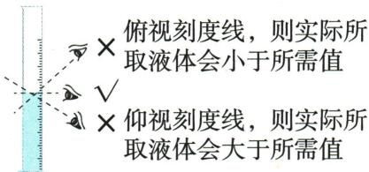
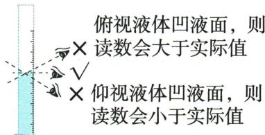
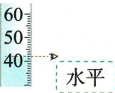

## 讲解

### 是什么

量筒用于量取液体体积或按装置间接测气体体积，常用mL；刻度比烧杯细，但仍属于有读数误差的量具。量程要能容纳目标体积并尽量接近，读凹液面最低处的对应刻度。

### 怎么来的

宽容器相同体积变化对应较小液面高度变化，粗刻度难以精细量取；量筒的形状和刻度便于读体积。视线与液面最低处不齐会把斜视位置对应到错误刻度，产生视差。量筒应放平，先倒入接近目标量，再用滴管调整。

### 什么时候能用

读数精度看具体刻度，不把所有量筒都当0.1mL。量筒不能加热、配制溶液或充当反应容器，也不量热液；烧杯刻度只作粗略参考，不能替代本题40.0mL任务。

## 例题

### 量取95mL水的量程与仰视

> 来源ID Q01-13；第一单元走进化学世界；1-50/full.md 第1041–1044行。原答案与解析定位：1-50/full.md 第1046–1048行。

例 在中学化学定量实验中,经常要用量筒来测量液体体积。

(1)实验者观察方法不正确,会造成所量取液体的体积或读出的体积数值出现误差。读数时视线应\_\_\_\_。  
(2)量取一定体积的液体。若需要量取 $95 \, mL$ 水, 最好选用 \_\_\_\_ mL 的量筒, 并配合使用 \_\_\_\_ 进行量取。若读数时仰视刻度, 则实际量取的水的体积 \_\_\_\_ (填“大于”“小于”或“等于”) $95 \, mL$ 。

**原资料答案与解析：**

解析 (1) 使用量筒量取液体, 读数时视线应与量筒内液体凹液面的最低处保持水平。(2) 若需量取 $95 \mathrm{~mL}$ 水, 最好选用 $100 \mathrm{~mL}$ 的量筒并配合使用胶头滴管进行量取。若读数时仰视刻度, 则实际量取的水的体积大于 $95 \mathrm{~mL}$ 。

答案 (1)与量筒内液体凹液面的最低处保持水平 (2)100 胶头滴管 大于

**展开解析（依据原详解补足理由与步骤）：**

(1)量筒放在水平台面，视线与凹液面最低处齐平，读对应刻度。(2)量程须容纳95mL且尽量接近，按原答案选100mL；接近目标时用胶头滴管逐滴调整。此处任务是“加水直到错误视线读为95mL”，仰视时读数偏小，达到读数95mL时实际水量已超过95mL。故填大于。若问题改为读取原有水量，仰视会得到偏小的读数；两种任务的比较对象不同。

### 量取40.0mL选择烧杯还是量筒

> 来源ID Q01-16；第一单元走进化学世界；1-50/full.md 第1099–1106行。原答案与解析定位：1-50/full.md 第1152–1154行。

例3 (2023 江苏扬州中考)实验室量取 $40.0 \mathrm{~mL} \mathrm{NaCl}$ 溶液时, 可供选用的仪器如图所示, 应选择的仪器及原因均正确的是 ( )

A.50 mL 烧杯, 因为烧杯放置于桌面时更稳定, 不易翻倒  
B.50 mL 烧杯, 因为烧杯的杯口较大, 便于加入溶液  
C. 50 mL 量筒, 因为量筒量取液体体积更精准  
D.50 mL 量筒, 因为量筒操作时便于手握

**原资料答案与解析：**

例3 解析 A(×)B(×)不能选择烧杯,因为烧杯误差大;C(√)D(×)用量筒量取液体体积更精准,量筒量程的选择应遵循“大而近”的原则。

答案 C

**展开解析（依据原详解补足理由与步骤）：**

先看任务是较准确量体积。A、B选择烧杯，其刻度只作粗略参考，稳定或杯口宽不能满足本题精度目的，均错。C选50mL量筒，量程能容纳40.0mL并接近目标，有较细刻度，正确。D虽选对量筒，但“便于手握”不是此题原因；读数应将量筒平放，故错。答案C。选对仪器与选对理由必须同时成立。

### 附录示意-读取液体体积

> 来源ID Q17-12；附录常见实验仪器及实验操作；1-50/full.md 第367–367行。原答案与解析定位：1-50/full.md 第367–367行。

原附录操作名称：读取液体体积。

这是一幅原操作示意，不是独立考试题。

**原资料答案与解析：**

原附录仅列操作名称和示意图，没有独立答案或文字详解。下方步骤与理由由学科规范补写；不为原图编制选项或改成新题。

**展开解析（依据原详解补足理由与步骤）：**

原图眼与凹液面最低处水平，量筒置平，读刻度对应位置。原简图用40、50、60刻度表示读法，并没有一道要求算具体体积的题，不编造精读结果。读现有量与按刻度量目标是不同任务，后者仰视到目标会多装，不能只说仰视就量少。

## 易错

- 量程越大越好：在能容纳体积的规格中取接近目标者。
- 手举量筒读数：应水平放置，平视最低处。
