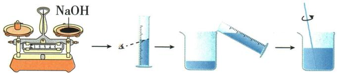

## 讲解

### 判据

遇到仰视、俯视时，先圈动词：“读出已有体积”是在问错误读数，“量取某体积”是在问达到目标读数时的实际量。两题固定的对象不同，不能把“仰视偏小”当成所有任务的答案。

### 流程

1. **先确定正确读数方式。** 量筒放在水平台面，视线与凹液面最低处同高，读对应刻度。仰视是视线低于液面，俯视是高于液面；量筒倾斜是另一项操作错误，不并入同一个口诀。
2. **已有液体固定时分析读数。** 仰视会把这份液体读得偏小，俯视读得偏大。这时变的是报告数值，不是筒内液体已经多了或少了。
3. **目标读数固定时反推实际量。** 仰视量到目标时，由于同一液面会被读得偏小，操作者需要多加液体才以为达到目标，因此实际偏多；俯视会较早以为达到目标，实际偏少。
4. **用原题回查对象。** Q01-13 要量取95毫升水，仰视到目标刻度时实际大于95毫升。Q09-16 要量40毫升水，仰视量取也会水多；这不是“已有40毫升被读小”的问题。
5. **继续判断浓度时分清所量液体。** NaOH 题固定10克溶质，实际水多使总溶液质量大于50克，质量分数低于20%。若量的是浓溶液而另加水不变，原液多会带入更多高浓度溶液，结果方向须按组成重新判断，不能直接沿用量水结论。
6. **最后写完整比较对象。** 答“实际量取的水多于目标”，或“对已有液体读出的数值偏小”；不要只写“大、小”，让两种量混在一起。

## 例题

### 量取95mL水的量程与仰视

> 来源ID Q01-13；第一单元走进化学世界；1-50/full.md 第1041–1044行。原答案与解析定位：1-50/full.md 第1046–1048行。

例 在中学化学定量实验中,经常要用量筒来测量液体体积。

(1)实验者观察方法不正确,会造成所量取液体的体积或读出的体积数值出现误差。读数时视线应\_\_\_\_。  
(2)量取一定体积的液体。若需要量取 $95 \, mL$ 水, 最好选用 \_\_\_\_ mL 的量筒, 并配合使用 \_\_\_\_ 进行量取。若读数时仰视刻度, 则实际量取的水的体积 \_\_\_\_ (填“大于”“小于”或“等于”) $95 \, mL$ 。

**原资料答案与解析：**

解析 (1) 使用量筒量取液体, 读数时视线应与量筒内液体凹液面的最低处保持水平。(2) 若需量取 $95 \mathrm{~mL}$ 水, 最好选用 $100 \mathrm{~mL}$ 的量筒并配合使用胶头滴管进行量取。若读数时仰视刻度, 则实际量取的水的体积大于 $95 \mathrm{~mL}$ 。

答案 (1)与量筒内液体凹液面的最低处保持水平 (2)100 胶头滴管 大于

**展开解析（依据原详解补足理由与步骤）：**

(1)量筒放在水平台面，视线与凹液面最低处齐平，读对应刻度。(2)量程须容纳95mL且尽量接近，按原答案选100mL；接近目标时用胶头滴管逐滴调整。此处任务是“加水直到错误视线读为95mL”，仰视时读数偏小，达到读数95mL时实际水量已超过95mL。故填大于。若问题改为读取原有水量，仰视会得到偏小的读数；两种任务的比较对象不同。

### NaOH配液三处错误

> 来源ID Q09-16；第九单元溶液；101-150/full.md 第2077–2085行。原答案与解析定位：101-150/full.md 第2100–2102行。

例5 (2024 山东济宁中考) 某同学在实验室配制 50 g 质量分数为 20% 的 $NaOH$ 溶液, 步骤如下图。

请回答：

(1)该同学实验操作过程中出现了\_\_\_\_处错误;   
(2)若完成溶液的配制,需要量取\_\_\_\_mL 的水(常温下水的密度为 1 g/mL);  
(3)用量筒量取水时,若像如图所示仰视读数,所配 $NaOH$ 溶液的溶质质量分数 \_\_\_\_ 20%(填“大于”“小于”或“等于”)。

**原资料答案与解析：**

例5 解析（1）实验操作中有3处错误：称量时氢氧化钠应放在玻璃器皿中；称量时氢氧化钠应置于左盘，右盘放砝码；量取水时，不能仰视读数。（2）需要$NaOH$质量= $50\ g\times20\%=10\ g$ ；水的质量= $50\ g-10\ g=40\ g$ ，则水的体积为40 mL。（3）量取水时仰视读数，会造成量取水的体积偏大，即水的实际质量偏大，则所配$NaOH$溶液的溶质质量分数小于20%。

答案 (1)3 (2)40 (3)小于

**展开解析（依据原详解补足理由与步骤）：**

(1)3处：$NaOH$不可裸放纸上，应在适当玻璃器皿称；图右物左码反；量水仰视。其他所示转移混合按本图不是错误。(2)$NaOH$ $50\times20\%=10$g，水$50-10=40$g，以1g/mL换40mL。(3)仰视按目标刻度停加水，真实水多于40mL；固定10g溶质，分母大于50g，分数小于20%。这题是按刻度量目标，不能套“读数偏小”就说实际水少。$NaOH$溶解放热，混匀冷却后处理，不以热体积代常温密度。

## 易错

- **仰视实际少**：把已有液体的读数偏小，错用到目标量取；原 Q01-13 实际水偏多。
- **俯视量水使浓度低**：目标量取时实际水偏少，在固定溶质且其他条件正确的模型中浓度偏高。
- **量水与量浓液沿用同一浓度方向**：先把实际多取的是什么写清，再算溶质与总液体。
- **水体积偏多却说盐量也同比变多**：Q09-16 只分析量水误差时，盐仍为10克；不能另加未给定误差。
- **仰俯视与量筒倾斜混为一项**：保持筒竖直、平放后再分析视线，否则原图的读数关系不适用。
