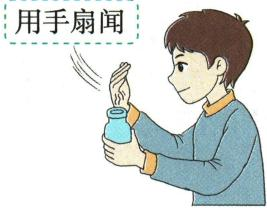
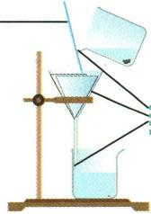
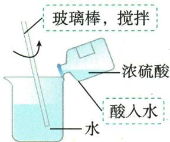

## 讲解

### 判据

题目只有操作图而无详细步骤时，看手的位置、仪器姿态、液面、瓶塞、火焰接触位置，逐项找具体违规动作。

### 流程

1. 认任务与仪器，不能只读选项“加热”“读数”标签。
2. 液体操作查瓶塞倒放、标签朝手心、滴管竖直悬空不触壁。
3. 量筒查放平与平视凹液面最低处。
4. 加热查装液量、预热/夹持及外焰，热器皿取用查夹具。
5. 称量查试剂性质：氢氧化钠易潮解且腐蚀，不能放纸上。
6. 核对题问正确还是错误，把每个选项的图上证据说清。

## 例题

### 滴加倾倒加热读数四图

> 来源ID Q01-17；第一单元走进化学世界；1-50/full.md 第1110–1122行。原答案与解析定位：1-50/full.md 第1156–1158行。

例4（2024山东枣庄中考）规范操作是实验成功和安全的保障。下列实验操作规范的是 （）

  
A.滴加液体

  
B. 倾倒液体

  
C.加热液体

  
D. 液体读数

**原资料答案与解析：**

例4 解析 B(×) 倾倒液体时, 试管应倾斜, 且瓶塞应倒放在桌面上; C(×) 加热液体时, 试管内液体的体积不可超过试管容积的 1/3, 应用外焰加热; D(×) 使用量筒量取液体, 读数时视线应与量筒内液体凹液面的最低处保持水平。

答案 A

**展开解析（依据原详解补足理由与步骤）：**

对照原图逐项检查。A滴管竖直，尖端悬空于试管口上方且不触壁，符合滴加要求。B瓶塞正放、试管没有恰当倾斜，易污染或洒液，错。C液体过多且加热部位不合原教材外焰要求，错。D视线低于凹液面最低处，是仰视，错。答案A。图中的动作而非选项名称“滴加”“加热”决定对错。

### 配制NaOH溶液的称量图

> 来源ID Q01-18；第一单元走进化学世界；1-50/full.md 第1124–1136行。原答案与解析定位：1-50/full.md 第1160–1162行。

例5 (2024 江苏宿迁中考)下列配制 100 g 溶质质量分数为 10% 的氢氧化钠溶液的系列操作中, 错误的是 ( )

  
A. 取用药品

  
B.读取水量

  
C.称取药品

  
D. 加速溶解

**原资料答案与解析：**

例5 解析 A(√) 氢氧化钠是固体试剂, 用药匙取用且瓶塞倒放; B(√) 用量筒量取液体, 读数时视线应与液体凹液面的最低处保持水平; C(×) 氢氧化钠固体易潮解, 具有腐蚀性, 应放在玻璃器皿中称量; D(√) 用玻璃棒搅拌可加速溶解。

答案 C

**展开解析（依据原详解补足理由与步骤）：**

A药匙取固体且瓶塞倒放，正确。B量筒平放、平视凹液面最低处，正确。C原图把氢氧化钠固体放在纸上称量，因它易潮解且有腐蚀性，应放入适宜玻璃器皿中称量，错误。D玻璃棒搅拌帮助溶解，正确。本题选错误项，故C。这里原条件100g、10%保留，用来解释器皿选取；未把它改造成新配液计算题。

### 闻气味加热读数取蒸发皿四图

> 来源ID Q01-19；第一单元走进化学世界；1-50/full.md 第1138–1150行。原答案与解析定位：1-50/full.md 第1164–1166行。

例6 (2024 四川自贡中考)规范的实验操作是实验成功和安全的重要保证。下列实验操作正确的是 ( )

  
A. 闻气体气味

  
B.加热液体

  
C.读取液体体积

  
D.移走蒸发皿

**原资料答案与解析：**

例6 解析 A(×) 应用手在瓶口轻轻地扇动, 使极少量的气体飘进鼻孔; B(×) 加热试管中的液体时, 液体不超过试管容积的 1/3; D(×) 不能用手直接拿热的蒸发皿, 应用坩埚钳夹取。

答案 C

**展开解析（依据原详解补足理由与步骤）：**

A鼻子直接靠近瓶口，错误；需按教材轻扇少量气体的方法闻，不能直接深吸。B试管中液体超过规定的约三分之一，错误。C原图量筒放平、视线与凹液面最低处齐平，正确。D用手直接取热蒸发皿，错误，应使用坩埚钳。故选C。操作图没有温度数字，依据其“正在加热”的情境判断器皿已热，不能擅自补温度。

### 附录示意-闻试剂气味

> 来源ID Q17-02；附录常见实验仪器及实验操作；1-50/full.md 第365–365行。原答案与解析定位：1-50/full.md 第365–365行。

原附录操作名称：闻试剂气味。

这是一幅原操作示意，不是独立考试题。

**原资料答案与解析：**

原附录仅列操作名称和示意图，没有独立答案或文字详解。下方步骤与理由由学科规范补写；不为原图编制选项或改成新题。

**展开解析（依据原详解补足理由与步骤）：**

原图以手轻扇闻，不把鼻子贴瓶口深吸。只在教师指定且允许闻的试剂上用，未知或有毒挥发物不靠闻鉴定；闻到刺激气味是现象，不自动证明某唯一物质。

### 附录示意-取用固体试剂

> 来源ID Q17-03；附录常见实验仪器及实验操作；1-50/full.md 第365–365行。原答案与解析定位：1-50/full.md 第365–365行。

原附录操作名称：取用固体试剂。

这是一幅原操作示意，不是独立考试题。

**原资料答案与解析：**

原附录仅列操作名称和示意图，没有独立答案或文字详解。下方步骤与理由由学科规范补写；不为原图编制选项或改成新题。

**展开解析（依据原详解补足理由与步骤）：**

原图块状用镊子送入横放试管口再慢慢竖起，使块滑到底，防直接坠落砸裂；粉末用药匙或纸槽送近底部，避免粘壁。不是因同为固体便用同取法。取多余试剂不倒回原瓶，按教师要求处置。

### 附录示意-取用少量液体

> 来源ID Q17-04；附录常见实验仪器及实验操作；1-50/full.md 第365–365行。原答案与解析定位：1-50/full.md 第365–365行。

原附录操作名称：取用少量液体。

这是一幅原操作示意，不是独立考试题。

**原资料答案与解析：**

原附录仅列操作名称和示意图，没有独立答案或文字详解。下方步骤与理由由学科规范补写；不为原图编制选项或改成新题。

**展开解析（依据原详解补足理由与步骤）：**

原图胶头滴管竖直悬空，不把一般滴管插进试管或碰壁，防污染；吸液时先在液外挤气，再吸入，不能将吸满液的滴管倒置令液接触胶头。滴瓶配套滴管按专用管理，不把本规则机械当所有移液器操作。

### 附录示意-酒精灯的使用

> 来源ID Q17-05；附录常见实验仪器及实验操作；1-50/full.md 第365–365行。原答案与解析定位：1-50/full.md 第365–365行。

原附录操作名称：酒精灯的使用。

这是一幅原操作示意，不是独立考试题。

**原资料答案与解析：**

原附录仅列操作名称和示意图，没有独立答案或文字详解。下方步骤与理由由学科规范补写；不为原图编制选项或改成新题。

**展开解析（依据原详解补足理由与步骤）：**

原图先在未点燃状态加酒精，灯帽盖灭再移开复盖；加料与盖灭是两个时段，不向燃着灯中加酒精，不用燃着灯点另一盏，也不口吹灭。酒精量按原章节与器材规范控制，图没给读数不补造数字。

### 附录示意-加热液体

> 来源ID Q17-06；附录常见实验仪器及实验操作；1-50/full.md 第365–365行。原答案与解析定位：1-50/full.md 第365–365行。

原附录操作名称：加热液体。

这是一幅原操作示意，不是独立考试题。

**原资料答案与解析：**

原附录仅列操作名称和示意图，没有独立答案或文字详解。下方步骤与理由由学科规范补写；不为原图编制选项或改成新题。

**展开解析（依据原详解补足理由与步骤）：**

原图试管口向上倾斜，液体不超过容量1/3，口不对人。先预热再集中加热、适当移动，避免局部过热导致突沸和破裂；使用外焰但不声称任何操作外焰温度必精确固定。热管不立即冷水洗。

### 附录示意-连接仪器

> 来源ID Q17-07；附录常见实验仪器及实验操作；1-50/full.md 第365–365行。原答案与解析定位：1-50/full.md 第365–365行。

原附录操作名称：连接仪器。

这是一幅原操作示意，不是独立考试题。

**原资料答案与解析：**

原附录仅列操作名称和示意图，没有独立答案或文字详解。下方步骤与理由由学科规范补写；不为原图编制选项或改成新题。

**展开解析（依据原详解补足理由与步骤）：**

原图玻璃管端用水润湿，轻转插入胶管或橡胶塞；手握近连接端，减少过长力臂导致折断，不强压。给试管塞塞子要握住试管再轻转塞入，不把底部抵桌强按。连接后装药前再查气密，连接动作本身不证明密闭。

### 附录示意-过滤

> 来源ID Q17-08；附录常见实验仪器及实验操作；1-50/full.md 第365–365行。原答案与解析定位：1-50/full.md 第365–365行。

原附录操作名称：过滤。

这是一幅原操作示意，不是独立考试题。

**原资料答案与解析：**

原附录仅列操作名称和示意图，没有独立答案或文字详解。下方步骤与理由由学科规范补写；不为原图编制选项或改成新题。

**展开解析（依据原详解补足理由与步骤）：**

原图玻璃棒引流，杯嘴靠棒、棒靠三层滤纸处、漏斗下口靠受液器内壁；滤纸贴壁、纸缘低于漏斗口，液面低于纸缘。低纸缘避免液越过未经滤纸路径；过滤针对不溶固液，不除已溶盐离子。

### 附录示意-稀释浓硫酸

> 来源ID Q17-09；附录常见实验仪器及实验操作；1-50/full.md 第365–365行。原答案与解析定位：1-50/full.md 第365–365行。

原附录操作名称：稀释浓硫酸。

这是一幅原操作示意，不是独立考试题。

**原资料答案与解析：**

原附录仅列操作名称和示意图，没有独立答案或文字详解。下方步骤与理由由学科规范补写；不为原图编制选项或改成新题。

**展开解析（依据原详解补足理由与步骤）：**

原图酸入水，沿杯壁慢慢加入并搅拌，利用较多水和搅拌分散放热。反向水滴入大量浓酸，局部温度可能过高而喷溅；不能在量筒中做稀释放热操作。由教师在规定防护与器材条件下进行，不把图作家庭操作建议。

### 附录示意-称量固体试剂

> 来源ID Q17-10；附录常见实验仪器及实验操作；1-50/full.md 第367–367行。原答案与解析定位：1-50/full.md 第367–367行。

原附录操作名称：称量固体试剂。

这是一幅原操作示意，不是独立考试题。

**原资料答案与解析：**

原附录仅列操作名称和示意图，没有独立答案或文字详解。下方步骤与理由由学科规范补写；不为原图编制选项或改成新题。

**展开解析（依据原详解补足理由与步骤）：**

原图托盘天平左物右码，两边称量纸应同质量，先调零。标准放置时试样质量等于砝码质量加游码示值；已知游码位置不能把右码左物错误直接当同值。图示普通固体可垫纸，易潮解或腐蚀性$NaOH$需适当玻璃器皿，扣容器质量，不能任意全用纸。电子天平则按其去皮和读数规程，不套托盘左右。

### 附录示意-取用较多液体

> 来源ID Q17-11；附录常见实验仪器及实验操作；1-50/full.md 第367–367行。原答案与解析定位：1-50/full.md 第367–367行。

原附录操作名称：取用较多液体。

这是一幅原操作示意，不是独立考试题。

**原资料答案与解析：**

原附录仅列操作名称和示意图，没有独立答案或文字详解。下方步骤与理由由学科规范补写；不为原图编制选项或改成新题。

**展开解析（依据原详解补足理由与步骤）：**

原图瓶塞倒放、瓶口紧挨受液管口，缓慢倾倒。标签向掌心以减少流下试剂腐蚀字迹；不把瓶塞内面接触桌面后再污染瓶中试剂。倒完及时盖好，不把取出多余试剂倒回原瓶。

### 附录示意-读取液体体积

> 来源ID Q17-12；附录常见实验仪器及实验操作；1-50/full.md 第367–367行。原答案与解析定位：1-50/full.md 第367–367行。

原附录操作名称：读取液体体积。

这是一幅原操作示意，不是独立考试题。

**原资料答案与解析：**

原附录仅列操作名称和示意图，没有独立答案或文字详解。下方步骤与理由由学科规范补写；不为原图编制选项或改成新题。

**展开解析（依据原详解补足理由与步骤）：**

原图眼与凹液面最低处水平，量筒置平，读刻度对应位置。原简图用40、50、60刻度表示读法，并没有一道要求算具体体积的题，不编造精读结果。读现有量与按刻度量目标是不同任务，后者仰视到目标会多装，不能只说仰视就量少。

### 附录示意-加热固体

> 来源ID Q17-13；附录常见实验仪器及实验操作；1-50/full.md 第367–367行。原答案与解析定位：1-50/full.md 第367–367行。

原附录操作名称：加热固体。

这是一幅原操作示意，不是独立考试题。

**原资料答案与解析：**

原附录仅列操作名称和示意图，没有独立答案或文字详解。下方步骤与理由由学科规范补写；不为原图编制选项或改成新题。

**展开解析（依据原详解补足理由与步骤）：**

原图一般固体试管加热口略向下，防冷凝水回流到热处使试管骤冷破裂；先预热，再加热固体所在部位。若原料先熔成液体、如草酸制气新情境，仍按实际反应状态和题图另判方向，不能称所有固体加热一律向下。

### 附录示意-检查装置气密性

> 来源ID Q17-14；附录常见实验仪器及实验操作；1-50/full.md 第367–367行。原答案与解析定位：1-50/full.md 第367–367行。

原附录操作名称：检查装置气密性。

这是一幅原操作示意，不是独立考试题。

**原资料答案与解析：**

原附录仅列操作名称和示意图，没有独立答案或文字详解。下方步骤与理由由学科规范补写；不为原图编制选项或改成新题。

**展开解析（依据原详解补足理由与步骤）：**

原图导管末端入水，手握试管使空气升温膨胀排出气泡，松手冷却应见一段稳定水柱，两阶段联合支持气密。除观察口外须封闭；未液封、无温差时没泡不能立即断为漏气。检查在装置接好、加试剂之前。

### 附录示意-洗涤试管

> 来源ID Q17-15；附录常见实验仪器及实验操作；1-50/full.md 第367–367行。原答案与解析定位：1-50/full.md 第367–367行。

原附录操作名称：洗涤试管。

这是一幅原操作示意，不是独立考试题。

**原资料答案与解析：**

原附录仅列操作名称和示意图，没有独立答案或文字详解。下方步骤与理由由学科规范补写；不为原图编制选项或改成新题。

**展开解析（依据原详解补足理由与步骤）：**

原图少水振荡冲洗，必要时用试管刷转动刷洗，不猛烈撞底。洗净后内壁水成均匀薄膜，不聚成滴、不成股流下；若有顽固残留按教师指定洗法，不任意混用清洁剂。热玻璃需先冷却，不直接骤冷。

### 附录示意-蒸发

> 来源ID Q17-16；附录常见实验仪器及实验操作；1-50/full.md 第367–367行。原答案与解析定位：1-50/full.md 第367–367行。

原附录操作名称：蒸发。

这是一幅原操作示意，不是独立考试题。

**原资料答案与解析：**

原附录仅列操作名称和示意图，没有独立答案或文字详解。下方步骤与理由由学科规范补写；不为原图编制选项或改成新题。

**展开解析（依据原详解补足理由与步骤）：**

原图蒸发皿加热且玻璃棒持续搅拌，使热量和液体分散、防局部过热喷溅。出现较多固体时停火用余热继续蒸发，不等全干仍猛烧；热皿用坩埚钳夹持，置合适耐热处。该操作蒸去溶剂，不能单凭它除掉所有非挥发可溶杂质。

### 附录示意-测溶液pH

> 来源ID Q17-17；附录常见实验仪器及实验操作；1-50/full.md 第367–367行。原答案与解析定位：1-50/full.md 第367–367行。

原附录操作名称：测溶液pH。

这是一幅原操作示意，不是独立考试题。

**原资料答案与解析：**

原附录仅列操作名称和示意图，没有独立答案或文字详解。下方步骤与理由由学科规范补写；不为原图编制选项或改成新题。

**展开解析（依据原详解补足理由与步骤）：**

原图干燥pH试纸放洁净表面，洁净玻璃棒蘸取液体点到纸上，按试纸规定及时与标准色卡比较；不能把整张试纸伸原试剂瓶。预润湿会稀释所测液、可能改变读数；广泛试纸为范围读数，不拿其颜色推任意精确小数或把酸碱度与强弱分类混同。

## 易错

- 用选项名称替代原图：同名操作可以有错姿势。
- 只找第一个错误忘记题问：检查正确/错误要求。
