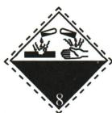
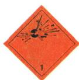
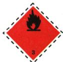
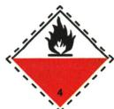

## 讲解

### 判据

题给危险标志或操作行为，把具体危险与所选措施对应，不把其他类别标志或另一场景规则代入。

### 流程

1. 看原图名称和题问物质，火药对应本题爆炸危险。
2. 对行为逐项找风险原因：热玻璃骤冷、明火与酒精、危险区手机、易燃易爆物运输。
3. 措施要直接控制该风险，如灯帽熄灯、避免热玻璃骤冷。
4. 标志与法规有版本和适用区域，本条保留原题图，不宣称为现行全部规定。

## 例题

### 火药运输的原题警示图

> 来源ID Q01-14；第一单元走进化学世界；1-50/full.md 第1072–1088行。原答案与解析定位：1-50/full.md 第1062–1064行。

例1（2024 山西中考）为保护他人和自己的生命财产安全,运输危险化学品火药、汽油、浓硫酸等的车辆,必须使用重要的警示标志,其中在运输火药的车辆上应该张贴的是()

A.腐蚀品

B. 爆炸品

C. 易燃液体

D. 自燃物品

**原资料答案与解析：**

例1 解析 火药易燃、易爆,应张贴爆炸品标志。

答案 B

**展开解析（依据原详解补足理由与步骤）：**

按本题图示名称与火药的危险特征对应。A为腐蚀品，不能代替题问的爆炸危险标志；B为爆炸品，符合火药危险性；C为易燃液体，不是火药在本题中的对应类别；D为自燃物品，也不符合本题选项分类。答案B。图为原题使用的运输警示标志，不把这四张图当成所有地区所有年份完整现行标志体系。

### 灯帽与热玻璃等安全判断

> 来源ID Q01-15；第一单元走进化学世界；1-50/full.md 第1090–1095行。原答案与解析定位：1-50/full.md 第1066–1068行。

例2 (2024 湖南长沙中考)树立安全意识,形成良好习惯。下列做法正确的是 ()

A.用灯帽盖灭酒精灯   
B.加热后的试管立即用冷水冲洗   
C. 在加油站用手机打电话  
D. 携带易燃、易爆品乘坐高铁

**原资料答案与解析：**

例2 解析 B(×)加热后的试管立即用冷水冲洗,会使试管炸裂; C(×)汽油具有可燃性,在加油站打电话,易引发火灾; D(×)禁止携带易燃、易爆品乘坐高铁。

答案 A

**展开解析（依据原详解补足理由与步骤）：**

A灯帽盖灭酒精灯，正确；其作用是阻断火焰处持续得到空气。B热试管立即冷水冲洗会受热不均、产生较大温差而易炸裂，错误。C在加油作业危险区域应遵守禁用手机等现场安全要求，按原题错误；原解析的“易引发火灾”是安全提示，不能单凭汽油可燃推出正常手机每次通话必然引燃。D携带易燃易爆品乘高铁违反本题安全要求，错误。答案A。[应急管理部门所载现场要求](https://www.mem.gov.cn/fw/yjpf/pfrd/202010/t20201021_370700.shtml)记录了具体地方的禁用规定，本文不把该地方通知改写成全部现行法规。

## 易错

- 把所有危险都选同一个标志：依据题给危险类别。
- 原安全提示等同每次必然事故：风险提示与必然因果要分清。
