## 讲解

### 判据

题目要求量取、称量、取药、加热或配制溶液，并问仪器和理由时，先辨认任务，再同时核对用途、量程、精度和试剂性质。选对工具但理由没有解释任务，也不能算整项正确。

### 流程

1. **把任务与所测量的量对应。** 量液体体积选量筒，称固体质量用天平，容纳并搅拌溶解用烧杯。烧杯上的粗刻度不等于量筒刻度，不能为了杯口大、放得稳而牺牲题目要求的量取精度。
2. **量程先能容纳，再尽量接近。** 同类量筒中，选大于或等于所需体积且较接近的量程，避免远大于目标量程造成读数误差较大。Q01-16 的40.0毫升用50毫升量筒；量程小于目标需多次量取，误差可能累积。
3. **根据阶段决定倒入还是滴加。** 离目标较远可缓慢倾倒，接近刻度改用胶头滴管。Q09-15 已有14.6毫升、目标15.0毫升，剩余量小，滴管便于逐滴控制；试剂瓶或烧杯继续倒容易超过目标。
4. **核对药品形态和性质。** 粉末用药匙、块状物通常用镊子；称量是否垫纸还要看药品，氢氧化钠不能照普通食盐直接放纸上，应使用适当玻璃器皿并处理器皿质量。
5. **同一器材按当前操作解释作用。** 配液中玻璃棒搅拌，过滤中引流，转移固体时帮助转移。不能只因都用玻璃棒，就把每一步理由都写成加快溶解。
6. **回到选项逐句核对。** Q01-16 中 C 的量筒与“量体积更精准”同时成立；D 虽选量筒，但“便于手握”不是本任务理由，读数应放稳并平视。

## 例题

### 量取40.0mL选择烧杯还是量筒

> 来源ID Q01-16；第一单元走进化学世界；1-50/full.md 第1099–1106行。原答案与解析定位：1-50/full.md 第1152–1154行。

例3 (2023 江苏扬州中考)实验室量取 $40.0 \mathrm{~mL} \mathrm{NaCl}$ 溶液时, 可供选用的仪器如图所示, 应选择的仪器及原因均正确的是 ( )

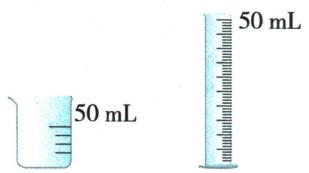

A.50 mL 烧杯, 因为烧杯放置于桌面时更稳定, 不易翻倒  
B.50 mL 烧杯, 因为烧杯的杯口较大, 便于加入溶液  
C. 50 mL 量筒, 因为量筒量取液体体积更精准  
D.50 mL 量筒, 因为量筒操作时便于手握

**原资料答案与解析：**

例3 解析 A(×)B(×)不能选择烧杯,因为烧杯误差大;C(√)D(×)用量筒量取液体体积更精准,量筒量程的选择应遵循“大而近”的原则。

答案 C

**展开解析（依据原详解补足理由与步骤）：**

先看任务是较准确量体积。A、B选择烧杯，其刻度只作粗略参考，稳定或杯口宽不能满足本题精度目的，均错。C选50mL量筒，量程能容纳40.0mL并接近目标，有较细刻度，正确。D虽选对量筒，但“便于手握”不是此题原因；读数应将量筒平放，故错。答案C。选对仪器与选对理由必须同时成立。

### 碳酸氢钠配液仪器

> 来源ID Q09-15；第九单元溶液；101-150/full.md 第2055–2075行。原答案与解析定位：101-150/full.md 第2095–2098行。

例4 (2024 江苏南通中考节选)配制一定质量分数的 $\mathrm{NaHCO}_{3}$ 溶液。

(1)“称量”时,用\_\_\_\_(填“镊子”或“药匙”)从试剂瓶中取出 $NaHCO_{3}$ 粉末。  
(2)“溶解”时,若需量取 15.0 mL 的水,当量筒中已有 14.6 mL 水时,后续加水使用的仪器为 \_\_\_\_ (填字母)。

  
a

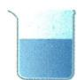  
b

  
c

(3)配制过程中玻璃棒的作用是\_\_\_\_（填字母）。

a.搅拌

b.引流

c.蘸取

**原资料答案与解析：**

例4 答案 (1) 药匙

(2)c   
(3)a

**展开解析（依据原详解补足理由与步骤）：**

(1)药匙取粉末，镊子通常取块状。(2)c胶头滴管，小量逐滴补到15.0mL并平视凹面最低处，a试剂瓶继续倾倒难精确控制，b烧杯不是滴加工具。(3)a搅拌，加快均匀溶解；b引流是过滤等转移液体时用途，c蘸取是取少量液体时用途，本配液步骤不选。

### 附录九类常见实验仪器

> 来源ID Q17-01；附录常见实验仪器及实验操作；1-50/full.md 第332–359行。原答案与解析定位：1-50/full.md 第332–359行。

# 一、常见实验仪器

1 可直接加热的反应容器  
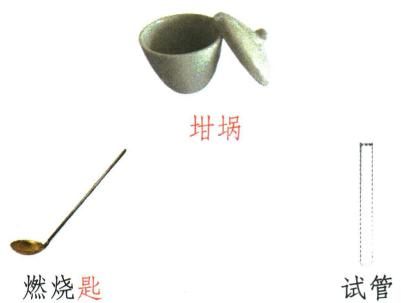

2 可间接加热的反应容器  
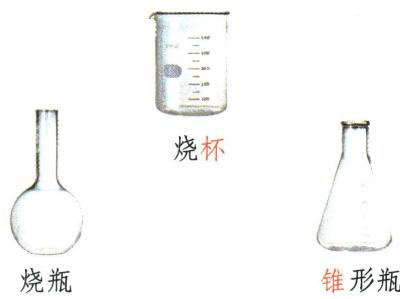

3 存放试剂的仪器  
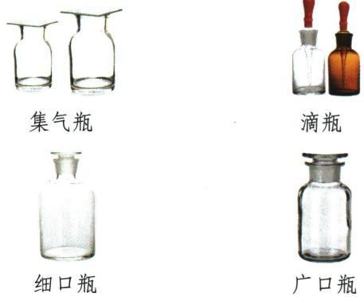

4 取用仪器  
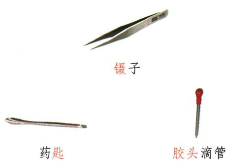

5 计量仪器  
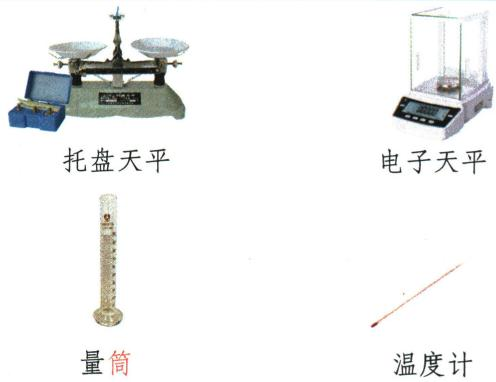

6 夹持固定仪器  
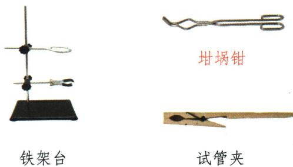

7) 加热仪器  
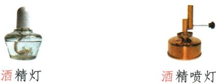

8 分离仪器  
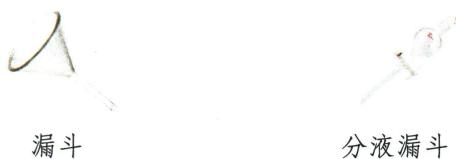

9 其他仪器  
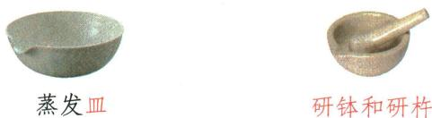

**原资料答案与解析：**

原资料以分类名称和仪器图示呈现，没有独立题目、文字答案或详解；图名和分类按原图保留，下面的用途解释为学科规范补写。

**展开解析（依据原详解补足理由与步骤）：**

原图名称与用途类别：直接加热图有试管、燃烧匙、坩埚；间接加热图有烧杯、烧瓶、锥形瓶，按合适均匀加热条件用。存放类区分广口瓶存常见固体、细口瓶存常见液体、滴瓶小量滴加、集气瓶集气；取用类药匙取粉末、镊子夹块、滴管取少液。量筒量体积、天平称质量、温度计测温度，不能互代。夹持类按大小温度选试管夹、铁架台、坩埚钳；酒精灯/酒精喷灯热源条件不同。普通漏斗过滤、分液漏斗在题给用途下分液或控制滴加，蒸发皿蒸发、研钵研碎。图中陶瓷坩埚能直接加热，但适用温度和物质相容性仍按器材规定；不能把所有同名容器都当同材质耐热。此组是原附录分类示意，书中无独立题干或答案。

### 附录示意-称量固体试剂

> 来源ID Q17-10；附录常见实验仪器及实验操作；1-50/full.md 第367–367行。原答案与解析定位：1-50/full.md 第367–367行。

原附录操作名称：称量固体试剂。

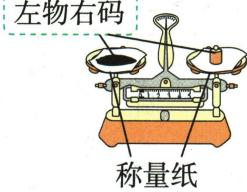

这是一幅原操作示意，不是独立考试题。

**原资料答案与解析：**

原附录仅列操作名称和示意图，没有独立答案或文字详解。下方步骤与理由由学科规范补写；不为原图编制选项或改成新题。

**展开解析（依据原详解补足理由与步骤）：**

原图托盘天平左物右码，两边称量纸应同质量，先调零。标准放置时试样质量等于砝码质量加游码示值；已知游码位置不能把右码左物错误直接当同值。图示普通固体可垫纸，易潮解或腐蚀性$NaOH$需适当玻璃器皿，扣容器质量，不能任意全用纸。电子天平则按其去皮和读数规程，不套托盘左右。

## 易错

- **用稳定或杯口大代替精度**：Q01-16 任务是较准确量取体积，烧杯的这些特点不解决刻度精度问题。
- **越大量程越好**：满足体积后还要接近目标，同类量筒并非量程越大越精确。
- **接近目标还继续倾倒**：Q09-15 应用胶头滴管小量补足，超过后不能靠读数方式补救。
- **玻璃棒一律写引流或搅拌**：按具体步骤选作用，配液溶解阶段对应搅拌。
- **只看左物右码不看药品和容器**：附录称量示意的普通固体口径不能覆盖易吸水、腐蚀性试剂。
