## 讲解

### 判据

装置中是否有长颈漏斗、导管和注射器，决定怎样形成液封或压差；判断依据需与观察位置对应。

### 流程

1. 找所有与外界相通的通道，先安排液封或夹闭，使除观察通道外的体系能形成压差。
2. 简单试管导管可用温差法，观察加热时气泡、冷却后稳定水柱。
3. 带长颈漏斗的结构可先液封，再夹闭导管注水，观察水柱能否保持。
4. 带注射器的结构按原图抽气，辨清空气从哪个通道进入而出现气泡。
5. 没变化先检查密闭条件和压差操作，不能只用“有泡/无泡”作结论。

## 例题

### 原气密性三法对照表

> 来源ID Q01-21；第一单元走进化学世界；1-50/full.md 第1003–1005行。原答案与解析定位：1-50/full.md 第991–995行；1-50/full.md 第1005–1005行。

# 2. 检查装置的气密性 14 一般在装置连接好之后，装入试剂之前

|  | 温差法 | 注水法 | 抽气法 |
| --- | --- | --- | --- |
| 图示 |  有气泡  - 冒出 形成稳定水柱 | 观察液面变化 |  |
| 操作 | 把导管的一端浸入水中,用手紧握试管,如果水中的导管口有气泡冒出,松开手一段时间后,导管中形成一小段稳定的水柱,证明装置气密性良好 | 夹紧弹簧夹,通过长颈漏斗向锥形瓶中注水至形成液封,继续加水,若在长颈漏斗中形成一段稳定的水柱,证明气密性良好 | 向锥形瓶中加入适量水形成液封,然后缓缓向外拉注射器的活塞,若看到锥形瓶中有气泡冒出,证明装置气密性良好 |

**原资料答案与解析：**

原表说明：温差法要观察加热出气泡及冷却后稳定水柱；注水法需夹闭导管、形成液封并保持稳定水柱；抽气法需先形成液封，外拉注射器时观察瓶中气泡。检查安排在连接装置之后、装入试剂之前。

**展开解析（依据原详解补足理由与步骤）：**

本组是原装置与操作对照示例。温差法先将导管口浸水，手握加热时内部空气膨胀而产生气泡；松手冷却后气压下降，水进入导管形成并保持水柱，两阶段一起支持密闭性。注水法先夹闭气体出口并形成长颈漏斗液封，继续加水产生压差，水柱持续稳定才支持密闭。抽气法先用水液封长颈漏斗下端，向外拉注射器降低瓶内气压，外界空气经漏斗进入形成气泡；看见气泡还应检查连接处及液封条件。必须先使除观察通道外的通路封闭，未形成压差时“没气泡”不能直接说漏气。

### 制二氧化碳操作图

> 来源ID Q06-11；第六单元碳和碳的氧化物；51-100/full.md 第2133–2149行。原答案与解析定位：51-100/full.md 第2104–2106行。

例2 (2024 陕西中考)实验室制取二氧化碳时,下列相关操作正确的是 ()

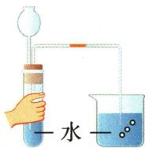

A. 检查气密性

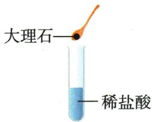

B. 装药品

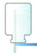

C.收集气体

D. 气体验满

**原资料答案与解析：**

例2 解析 B(×) 向试管中装药品时, 应先装固体药品, 再装液体药品, 且装块状固体药品时, 先将试管横放, 用镊子把固体放在试管口, 再将试管慢慢竖起来; C(×) 二氧化碳密度比空气大, 应该用向上排空气法收集; D(×) 二氧化碳验满的方法: 将燃着的木条放在集气瓶口, 若木条熄灭, 则说明已收集满。

答案 A

**展开解析（依据原详解补足理由与步骤）：**

选A。A封住长颈漏斗下口的液柱，手握瓶使气体受热膨胀，若导管水端冒泡并冷却后形成水柱可判断气密。B把块石灰石直接往竖直试管落易砸破，且应先固后液。C瓶倒置作向下排空气，$CO_{2}$密度大应正放并导管近瓶底，错误。D木条伸瓶内，只证明内有气体；验满应瓶口。注意此木条方法不能独立检验未知气体身份。

### 原气密性压差检查

> 来源ID Q12-10；专题一气体的制取；151-200/full.md 第847–881行。原答案与解析定位：151-200/full.md 第847–881行。

a.“试管+导管”的气密性检查:组装好仪器,导管一端放入水中,形成密闭系统,用手紧握试管,观察到水中的导管口有气泡冒出(如图1),松手后,导管中形成一段稳定的水柱(如图2),说明气密性良好。

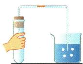  
图 1

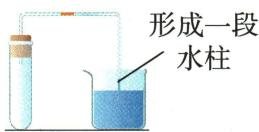  
图 2

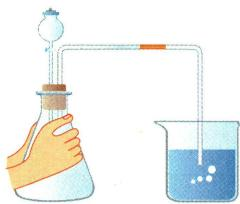  
图3

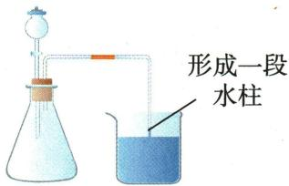  
图 4

b.“分液漏斗+锥形瓶”的气密性检查:组装好仪器,导管一端放入水中,关闭分液漏斗的活塞,形成密闭系统,用双手捂住锥形瓶(或用酒精灯隔着陶土网加热锥形瓶,加热片刻即可),观察到水中的导管口有气泡冒出(如图3),松手后,导管中形成一段稳定的水柱(如图4),说明气密性良好。

②注水法(液差法)

a.“长颈漏斗+锥形瓶”的气密性检查:组装好仪器,关闭弹簧夹,通过长颈漏斗向锥形瓶中不断注入水,直至长颈漏斗中的水面高出锥形瓶内水面,形成液面差(如图5),观察液面差稳定不变,说明气密性良好。

b. U 形管的气密性检查: 关闭 U 形管一端的弹簧夹, 在另一端注入水, 直至左右两端形成液面差(如图 6), 静置一段时间, 液面差无变化, 说明气密性良好。

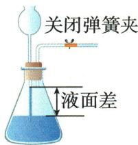  
图 5

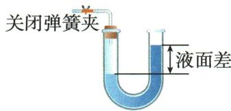  
图6

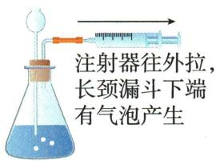  
图7

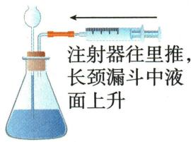  
图 8

③抽气与打气法(注射器+长颈漏斗):组装好仪器,向长颈漏斗中注水直至长颈漏斗的下端浸没在水面以下。向外抽气时,长颈漏斗下端有气泡冒出(如图7);向内打气时,长颈漏斗中液面上升,形成一段稳定的水柱(如图8),说明气密性良好。

**原资料答案与解析：**

a.“试管+导管”的气密性检查:组装好仪器,导管一端放入水中,形成密闭系统,用手紧握试管,观察到水中的导管口有气泡冒出(如图1),松手后,导管中形成一段稳定的水柱(如图2),说明气密性良好。

  
图 1

  
图 2

  
图3

  
图 4

b.“分液漏斗+锥形瓶”的气密性检查:组装好仪器,导管一端放入水中,关闭分液漏斗的活塞,形成密闭系统,用双手捂住锥形瓶(或用酒精灯隔着陶土网加热锥形瓶,加热片刻即可),观察到水中的导管口有气泡冒出(如图3),松手后,导管中形成一段稳定的水柱(如图4),说明气密性良好。

②注水法(液差法)

a.“长颈漏斗+锥形瓶”的气密性检查:组装好仪器,关闭弹簧夹,通过长颈漏斗向锥形瓶中不断注入水,直至长颈漏斗中的水面高出锥形瓶内水面,形成液面差(如图5),观察液面差稳定不变,说明气密性良好。

b. U 形管的气密性检查: 关闭 U 形管一端的弹簧夹, 在另一端注入水, 直至左右两端形成液面差(如图 6), 静置一段时间, 液面差无变化, 说明气密性良好。

  
图 5

  
图6

  
图7

  
图 8

③抽气与打气法(注射器+长颈漏斗):组装好仪器,向长颈漏斗中注水直至长颈漏斗的下端浸没在水面以下。向外抽气时,长颈漏斗下端有气泡冒出(如图7);向内打气时,长颈漏斗中液面上升,形成一段稳定的水柱(如图8),说明气密性良好。

**展开解析（依据原详解补足理由与步骤）：**

原热胀冷缩、液差、注射器方法。先封闭其他通路，制造小压差，再观察稳定水柱或液面差；仅一瞬气泡不能排所有漏。长颈漏斗下口需液封，分液漏斗活塞需合适关闭，检查应在装药反应前。

## 易错

- 出口没封仍强求水柱：检验体系没有建立。
- 查完再大幅拆装：重新连接后应再检查。
