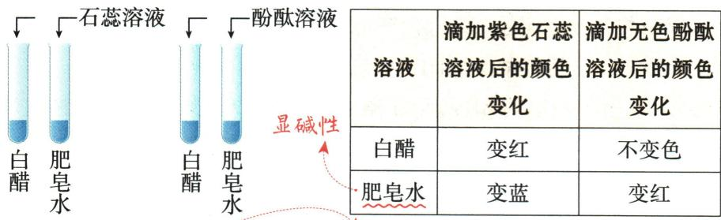
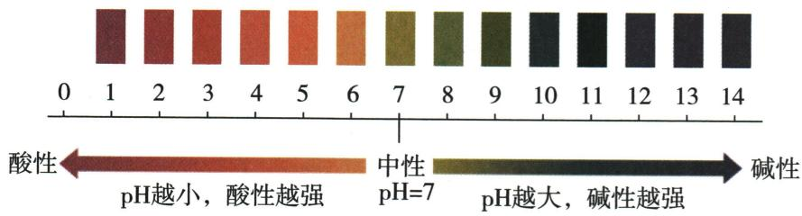
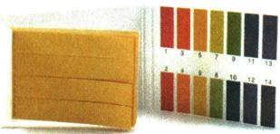
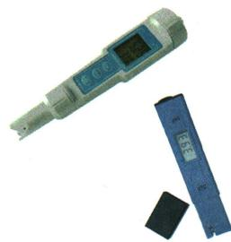
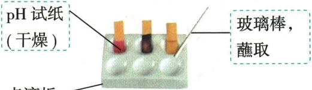

## 讲解

### 判据

问试纸操作或加水后酸碱性，先明确液体测量还是气体检验。

### 流程

取少量液，用干洁净玻璃棒点干pH纸，再及时比色。纸预湿相当稀释：酸读数趋7而偏大，碱趋7而偏小，中性按模型近不变。气体检验湿润试纸是让气体先溶解反应，不能套干纸规则。

## 例题

### 原指示剂与pH操作案例

> 来源ID Q10-22；第十单元常见的酸碱盐；101-150/full.md 第2216–2278行。原答案与解析定位：101-150/full.md 第2216–2278行。

# 知识点① 酸碱指示剂★★☆

1. 定义：能跟酸性或碱性溶液起作用而显示不同颜色的物质叫作酸碱指示剂，通常简称为指示剂。

# 2. 探究实验

3. 常用指示剂的变色情况 ①② 变色的是指示剂，而不是酸性或碱性溶液

|  | 酸性溶液 | 碱性溶液 | 中性溶液 |
| --- | --- | --- | --- |
| 紫色石蕊溶液 | 变红 | 变蓝 | 不变色(显紫色) |
| 无色酚酞溶液 | 不变色(显无色) | 变红 | 不变色(显无色) |

# 知识点 ② 溶液酸碱度的表示——pH ★★★★ ③

1. 溶液的酸碱度: 指溶液酸碱性的强弱程度, 是定量表示溶液酸碱性强弱的一种方法, 通常用 $\mathrm{pH}$ 来表示。

# 2.pH 与溶液酸碱性的关系

室温下，pH 的范围通常为 0\~14。pH 与溶液酸碱性的关系可用下图表示。

# 3.pH 的测定方法

(1) 测定溶液的 pH 通常用 pH 试纸或 pH 计, 简便方法是使用 pH 试纸。④用 pH 试纸测定 pH 的操作方法:

# (2) 注意事项

①不能直接把 pH 试纸浸入待测溶液中,否则会使待测溶液受到污染。

1 巧学妙记 指示剂变色口诀酸红碱蓝中性紫，酚酞遇碱变红色。

# ② 拓展延伸

1. 石蕊试纸有红色石蕊试纸和蓝色石蕊试纸两种。碱性溶液使红色石蕊试纸变蓝，酸性溶液使蓝色石蕊试纸变红。

2. 指示剂遇到酸性或碱性溶液变色是化学变化。

# ③ 温馨提示

酸碱指示剂只能检验溶液的酸碱性，不能精确测定溶液酸碱性的强弱程度。

# 4 实验用品

一种 pH 试纸和标准比色卡

两种 pH 计(酸度计)

# 5 温馨提示

pH 通常用来表示溶质质量分数较小的溶液的酸碱度，对于溶质质量分数较大的溶液，一般直接用 $H^{+}$ 或 $OH^{-}$ 的浓度表示。因此，pH = 0 的溶液不是酸性最强的溶液；同样，pH = 14 的溶液也不是碱性最强的溶液。

# 6 拓展延伸

厕所清洁剂中含有强酸，炉具清洁剂中含有强碱（$NaOH$）。

②测溶液的 pH 时,不能先用水将 pH 试纸润湿再进行测定,因为将待测溶液点到用水润湿后的 pH 试纸上,相当于稀释了待测溶液,会导致测得的 pH 不准确。

**原资料答案与解析：**

# 知识点① 酸碱指示剂★★☆

1. 定义：能跟酸性或碱性溶液起作用而显示不同颜色的物质叫作酸碱指示剂，通常简称为指示剂。

# 2. 探究实验

3. 常用指示剂的变色情况 ①② 变色的是指示剂，而不是酸性或碱性溶液

|  | 酸性溶液 | 碱性溶液 | 中性溶液 |
| --- | --- | --- | --- |
| 紫色石蕊溶液 | 变红 | 变蓝 | 不变色(显紫色) |
| 无色酚酞溶液 | 不变色(显无色) | 变红 | 不变色(显无色) |

# 知识点 ② 溶液酸碱度的表示——pH ★★★★ ③

1. 溶液的酸碱度: 指溶液酸碱性的强弱程度, 是定量表示溶液酸碱性强弱的一种方法, 通常用 $\mathrm{pH}$ 来表示。

# 2.pH 与溶液酸碱性的关系

室温下，pH 的范围通常为 0\~14。pH 与溶液酸碱性的关系可用下图表示。

# 3.pH 的测定方法

(1) 测定溶液的 pH 通常用 pH 试纸或 pH 计, 简便方法是使用 pH 试纸。④用 pH 试纸测定 pH 的操作方法:

# (2) 注意事项

①不能直接把 pH 试纸浸入待测溶液中,否则会使待测溶液受到污染。

1 巧学妙记 指示剂变色口诀酸红碱蓝中性紫，酚酞遇碱变红色。

# ② 拓展延伸

1. 石蕊试纸有红色石蕊试纸和蓝色石蕊试纸两种。碱性溶液使红色石蕊试纸变蓝，酸性溶液使蓝色石蕊试纸变红。

2. 指示剂遇到酸性或碱性溶液变色是化学变化。

# ③ 温馨提示

酸碱指示剂只能检验溶液的酸碱性，不能精确测定溶液酸碱性的强弱程度。

# 4 实验用品

一种 pH 试纸和标准比色卡

两种 pH 计(酸度计)

# 5 温馨提示

pH 通常用来表示溶质质量分数较小的溶液的酸碱度，对于溶质质量分数较大的溶液，一般直接用 $H^{+}$ 或 $OH^{-}$ 的浓度表示。因此，pH = 0 的溶液不是酸性最强的溶液；同样，pH = 14 的溶液也不是碱性最强的溶液。

# 6 拓展延伸

厕所清洁剂中含有强酸，炉具清洁剂中含有强碱（$NaOH$）。

②测溶液的 pH 时,不能先用水将 pH 试纸润湿再进行测定,因为将待测溶液点到用水润湿后的 pH 试纸上,相当于稀释了待测溶液,会导致测得的 pH 不准确。

**展开解析（依据原详解补足理由与步骤）：**

原定义与操作。石蕊红酸、蓝碱，紫不能细判精确pH；酚酞无色可能酸或中性，且第5原题强碱也可能无色。取少量液用洁净玻璃棒点干pH纸，对色卡；不可把纸浸瓶污染，不可先湿纸稀释待测液。通常试纸读近似整数，pH计可精测。室温常见稀水溶液以7中性，0—14是常见范围非数学绝对边界。

### 附录示意-测溶液pH

> 来源ID Q17-17；附录常见实验仪器及实验操作；1-50/full.md 第367–367行。原答案与解析定位：1-50/full.md 第367–367行。

原附录操作名称：测溶液pH。

这是一幅原操作示意，不是独立考试题。

**原资料答案与解析：**

原附录仅列操作名称和示意图，没有独立答案或文字详解。下方步骤与理由由学科规范补写；不为原图编制选项或改成新题。

**展开解析（依据原详解补足理由与步骤）：**

原图干燥pH试纸放洁净表面，洁净玻璃棒蘸取液体点到纸上，按试纸规定及时与标准色卡比较；不能把整张试纸伸原试剂瓶。预润湿会稀释所测液、可能改变读数；广泛试纸为范围读数，不拿其颜色推任意精确小数或把酸碱度与强弱分类混同。

## 易错

先交代题设条件，再沿现象和物质账推理，不以一种颜色或气泡唯一认物。
