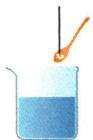
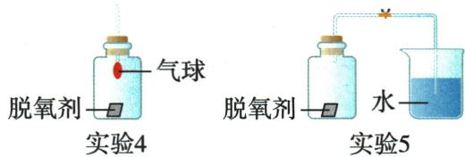
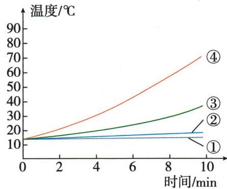

## 错法

原冰糖题把 A 与 C 比较后，想用一组更快来说明块糖与粉糖哪一个溶解快。容易这样想，是因为两组的颗粒外观最醒目；看见“块状和粉末不同”，便忽略了水温和搅拌也不同。

错误发生在**确定对照组**这一步。A 是60℃、搅拌，C 是40℃、不搅拌；即使观察到速度差异，也无法判断差异分别由哪些因素造成。观察结果可以是真的，单因素结论却没有足够依据。

同样的错误也会出现在反应速率题：同时改变浓度、温度或催化剂，再把全部差异归给浓度。后面的原题用于检验这种方法的迁移，不把化学反应速率与溶解速率当成同一知识。

## 正解

先写出要研究的因素，再给其他条件逐项打勾。研究颗粒大小时，要求糖种类和质量、水的种类和用量、水温、搅拌状态都相同，仅颗粒不同。原图中 A、B 或 D、E 才是这种组合；研究搅拌则用 A、E 或 B、D，研究温度则用 A、F 或 C、D。

答案须同时写“不能得出该结论”和具体原因：A、C 没有控制温度相同，搅拌条件也不同。只写“没有控制变量”太笼统，不能说明究竟缺哪项。

若没有一对合格的实验组，应指出现有证据不足，并提出只改变一个因素的对照安排；不能猜测哪种因素影响更大来补救。后续铁系脱氧剂和过氧化氢原题，也先按表格固定其余条件，再从对应测量结果写条件内结论。

## 例题

### 冰糖溶解快慢对照

> 来源ID Q09-01；第九单元溶液；101-150/full.md 第1270–1324行。原答案与解析定位：101-150/full.md 第1326–1328行。

例 某小组同学计划用如图所示的实验探究影响冰糖溶解快慢的因素,请回答下列问题。

块状冰糖10 g

50 mL 60 ℃ 水

A

粉末状冰糖10 g

50 mL 60 ℃ 水

B

粉末状冰糖10 g

50 mL 40 ℃ 水

C

粉末状冰糖10 g

50 mL 60 ℃ 水

D

块状冰糖10 g

50 mL 60 ℃ 水

E

块状冰糖10g

$50 \mathrm{~mL} 40^{\circ} \mathrm{C}$ 水

F

(1)根据图示的信息,你认为该组同学假设影响冰糖溶解快慢的因素有\_\_\_\_、\_\_\_\_、\_\_\_\_。

(2)若研究搅拌对冰糖溶解快慢的影响,应选择实验\_\_\_\_(填字母)与A进行对照。

(3)选择 A 和 C 同时进行实验时,小科发现 A 中冰糖溶解得快,他由此得出结论:块状冰糖比粉末状冰糖溶解得快。你认为他的结论对吗? (填“对”或“不对”)。你的理由是\_\_\_\_。

**原资料答案与解析：**

解析 (1)由实验A和E(或B和D)可探究冰糖的溶解速率与搅拌的关系;由实验A和B(或D和E)可探究冰糖的溶解速率与冰糖颗粒的大小的关系;由实验C和D(或A和F)可探究冰糖的溶解速率与温度的关系。(3)实验A和C中没有控制水的温度相同,且A中用玻璃棒搅拌而C中没有,实验变量不唯一,无法得出块状冰糖比粉末状冰糖溶解得快的结论。

答案 (1) 温度 冰糖颗粒的大小 是否搅拌 (2) E (3) 不对 没有控制水的温度相同, 且 A 搅拌, C 没有搅拌

**展开解析（依据原详解补足理由与步骤）：**

(1)温度、颗粒大小、是否搅拌。(2)E：与A同10g块糖、50mL60℃水，只有搅拌状态不同。(3)不对。A与C除块状粉末不同，还温度60/40℃不同、搅拌不同，不能将较快归颗粒一个因素。有效对照可A/B或D/E研究颗粒，A/E或B/D研究搅拌，A/F或C/D研究温度；每组依据图中条件逐项配对。

### 铁系脱氧剂成分压力和对照

> 来源ID Q16-01；专题五实验探究题；151-200/full.md 第1884–1924行。原答案与解析定位：151-200/full.md 第1926–1940行。

例1 (2024 江苏无锡中考)项目小组对铁系食品脱氧剂(又称为“双吸剂”)进行了如下探究。

# I. 探成分

某脱氧剂标签显示含有铁粉、活性炭、食盐以及无水氯化钙等。为确定脱氧剂中铁粉的存在,进行如下实验。

实验 1: 取一包脱氧剂粉末, 用磁铁吸引。观察到部分黑色粉末被吸引。

实验 2: 取实验 1 中被吸引的部分粉末放入试管中, 加入适量硫酸铜溶液。观察到有红色固体生成。

实验 3: 另取被磁铁吸引的黑色粉末, 撒向酒精灯的火焰。观察到粉末剧烈燃烧, 火星四射。

(1)写出实验2中有关反应的化学方程式：\_\_\_\_。

(2)铁粉在空气中能燃烧,而铁丝在空气中不易被点燃。原因是\_\_\_\_。

# Ⅱ.明原理

利用图 1 所示装置进行实验 4 和实验 5。

  
图 1

(3)实验4:一段时间后,观察到气球变大。气球变大的原因是\_\_\_\_。  
(4)实验5:能证明脱氧剂“脱氧”的现象是\_\_\_\_。

# Ⅲ. 悟应用

实验 6: 设计如表所示对比实验探究脱氧剂中活性炭和食盐的作用。利用温度传感器测得集气瓶中温度随时间的变化曲线如图 2 所示。

| 实验序号 | 铁粉的质量/g | 水的体积/mL | 活性炭的质量/g | $NaCl$ 的质量/g |
| --- | --- | --- | --- | --- |
| 1 | 2 | 5 | 0 | 0 |
| 2 | 2 | 5 | 0 | 0.1 |
| 3 | 2 | 5 | 0.2 | 0 |
| 4 | 2 | 5 | 0.2 | 0.1 |

  
图 2

(5)对比实验①与实验③可得到的结论是\_\_\_\_\_\_\_\_\_;对比实验③与实验④可得到的结论是\_\_\_\_\_\_\_\_。  
(6)下列叙述正确的是\_\_\_\_（填字母）。

a.铁系食品脱氧剂可吸收氧气和水  
b. 铁系食品脱氧剂使用过程中放出热量  
c. 铁系食品脱氧剂能延长食物的保存时间

**原资料答案与解析：**

解析 (1) 实验 1 中被磁铁吸引的粉末是铁粉, 实验 2 中铁与硫酸铜反应生成硫酸亚铁和铜。

(2)铁粉和铁丝的区别是与氧气的接触面积不同。铁粉与氧气的接触面积大,所以铁粉在空气中能燃烧,而铁丝在空气中不易被点燃。  
(3)实验4中脱氧剂中的铁粉消耗集气瓶中的氧气,使瓶内气压变小,外界空气进入气球,气球变大。  
(4) 实验 5 中脱氧剂中的铁粉消耗集气瓶中的氧气, 使瓶内气压减小, 打开弹簧夹后, 外界大气压使烧杯中的水倒吸。  
(5)实验①与实验③的变量为活性炭的质量,由图2可知实验③温度升高得快,说明活性炭对脱氧剂脱氧有促进作用;实验③与实验④的变量为$NaCl$的质量,实验④温度升高得快,说明活性炭和氯化钠共同作用更有利于脱氧剂脱氧。  
(6) a(√) 铁可与氧气和水共同作用, 无水氯化钙也可以吸收水, 所以铁系食品脱氧剂可吸收氧气和水; b(√) 铁系食品脱氧剂使用过程中发生缓慢氧化, 放出热量; c(√) 铁系食品脱氧剂既能吸收氧气, 防止食品腐败, 又能吸收水分, 保持食品干燥, 能延长食物的保存时间。故选 abc。

答案 (1) $\mathrm{Fe} + \mathrm{CuSO}_{4} = \mathrm{FeSO}_{4} + \mathrm{Cu}$

(2)铁粉与氧气的接触面积大(合理即可)   
(3)集气瓶内氧气被脱氧剂吸收,使瓶内气压变小   
(4) 打开弹簧夹后, 烧杯中的水倒吸  
(5)活性炭对脱氧剂脱氧有促进作用 活性炭和氯化钠共同作用更有利于脱氧剂脱氧  
(6) abc

**展开解析（依据原详解补足理由与步骤）：**

(1)$Fe+CuSO_4=FeSO_4+Cu$。被磁铁吸引和生成红铜联合支持铁粉，单独“黑色”不够。(2)铁粉表面积大，与氧气接触较充分，比铁丝易点燃；不能写铁丝完全不反应。(3)原图气球在瓶内，球内连外界。脱氧剂消耗瓶内$O_{2}$，在其余条件相应时瓶内压强降低，外界空气进气球使其膨大；不是瓶内反应产气吹球。(4)打开夹子后烧杯水进入瓶中，压力差将水推入，是脱氧证据；温度、密封等条件也需受控制。(5)①③只差0与0.2g活性炭，③曲线升温较快，支持该条件炭促进脱氧；③④固定已有活性炭，只差$NaCl$的0与0.1g，④升温更快，支持有活性炭时加$NaCl$更利于脱氧。不能仅这两组证明任意浓度均更快、任意添加量最佳，或严格定量“协同作用”机制。(6)a正确，铁系配方消耗$O_{2}$，另有吸水的无水$CaCl_{2}$；b正确，反应缓慢氧化并放热，温度曲线上升与之相符；c正确，合适包装中减氧降湿有利于延长保存。选abc。脱氧剂不是食品，材料题不能推出可食用或能使已腐败食品恢复安全。

### 固定催化剂温度比较硫酸浓度

> 来源ID Q16-04；专题五实验探究题；151-200/full.md 第2035–2045行。原答案与解析定位：151-200/full.md 第2047–2053行。

例4 (2024 山东潍坊中考节选)任务四 探究抛光过程中,稀 $\mathrm{H}_{2} \mathrm{SO}_{4}$ 浓度对 $\mathrm{H}_{2} \mathrm{O}_{2}$ 分解速率的影响

【查阅文献】 $H_{2}O_{2}$ 易分解, 分解速率与温度、 $CuSO_{4}$ (催化剂) 和稀 $H_{2}SO_{4}$ 的浓度有关。

【实验探究】探究温度和 $CuSO_{4}$ 溶液浓度一定时, 不同浓度的稀 $H_{2}SO_{4}$ 对 $H_{2}O_{2}$ 分解速率的影响。向两支试管中分别加入如下试剂(见表), 置于 $40^{\circ}C$ 水浴中, 测量各时间段生成 $O_{2}$ 的速率, 实验结果记录如下:

| 试管 | 相同试剂 | 不同试剂 | 各时间段生成 $O_{2}$ 的速率/(mL/min) / 第3 min | 各时间段生成 $O_{2}$ 的速率/(mL/min) / 第6 min | 各时间段生成 $O_{2}$ 的速率/(mL/min) / 第9 min | 各时间段生成 $O_{2}$ 的速率/(mL/min) / 第12 min |
| --- | --- | --- | --- | --- | --- | --- |
| 4 | 10 mL 30%的 $H_{2}O_{2}$ 溶液、1 mL 14%的 $CuSO_{4}$ 溶液 | 1 mL 5%的稀 $H_{2}SO_{4}$ | 3.0 | 3.5 | 3.6 | 3.6 |
| 5 | 10 mL 30%的 $H_{2}O_{2}$ 溶液、1 mL 14%的 $CuSO_{4}$ 溶液 | 1 mL 10%的稀 $H_{2}SO_{4}$ | 2.0 | 2.3 | 2.4 | 2.4 |

【得出结论】不同浓度的稀 $H_{2}SO_{4}$ 对 $H_{2}O_{2}$ 分解速率的影响是 \_\_\_\_

【反思改进】某同学认为,为了更明显地观察稀 $H_{2}SO_{4}$ 浓度对 $H_{2}O_{2}$ 分解速率的影响,还需要增加试管⑥实验,除了在 $40^{\circ}C$ 水浴中以及加入 10 mL 30% 的 $H_{2}O_{2}$ 溶液、1 mL 14% 的 $CuSO_{4}$ 溶液之外,还应该加入的试剂为 \_\_\_\_ (填用量和试剂名称)。

**原资料答案与解析：**

解析【得出结论】试管④和⑤中过氧化氢溶液、硫酸铜溶液体积相同、浓度相等, 硫酸溶液体积相同、浓度不同, 变量是硫酸溶液的浓度。硫酸溶液浓度越小, 各时间段生成氧气的速率越快, 说明不同浓度的硫酸溶液对 $\mathrm{H}_{2} \mathrm{O}_{2}$ 分解速率的影响是相同条件下, 硫酸溶液浓度越小, 过氧化氢分解速率越快。

【反思改进】变量是硫酸溶液的浓度,为了使观察更直观,可使三组实验作对比,比较硫酸溶液浓度对过氧化氢分解速率的影响,还应该加入的试剂为1 mL 15%的稀硫酸(合理即可)。

答案【得出结论】其他条件完全相同时,稀硫酸浓度越小生成氧气的速率越快,说明 $H_{2}O_{2}$ 分解速率越快

【反思改进】1 mL 15%的稀 $H_{2}SO_{4}$

**展开解析（依据原详解补足理由与步骤）：**

④⑤均为10mL30%$H_{2}O_{2}$、1mL14%$CuSO_{4}$、1mL酸、40℃水浴，只改加入的稀$H_{2}SO_{4}$浓度5%与10%。同一时段氧气速率④为3.0/3.5/3.6/3.6mL/min，⑤为2.0/2.3/2.4/2.4mL/min，均④更快，支持本实验其它条件相同且5%与10%比较时，较低酸浓度分解较快。原答案概括“越小越快”，不能推到所有浓度全部温度范围。
改进按原答案加入1mL15%稀$H_{2}SO_{4}$，与原两组保持相同总加入体积、水浴、$H_{2}O_{2}$和催化剂。该值是原题方案，不是另编变式；增一组扩大比较点，还需实际测量，不能先宣告它一定沿同规律。用单位时间$O_{2}$体积判断速率，不用最终总气量直接代替速率。
