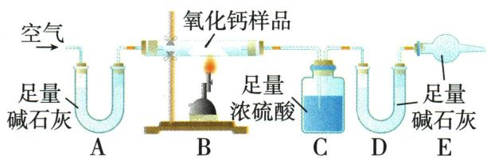

## 错法

$CaO$加水后石蕊变蓝，就宣布原样$Ca(OH)_{2}$也有；将检验改变样品的过程忽略。

## 正解

先写检验本身的反应，$CaO$已能在加水时生成$Ca(OH)_{2}$，所以原样仅$CaO$也给同现象。应改用原样加热释放水的独立证据，并排原有游离水。证据要能区分“原有”和“本次新生成”，不是观察到了就能追认原料。

## 例题

### 氧化钙变质定性与定量吸收

> 来源ID Q16-03；专题五实验探究题；151-200/full.md 第1991–2013行。原答案与解析定位：151-200/full.md 第2015–2027行。

例3 (2023 山东烟台中考)某兴趣小组在实验室发现一瓶敞口放置的氧化钙,猜测该氧化钙可能变质。小明为确定该瓶氧化钙的成分进行了实验探究,如下表所示:

| 实验步骤 | 实验现象 | 实验结论 |
| --- | --- | --- |
| 取少量该氧化钙样品于烧杯中,加水搅拌,静置,取上层清液滴加到红色石蕊试纸上 | 1烧杯壁变热,石蕊试纸变为蓝色 | 样品中含有氧化钙和氢氧化钙 |
| 取少量该氧化钙样品于烧杯中,加水搅拌,静置,取上层清液滴加到红色石蕊试纸上 | 2烧杯底部有白色固体 | 样品中含有碳酸钙 |

【交流讨论】小组讨论后,同学们认为:“现象①”不足以证明样品中有氢氧化钙,原因是\_\_\_\_(用化学方程式表示);“现象②”不足以证明样品中有碳酸钙,原因是\_\_\_\_。

兴趣小组同学为准确测定该瓶氧化钙的成分,进行了如下探究。

【提出问题】该瓶氧化钙中都有哪些成分,各成分的质量比是多少?

【查阅资料】氢氧化钙在一定温度下能分解: $\text{Ca(OH)}_2 \xlongequal{580^\circ\text{C}} \text{CaO} + \text{H}_2\text{O} \uparrow$ 。

碱石灰是氢氧化钠与氧化钙的固体混合物,能吸收水和二氧化碳。

【设计并实施实验】兴趣小组设计了如下图所示的实验(装置气密性良好)。取 10.0 g 该氧化钙样品放在 B 装置的玻璃管中,先通入一会儿空气,再称量 C、D 装置的质量。然后边通入空气,边用酒精喷灯加热(能达到 1 000 ℃ 高温),至固体不再发生变化,继续通一会儿空气。实验后测得 C 装置增重 0.9 g,D 装置增重 1.1 g。

【形成结论】该氧化钙样品中的成分是\_\_\_\_，它们的质量比是\_\_\_\_。

【反思评价】E 装置的作用是\_\_\_\_。如果没有 A 装置, 可能会导致氧化钙样品成分中的\_\_\_\_测定结果偏大。

【拓展应用】为废物利用,兴趣小组打算用这瓶变质的氧化钙与足量的稀盐酸反应,再蒸发制取产品氯化钙固体。与变质前的氧化钙相比,变质后的氧化钙对产品氯化钙的产量是否会有影响,为什么?\_\_\_\_。

**原资料答案与解析：**

解析【交流讨论】现象①:样品中若只含有氧化钙,溶于水放热,同时生成氢氧化钙,也能使石蕊试纸变蓝。现象②:氢氧化钙微溶于水,也可能在烧杯底部形成白色固体。

【形成结论】由题中信息可知，A、E装置用于吸收空气中的 $CO_{2}$ 和水蒸气，避免对实验产生干扰；C装置用于吸收反应生成的水蒸气；D装置用于吸收反应生成的 $CO_{2}$ 。根据“C装置增重0.9g”可知，反应后有水蒸气生成，则该氧化钙样品中有 $\mathrm{Ca(OH)}_{2}$ ，根据 $\mathrm{Ca(OH)}_{2}\xlongequal{580^{\circ}\mathrm{C}}\mathrm{CaO}+\mathrm{H}_{2}\mathrm{O}\uparrow$ 可求出 $\mathrm{Ca(OH)}_{2}$ 的质量为 $0.9\mathrm{g}\times\frac{74}{18}=3.7\mathrm{g}$ ；根据“D装置增重1.1g”可知，反应后有 $CO_{2}$ 生成，则该氧化钙样品中有 $CaCO_{3}$ ，根据化学方程式 $CaCO_{3}\xlongequal{\text{高温}}CaO+CO_{2}\uparrow$ 可求出 $CaCO_{3}$ 的质量为 $1.1\mathrm{g}\times\frac{100}{44}=2.5\mathrm{g}$ ；该氧化钙样品中氧化钙的质量为 $10.0\mathrm{g}-3.7\mathrm{g}-2.5\mathrm{g}=3.8\mathrm{g}$ 。故该氧化钙样品中的成分是 $CaO、Ca(OH)_{2}、CaCO_{3}$ ，它们的质量比是38:37:25。

【反思评价】如果没有 A 装置,会使进入 B 装置的空气中带有 $CO_{2}$ 和水蒸气,使 C、D 装置增加的质量偏大,导致氧化钙样品成分中的 $\mathrm{Ca(OH)}_{2}$ 、 $CaCO_{3}$ 的测定结果偏大。

答案【交流讨论】 $CaO+H_{2}O=Ca(OH)_{2}$ 氢氧化钙微溶于水

【形成结论】$CaO$、Ca(OH) $_{2}$ 、CaCO $_{3}$ 38:37:25

【反思评价】防止 D 装置吸收空气中的 $CO_{2}$ 和水蒸气, 干扰实验结果 $\mathrm{Ca(OH)}_{2}$ 、 $CaCO_{3}$

【拓展应用】无影响,变质前后瓶中固体的钙元素质量无变化,完全反应后生成氯化钙质量相等

**展开解析（依据原详解补足理由与步骤）：**

【交流】加水发生$CaO+H_2O=Ca(OH)_2$，新生成的$Ca(OH)_{2}$已能使红石蕊试纸变蓝；不能由它证明原样已有$Ca(OH)_{2}$。底部白固体也可能是未溶的微溶$Ca(OH)_{2}$，所以不能只凭残渣证明$CaCO_{3}$。
【成分计算】A碱石灰先除载气水和$CO_{2}$；B加热使原$Ca(OH)_{2}$按题给580℃分解、$CaCO_{3}$高温分解；C浓硫酸吸水，D碱石灰吸去水后的$CO_{2}$，E防外界水/$CO_{2}$进入D。需完全分解、充分吸收且原样无另含水等干扰。$Ca(OH)_2\xlongequal{580^\circ\mathrm{C}}CaO+H_2O\uparrow$，式量74∶18，设原氢氧化钙质量y，$\dfrac{y}{0.9\,\mathrm{g}}=\dfrac{74}{18}$，两侧乘0.9g，$y=0.9\,\mathrm{g}\times74/18=3.7\,\mathrm{g}$。$CaCO_3\xlongequal{\text{高温}}CaO+CO_2\uparrow$，式量100∶44，设原碳酸钙质量z，$\dfrac{z}{1.1\,\mathrm{g}}=\dfrac{100}{44}$，所以$z=1.1\,\mathrm{g}\times100/44=2.5\,\mathrm{g}$。原三组分总10.0g，原$CaO$质量$10.0-3.7-2.5=3.8\,\mathrm{g}$；按$CaO$、$Ca(OH)_{2}$、$CaCO_{3}$顺序质量比$3.8:3.7:2.5=38:37:25$。此$CaO$是原料中余量，不等于加热后全部残渣，因为另两组分分解也产$CaO$。
【评价】E防止D吸外界水$CO_{2}$；无A则载气带来的水增C、$CO_{2}$增D，把氢氧化钙和碳酸钙测大，差量$CaO$测小。先通气再称C/D是稳定并排原系统空气，不把预通气阶段带入本次增重。
【拓展】比较同一瓶变质前后、无钙物损失且盐酸足量时，Ca元素总量不变，三种钙物均每式单位供一份$CaCl_{2}$，所以产品理论量不变。空气水和$CO_{2}$能增加样品总质量，但不增加原有钙。不适用于任意取同质量变质样与新$CaO$比较。

### 原三种钙钠变质验证表

> 来源ID Q16-07；专题五实验探究题；151-200/full.md 第1987–1989行。原答案与解析定位：151-200/full.md 第1987–1989行。

主要结合常见物质,如氢氧化钠固体、氢氧化钙固体、氧化钙等的变质进行探究。针对物质变质问题提出猜想并验证时,在了解变质本质的前提下可从没有变质、部分变质、完全变质三种情况入手。

| 试剂 | 变质原因 | 成分 | 验证方法 | 评价的关键点 |
| --- | --- | --- | --- | --- |
| $NaOH$固体 | $2NaOH+CO_2=Na_2CO_3+H_2O$ | 未变质:$NaOH$ | 溶于水,滴加足量稀盐酸,无气泡产生 | 若滴加盐酸太少,即使有$Na_{2}CO_{3}$,也不会有气泡 |
| $NaOH$固体 | $2NaOH+CO_2=Na_2CO_3+H_2O$ | 部分变质:$NaOH$和$Na_{2}CO_{3}$ | 溶于水,滴加足量$BaCl_{2}$(或$CaCl_{2}$)溶液,产生白色沉淀;取上层清液于试管中,滴加酚酞溶液(或测pH),溶液变红(或pH>7) | 1.足量$BaCl_{2}$(或$CaCl_{2}$)溶液的作用:检验并除去$Na_{2}CO_{3}$。2.不能用$Ba(OH)_{2}$或$Ca(OH)_{2}$代替$BaCl_{2}$或$CaCl_{2}$,否则反应生成的$NaOH$干扰实验 |
| $NaOH$固体 | $2NaOH+CO_2=Na_2CO_3+H_2O$ | 全部变质:$Na_{2}CO_{3}$ | 溶于水,滴加足量$BaCl_{2}$(或$CaCl_{2}$)溶液,产生白色沉淀;取上层清液于试管中,滴加酚酞溶液,溶液不变色 | 1.足量$BaCl_{2}$(或$CaCl_{2}$)溶液的作用:检验并除去$Na_{2}CO_{3}$。2.不能用$Ba(OH)_{2}$或$Ca(OH)_{2}$代替$BaCl_{2}$或$CaCl_{2}$,否则反应生成的$NaOH$干扰实验 |
| $Ca(OH)_{2}$固体 | $Ca(OH)_2+CO_2=CaCO_3+H_2O$ | 未变质:$Ca(OH)_{2}$ | 溶于水,取上层清液于试管中,滴加酚酞溶液,溶液变红;取底部固体滴加足量稀盐酸,无气泡产生 | 加水没有全部溶解不能证明一定变质,因为$Ca(OH)_{2}$微溶于水 |
| $Ca(OH)_{2}$固体 | $Ca(OH)_2+CO_2=CaCO_3+H_2O$ | 部分变质:$Ca(OH)_{2}$和 $CaCO_{3}$ | 溶于水,取上层清液于试管中,滴加酚酞溶液,溶液变红;取底部固体滴加足量稀盐酸,有气泡产生 | 加水没有全部溶解不能证明一定变质,因为$Ca(OH)_{2}$微溶于水 |
| $Ca(OH)_{2}$固体 | $Ca(OH)_2+CO_2=CaCO_3+H_2O$ | 全部变质:$CaCO_{3}$ | 加水,取上层清液于试管中,滴加酚酞溶液,溶液不变色;取底部固体滴加足量稀盐酸,有气泡产生 | 加水没有全部溶解不能证明一定变质,因为$Ca(OH)_{2}$微溶于水 |
| $CaO$ | $CaO+H_2O=Ca(OH)_2$；$Ca(OH)_2+CO_2=CaCO_3+H_2O$ | $CaO$ | 根据溶于水有无放热现象,判断有无$CaO$;取底部固体滴加足量稀盐酸,根据有无气泡产生判断有无$CaCO_{3}$ | 若有$CaO$,加水后无法判断原固体有无$Ca(OH)_{2}$ |
| $CaO$ | $CaO+H_2O=Ca(OH)_2$；$Ca(OH)_2+CO_2=CaCO_3+H_2O$ | $CaO$、$Ca(OH)_{2}$ | 根据溶于水有无放热现象,判断有无$CaO$;取底部固体滴加足量稀盐酸,根据有无气泡产生判断有无$CaCO_{3}$ | 若有$CaO$,加水后无法判断原固体有无$Ca(OH)_{2}$ |
| $CaO$ | $CaO+H_2O=Ca(OH)_2$；$Ca(OH)_2+CO_2=CaCO_3+H_2O$ | $CaO$、$CaCO_{3}$ | 根据溶于水有无放热现象,判断有无$CaO$;取底部固体滴加足量稀盐酸,根据有无气泡产生判断有无$CaCO_{3}$ | 若有$CaO$,加水后无法判断原固体有无$Ca(OH)_{2}$ |
| $CaO$ | $CaO+H_2O=Ca(OH)_2$；$Ca(OH)_2+CO_2=CaCO_3+H_2O$ | $CaO$、$Ca(OH)_{2}$、$CaCO_{3}$ | 根据溶于水有无放热现象,判断有无$CaO$;取底部固体滴加足量稀盐酸,根据有无气泡产生判断有无$CaCO_{3}$ | 若有$CaO$,加水后无法判断原固体有无$Ca(OH)_{2}$ |
| $CaO$ | $CaO+H_2O=Ca(OH)_2$；$Ca(OH)_2+CO_2=CaCO_3+H_2O$ | $Ca(OH)_{2}$ | 同$Ca(OH)_{2}$固体变质成分的验证 | 若有$CaO$,加水后无法判断原固体有无$Ca(OH)_{2}$ |
| $CaO$ | $CaO+H_2O=Ca(OH)_2$；$Ca(OH)_2+CO_2=CaCO_3+H_2O$ | $Ca(OH)_{2}$、$CaCO_{3}$ | 同$Ca(OH)_{2}$固体变质成分的验证 | 若有$CaO$,加水后无法判断原固体有无$Ca(OH)_{2}$ |
| $CaO$ | $CaO+H_2O=Ca(OH)_2$；$Ca(OH)_2+CO_2=CaCO_3+H_2O$ | $CaCO_{3}$ | 同$Ca(OH)_{2}$固体变质成分的验证 | 若有$CaO$,加水后无法判断原固体有无$Ca(OH)_{2}$ |

**原资料答案与解析：**

主要结合常见物质,如氢氧化钠固体、氢氧化钙固体、氧化钙等的变质进行探究。针对物质变质问题提出猜想并验证时,在了解变质本质的前提下可从没有变质、部分变质、完全变质三种情况入手。

| 试剂 | 变质原因 | 成分 | 验证方法 | 评价的关键点 |
| --- | --- | --- | --- | --- |
| $NaOH$固体 | $2NaOH+CO_2=Na_2CO_3+H_2O$ | 未变质:$NaOH$ | 溶于水,滴加足量稀盐酸,无气泡产生 | 若滴加盐酸太少,即使有$Na_{2}CO_{3}$,也不会有气泡 |
| $NaOH$固体 | $2NaOH+CO_2=Na_2CO_3+H_2O$ | 部分变质:$NaOH$和$Na_{2}CO_{3}$ | 溶于水,滴加足量$BaCl_{2}$(或$CaCl_{2}$)溶液,产生白色沉淀;取上层清液于试管中,滴加酚酞溶液(或测pH),溶液变红(或pH>7) | 1.足量$BaCl_{2}$(或$CaCl_{2}$)溶液的作用:检验并除去$Na_{2}CO_{3}$。2.不能用$Ba(OH)_{2}$或$Ca(OH)_{2}$代替$BaCl_{2}$或$CaCl_{2}$,否则反应生成的$NaOH$干扰实验 |
| $NaOH$固体 | $2NaOH+CO_2=Na_2CO_3+H_2O$ | 全部变质:$Na_{2}CO_{3}$ | 溶于水,滴加足量$BaCl_{2}$(或$CaCl_{2}$)溶液,产生白色沉淀;取上层清液于试管中,滴加酚酞溶液,溶液不变色 | 1.足量$BaCl_{2}$(或$CaCl_{2}$)溶液的作用:检验并除去$Na_{2}CO_{3}$。2.不能用$Ba(OH)_{2}$或$Ca(OH)_{2}$代替$BaCl_{2}$或$CaCl_{2}$,否则反应生成的$NaOH$干扰实验 |
| $Ca(OH)_{2}$固体 | $Ca(OH)_2+CO_2=CaCO_3+H_2O$ | 未变质:$Ca(OH)_{2}$ | 溶于水,取上层清液于试管中,滴加酚酞溶液,溶液变红;取底部固体滴加足量稀盐酸,无气泡产生 | 加水没有全部溶解不能证明一定变质,因为$Ca(OH)_{2}$微溶于水 |
| $Ca(OH)_{2}$固体 | $Ca(OH)_2+CO_2=CaCO_3+H_2O$ | 部分变质:$Ca(OH)_{2}$和 $CaCO_{3}$ | 溶于水,取上层清液于试管中,滴加酚酞溶液,溶液变红;取底部固体滴加足量稀盐酸,有气泡产生 | 加水没有全部溶解不能证明一定变质,因为$Ca(OH)_{2}$微溶于水 |
| $Ca(OH)_{2}$固体 | $Ca(OH)_2+CO_2=CaCO_3+H_2O$ | 全部变质:$CaCO_{3}$ | 加水,取上层清液于试管中,滴加酚酞溶液,溶液不变色;取底部固体滴加足量稀盐酸,有气泡产生 | 加水没有全部溶解不能证明一定变质,因为$Ca(OH)_{2}$微溶于水 |
| $CaO$ | $CaO+H_2O=Ca(OH)_2$；$Ca(OH)_2+CO_2=CaCO_3+H_2O$ | $CaO$ | 根据溶于水有无放热现象,判断有无$CaO$;取底部固体滴加足量稀盐酸,根据有无气泡产生判断有无$CaCO_{3}$ | 若有$CaO$,加水后无法判断原固体有无$Ca(OH)_{2}$ |
| $CaO$ | $CaO+H_2O=Ca(OH)_2$；$Ca(OH)_2+CO_2=CaCO_3+H_2O$ | $CaO$、$Ca(OH)_{2}$ | 根据溶于水有无放热现象,判断有无$CaO$;取底部固体滴加足量稀盐酸,根据有无气泡产生判断有无$CaCO_{3}$ | 若有$CaO$,加水后无法判断原固体有无$Ca(OH)_{2}$ |
| $CaO$ | $CaO+H_2O=Ca(OH)_2$；$Ca(OH)_2+CO_2=CaCO_3+H_2O$ | $CaO$、$CaCO_{3}$ | 根据溶于水有无放热现象,判断有无$CaO$;取底部固体滴加足量稀盐酸,根据有无气泡产生判断有无$CaCO_{3}$ | 若有$CaO$,加水后无法判断原固体有无$Ca(OH)_{2}$ |
| $CaO$ | $CaO+H_2O=Ca(OH)_2$；$Ca(OH)_2+CO_2=CaCO_3+H_2O$ | $CaO$、$Ca(OH)_{2}$、$CaCO_{3}$ | 根据溶于水有无放热现象,判断有无$CaO$;取底部固体滴加足量稀盐酸,根据有无气泡产生判断有无$CaCO_{3}$ | 若有$CaO$,加水后无法判断原固体有无$Ca(OH)_{2}$ |
| $CaO$ | $CaO+H_2O=Ca(OH)_2$；$Ca(OH)_2+CO_2=CaCO_3+H_2O$ | $Ca(OH)_{2}$ | 同$Ca(OH)_{2}$固体变质成分的验证 | 若有$CaO$,加水后无法判断原固体有无$Ca(OH)_{2}$ |
| $CaO$ | $CaO+H_2O=Ca(OH)_2$；$Ca(OH)_2+CO_2=CaCO_3+H_2O$ | $Ca(OH)_{2}$、$CaCO_{3}$ | 同$Ca(OH)_{2}$固体变质成分的验证 | 若有$CaO$,加水后无法判断原固体有无$Ca(OH)_{2}$ |
| $CaO$ | $CaO+H_2O=Ca(OH)_2$；$Ca(OH)_2+CO_2=CaCO_3+H_2O$ | $CaCO_{3}$ | 同$Ca(OH)_{2}$固体变质成分的验证 | 若有$CaO$,加水后无法判断原固体有无$Ca(OH)_{2}$ |

**展开解析（依据原详解补足理由与步骤）：**

原表案例。$NaOH$变质生成碳酸钠，先检并除碳酸根，再用不引入$OH^{-}$的中性氯化物除杂剂后查余碱；酸加少时无气泡不能立即排$Na_{2}CO_{3}$。$Ca(OH)_{2}$微溶，白渣还需酸产$CO_{2}$证碳酸钙。$CaO$先遇水成$Ca(OH)_{2}$，加水后观察碱性不能追认原样$Ca(OH)_{2}$；用受热生水与生$CO_{2}$的独立证据才能分量判断。放热只在已排其它可放热成分的本候选模型下支持$CaO$，不是普遍唯一鉴定。
