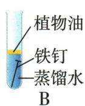

## 错法

酸除锈看见黄色仍写$FeCl_{2}$，或以生锈与铁丝燃烧都是氧化就写同产物。

## 正解

原题锈按$Fe_{2}O_{3}$成$FeCl_{3}$、黄色；基体铁与稀酸成$FeCl_{2}$、氢气。两种反应阶段不同，$Fe_{3}O_{4}$又是氧气点燃产物。

## 例题

### 铁锈条件除锈防锈

> 来源ID Q08-16；第八单元金属和金属材料；101-150/full.md 第1074–1098行。原答案与解析定位：101-150/full.md 第1051–1057行。

例2（2024 湖南中考）铁制品经常有锈蚀现象,于是某兴趣小组围绕“锈”进行一系列研究。

(1)探锈

现有洁净无锈的铁钉、经煮沸迅速冷却的蒸馏水、植物油、棉花和干燥剂氯化钙,还可以选用其他物品。为探究铁制品锈蚀的条件,设计如下实验:

①A 中玻璃仪器的名称是\_\_\_\_。

②一周后,观察 A、B、C 中的铁钉,只有 A 中的铁钉出现了明显锈蚀现象,由此得出铁钉锈蚀需要与\_\_\_\_接触的结论。

(2)除锈

取出生锈的铁钉,将其放置在稀盐酸中,一段时间后发现溶液变黄,铁钉表面有少量气泡产生。产生气泡的原因是\_\_\_\_(用化学方程式表示)。稀盐酸可用于除锈,但铁制品不可长时间浸泡其中。

(3)防锈

防止铁制品锈蚀,可以破坏其锈蚀的条件。常用的防锈方法有\_\_\_\_(写一种即可)。

兴趣小组继续通过文献研究、调研访谈,发现如何防止金属锈蚀已成为科学研究和技术领域中的重要科研课题。

**原资料答案与解析：**

例2 解析 (1) ①A 中玻璃仪器是试管; ②A 中铁钉与氧气和水同时接触, B 中铁钉只与水接触, C 中铁钉只与氧气接触, 只有 A 中的铁钉出现了明显锈蚀现象, 由此得出铁钉锈蚀需要与氧气和水接触的结论。(2) 铁锈的主要成分是氧化铁, 氧化铁和盐酸反应生成氯化铁和水, 溶液变黄; 铁锈反应完全, 铁和盐酸反应生成氯化亚铁和氢气, 产生气泡。(3) 铁与氧气和水同时接触会发生锈蚀, 防止铁制品锈蚀, 可以破坏其锈蚀的条件, 常用的防锈方法有表面刷漆、涂油等。

答案（1）①试管 ②氧气（或空气）和水

(2) $\mathrm{Fe} + 2\mathrm{HCl} = \mathrm{FeCl}_2 + \mathrm{H}_2\uparrow$

(3) 表面刷漆、涂油(或置于干燥、低温、低氧的环境中, 合理即可)

**展开解析（依据原详解补足理由与步骤）：**

(1)①试管。②A有水氧，B煮沸迅速冷却水减溶氧、油层隔空气，C干燥剂除水，两对照分别支持氧和水同时需要。(2)先铁锈按教材$Fe_{2}O_{3}$模型与酸反应，$Fe_2O_3+6HCl=2FeCl_3+3H_2O$，$Fe^{3+}$呈黄色；酸接触铁基体又$Fe+2HCl=FeCl_2+H_2\uparrow$，气泡来自氢，故不要长浸导致基体损失。(3)刷漆、涂油、干燥等破坏水/氧条件。油层不是把原有全部溶氧凭空去掉，必须先用煮沸后冷却水配合。
