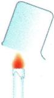
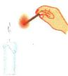

## 讲解

### 是什么

现象是直接观察和记录的表现，如放热、颜色、浑浊、气泡、水雾；结论是借助知识和检验规则从现象作出的判断。写“产生二氧化碳”已经指出物质身份，属于本书要求的结论层。

### 怎么来的

同一种现象可以有不同原因，所以需对照和检验。原蜡烛实验先用干燥烧杯观察水雾，再用石灰水验证二氧化碳，既记录看到什么，也解释它支持什么；切石蜡、浮水等不同操作分别提供不同性质证据。

### 什么时候能用

先看题目要求“现象”还是“结论”，按对应层回答。结论需指出所凭现象和已知检验条件；不能看见任意气泡就说二氧化碳，也不能由“没看到”无条件推出没有。原蜡烛实验所有操作为资料案例，不另造未知样品题。

## 例题

### 原蜡烛观察实验记录

> 来源ID Q01-20；第一单元走进化学世界；1-50/full.md 第1011–1011行。原答案与解析定位：1-50/full.md 第1011–1011行；1-50/full.md 第1013–1025行。

| 实验步骤 | 实验步骤 | 现象17 | 解释和结论 |
| --- | --- | --- | --- |
| 观察蜡烛的制作材料 | 观察蜡烛的制作材料 | 棉线作烛芯;外部为石蜡 | 蜡烛由石蜡和棉线组成 |
| 点燃前 | (1)观察蜡烛的颜色、状态、形状,闻一闻气味等 | 蜡烛是白色(或其他颜色)、柱状固体,有轻微气味 | 蜡烛多呈乳白色,呈固态,形状不固定 |
| 点燃前 | (2)用小刀从蜡烛上切下一块石蜡放入水中 | 能被小刀切开,放入水中浮在水面上,不溶于水 | 质地较软,密度比水的小,难溶于水 |
| 点燃蜡烛 | (1)用火柴点燃蜡烛,观察燃着的部分 | 发出黄色火焰,放热;火焰:外焰最亮,焰心最暗;火焰附近的石蜡熔化成液态又凝固;烛芯变黑;偶有黑烟 | 蜡烛燃烧时火焰分三层:外焰、内焰、焰心;燃烧放热,使未燃烧的石蜡受热熔化,冷却又凝固;不充分燃烧生成炭黑,炭黑来不及燃烧,冒黑烟 |
| 点燃蜡烛 | (2)取一个干燥的烧杯,罩在火焰上方 | 烧杯内壁有水雾产生雾是小液滴在空气中扩散产生的现象 | 蜡烛燃烧生成了水和二氧化碳,反应的文字表达式:石蜡+氧气 $\xrightarrow{\text{点燃}}$ 水+二氧化碳 |
| 点燃蜡烛 | (3)取另一个用澄清石灰水润湿内壁的烧杯,罩在火焰上方 | 澄清石灰水变浑浊 | 蜡烛燃烧生成了水和二氧化碳,反应的文字表达式:石蜡+氧气 $\xrightarrow{\text{点燃}}$ 水+二氧化碳 |
| 点蜡烛刚熄灭时产生的白烟 | (1)将蜡烛熄灭 | 冒白烟 $\xrightarrow{\text{烟是固体小颗粒}}$ 在空气中扩散产生的现象 | 蜡烛的燃烧实为气态石蜡燃烧,熄灭时尚未燃烧的气态石蜡因冷却降温转化为液态,进而转化为固态小颗粒,呈白烟状 |
| 点蜡烛刚熄灭时产生的白烟 | (2)用火柴迅速点蜡烛刚熄灭时产生的白烟 | 白烟燃烧,从而使蜡烛重新燃烧 | 石蜡的固体小颗粒(白烟)具有可燃性 |
| 蜡烛熄灭后 | 观察其颜色、长度等与点燃前相比的变化 | 熄灭的蜡烛颜色不变,长度变短 | 被点燃的蜡烛发生化学变化,转化为水和二氧化碳,所以蜡烛的长度变短 |

**原资料答案与解析：**

原表结论：蜡烛由石蜡和棉线组成；石蜡质地较软，密度比水的小，难溶于水；燃烧生成了水和二氧化碳；熄灭时的白烟能被点燃使蜡烛重新燃烧。原详表与原现象措辞完整保存在本来源的证据CSV中。

**展开解析（依据原详解补足理由与步骤）：**

本组是原资料完整实验记录，不是额外自编试题。切开石蜡及其浮水、不溶于水，支持质软、密度小于水、难溶于水；不是只由“浮”便推出一切物理性质。烧杯先干燥，再罩火焰，水雾提供生成水的证据；另一个烧杯先用澄清石灰水润湿，变浑浊提供二氧化碳证据，两次操作用途不同。石蜡先熔化、汽化，再由石蜡蒸气燃烧；熄灭白烟中含可燃的微小石蜡颗粒并伴有蒸气，及时点燃可使蜡烛复燃。原表“外焰最亮”不作统一温度判据，亮度不等于温度；加热用外焰依据原书燃烧充分的解释。烟雾为可见分散小颗粒/液滴，水蒸气本身不可直接看见。原表格全文保存在证据CSV，正文只保留原记录并逐项解释。[英国皇家化学会蜡烛讲解](https://edu.rsc.org/feature/the-chemistry-of-candles/3007566.article)也说明燃烧的是蜡蒸气，熄灭后可燃云团还能点燃。

## 易错

- “生成二氧化碳”当可直接看到：需检验支持。
- 只列现象不解释结论依据：把两层连起来。
