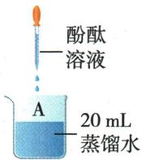
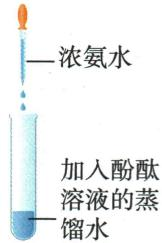
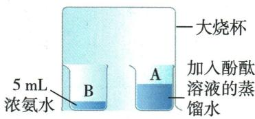

## 讲解

### 是什么

酚酞在水中无色，氨水使其变红；不接触的两烧杯罩住后，酚酞一侧变红。

### 怎么来的

水与酚酞对照排除“水本身导致红色”；加入氨水的对照确认变色响应。两杯不接触却变色，联系氨水挥发，支持氨分子移动到另一侧。

### 什么时候能用

变色只作为氨到达的间接证据，不能说看到单个氨分子。另杯不变色不等于微粒停止运动；避免未设对照就把变色归因空气或酚酞挥发。

## 例题

### 原氨分子运动实验案例

> 来源ID Q03-16；第三单元物质构成的奥秘；1-50/full.md 第2088–2088行。原答案与解析定位：1-50/full.md 第2088–2092行。

| 实验图示 |  |  |  |
| --- | --- | --- | --- |
| 实验现象 | 无明显现象 | 溶液由无色变为红色 | 烧杯A中溶液由无色变为红色,烧杯B中溶液颜色无变化 |
| 实验分析 | 水不能使酚酞溶液变红 | 氨水能使酚酞溶液变红 | 浓氨水具有挥发性6,挥发出的氨分子运动到烧杯A中与水结合成氨水,氨水使酚酞溶液变红 |
| 实验结论 | 氨分子在不断运动 烧杯A中物质不具有挥发性,但分子也在不断运动 | 氨分子在不断运动 烧杯A中物质不具有挥发性,但分子也在不断运动 | 氨分子在不断运动 烧杯A中物质不具有挥发性,但分子也在不断运动 |

**原资料答案与解析：**

| 实验图示 |  |  |  |
| --- | --- | --- | --- |
| 实验现象 | 无明显现象 | 溶液由无色变为红色 | 烧杯A中溶液由无色变为红色,烧杯B中溶液颜色无变化 |
| 实验分析 | 水不能使酚酞溶液变红 | 氨水能使酚酞溶液变红 | 浓氨水具有挥发性6,挥发出的氨分子运动到烧杯A中与水结合成氨水,氨水使酚酞溶液变红 |
| 实验结论 | 氨分子在不断运动 烧杯A中物质不具有挥发性,但分子也在不断运动 | 氨分子在不断运动 烧杯A中物质不具有挥发性,但分子也在不断运动 | 氨分子在不断运动 烧杯A中物质不具有挥发性,但分子也在不断运动 |

(2)装置改进:氨气有刺激性气味,容器敞口会污染空气,故常将实验装置进行以下改进。

改进装置的优点:节约试剂,减少环境污染。

**展开解析（依据原详解补足理由与步骤）：**

这是原实验表格，不是新编题。水加酚酞无明显变化作为对照，氨水使酚酞变红；罩在大烧杯下、互不接触的氨水与酚酞溶液中，酚酞一侧变红，说明氨从氨水逸出并运动过去。不能说酚酞分子“移走颜色”，也不能由另侧不变色推出那里粒子不动。不直接接触是排除液体混合的条件，密闭改进减少有刺激性气体逸散。

## 易错

定义须保留条件，电子、质子和物质种类不能互相代替。
