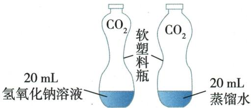
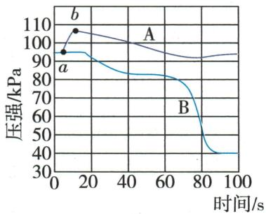

## 讲解

### 判据

$CO_{2}$与$NaOH$表面无明显现象，可测气压、体积或找新$Na_{2}CO_{3}$。

### 流程

先设同量水空白排$CO_{2}$溶解；密闭同气量、液量、温度比较压力。另取反应液检碳酸根，起始碱需检空白排原有碳酸盐。用不同溶剂使生成物析出也是题给证据；每条方法说明其他原因是否排除。

## 例题

### 二氧化碳碱反应三路证据

> 来源ID Q10-03；第十单元常见的酸碱盐；101-150/full.md 第2611–2634行。原答案与解析定位：101-150/full.md 第2636–2642行。

例1 (2024 山东临沂中考)同学们在整理归纳碱的化学性质时,发现氢氧化钠和二氧化碳反应无明显现象,于是进行了如下实验探究。

【提出问题】如何证明氢氧化钠和二氧化碳发生了反应？

【进行实验】探究实验 I: 分别向两个充满二氧化碳的软塑料瓶中加入 20 mL 氢氧化钠溶液和蒸馏水, 振荡, 使其充分反应, 现象如图 1、图 2, 证明氢氧化钠与二氧化碳发生了化学反应。设计图 2 实验的目的是 \_\_\_\_。

  
图1 图2

探究实验Ⅱ:取图1实验反应后的少量溶液于试管中,加入\_\_\_\_,现象为\_\_\_\_,再次证明二者发生了反应。

探究实验Ⅲ: [查阅资料]20 ℃时, $\mathrm{{NaOH}}\text{、}{\mathrm{{Na}}}_{2}{\mathrm{{CO}}}_{3}$ 在水和乙醇中的溶解性如表所示:

| 溶质/溶剂 | 水 | 乙醇 |
| --- | --- | --- |
| $NaOH$ | 溶 | 溶 |
| $Na_{2}CO_{3}$ | 溶 | 不 |

[设计方案]20 ℃时,兴趣小组进行了如下实验:

实验现象:装置 A 中出现白色沉淀,装置 B 中无明显现象。装置 A 中出现白色沉淀的原因是\_\_\_\_。

【反思评价】(1)写出氢氧化钠和二氧化碳反应的化学方程式：\_\_\_\_。

(2)对于无明显现象的化学反应,一般可以从反应物的减少或新物质的生成等角度进行分析。

**原资料答案与解析：**

解析【进行实验】探究实验Ⅰ:二氧化碳和氢氧化钠反应,塑料瓶内气体减少,压强减小,塑料瓶变瘪。二氧化碳溶于水,塑料瓶也会变瘪,为了排除二氧化碳溶于水使塑料瓶变瘪,设计图2作对比实验,通过图1的塑料瓶比图2变瘪程度大,证明二氧化碳和氢氧化钠发生了反应。探究实验Ⅱ:二氧化碳和氢氧化钠反应生成碳酸钠和水,可验证碳酸钠的生成,证明反应的发生。取图1实验反应后的少量溶液于试管中,加入过量的稀盐酸,碳酸钠和盐酸反应生成氯化钠、水、二氧化碳,若能观察到有气泡产生,再次证明二者发生了反应。探究实验Ⅲ:装置A中,二氧化碳和氢氧化钠反应生成碳酸钠和水,碳酸钠不溶于乙醇,故出现白色沉淀。

答案【进行实验】探究实验Ⅰ:作对比实验 探究实验Ⅱ:过量的稀盐酸 有气泡产生

探究实验Ⅲ:生成的碳酸钠不溶于乙醇

【反思评价】(1) $CO_{2}+2NaOH=Na_{2}CO_{3}+H_{2}O$

**展开解析（依据原详解补足理由与步骤）：**

实验Ⅰ水瓶作空白，排除仅溶于水就使瓶瘪的解释；同温同瓶同$CO_{2}$同20mL，碱瓶更瘪支持额外消耗。Ⅱ加入过量稀盐酸，有气泡：$Na_2CO_3+2HCl=2NaCl+CO_2\uparrow+H_2O$，过量保证先耗余$NaOH$后还能与碳酸盐反应。实际还应排除起始$NaOH$已有碳酸盐。Ⅲ按题给20℃溶解表，新$Na_{2}CO_{3}$不溶乙醇，A出白色沉淀；B无明显现象说明通入后未检出足以浑浊的$CO_{2}$，不能把“无明显”说成任何气体都没有。反应$CO_2+2NaOH=Na_2CO_3+H_2O$。反应物减少与产物形成是两条互相支持的证据。

### 二氧化碳压强数字实验

> 来源ID Q10-10；第十单元常见的酸碱盐；101-150/full.md 第2810–2821行。原答案与解析定位：101-150/full.md 第2827–2829行。

例4 (2024 山东菏泽中考)某兴趣小组利用图 1 装置, 对“$CO_{2}$ 和 $NaOH$ 溶液是否反应”进行数字化实验再探究。实验 1: 在盛满 $CO_{2}$ 的烧瓶中滴加 80 mL 蒸馏水; 实验 2: 在同样的烧瓶中滴加 80 mL $NaOH$ 溶液。实验得到如图 2 所示曲线。下列说法不正确的是 ( )

  
图1

  
图 2

A.由实验1得到的图像是A曲线  
B.A 曲线中 ab 段上升是因为加液体使烧瓶内 $CO_{2}$ 分子数增多  
C.该实验能证明 $\mathrm{CO}_{2}$ 与 $\mathrm{NaOH}$ 溶液发生了反应  
D. 通过此实验说明, 利用数字化实验可以实现对化学反应由定性到定量的研究

**原资料答案与解析：**

例4 解析 A(√)$CO_{2}$能溶于水,且能与$NaOH$溶液反应,这两种情况均会使容器内压强减小,而且反应消耗的$CO_{2}$越多,压强减小得越多,故图2中A曲线表示的是实验1;B(×)A曲线中ab段上升是因为注入水后将$CO_{2}$气体压缩导致压强增大,$CO_{2}$的分子数目并未增多;C(√)该实验通过对比注入相同体积的水和$NaOH$溶液后瓶内气体的压强改变不同,可以证明$CO_{2}$能与$NaOH$溶液反应;D(√)数字化实验能使无现象的实验变得可视化,且有明确的数据显示,实现由定性到定量的研究。

答案 B

**展开解析（依据原详解补足理由与步骤）：**

选不正确B。A水仅部分溶解吸收，终压比$NaOH$高，对；B加液压缩气相空间，使压强初升，未增加$CO_{2}$分子数，错；C同样80mL、同瓶及气体条件，碱终压明显更低支持额外反应消耗，对；D连续数值使定性现象可量化记录，对，但要用压强算具体反应物量还需体积、温度等条件，图本身不支持任意定量计算。

## 易错

先交代题设条件，再沿现象和物质账推理，不以一种颜色或气泡唯一认物。
