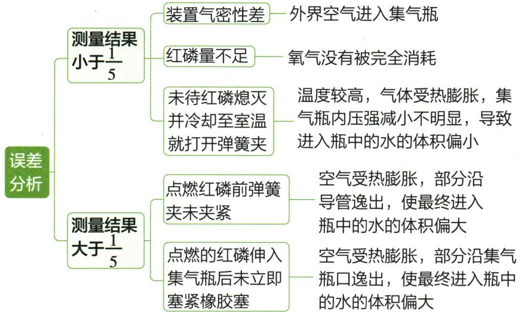

## 讲解

### 判据

测得比例偏离1/5时，先问进水体积增减和原因。

### 流程

按“氧气是否耗尽→气体是否漏入或逸出→温度是否恢复→读数是否包括原有液体”检查。磷不足和外界漏气会使应有体积减少量不足；未冷却有热膨胀干扰。先解释方向再报偏大偏小。

## 例题

### 原红磷测氧实验案例

> 来源ID Q02-16；第二单元空气和氧气；1-50/full.md 第1278–1286；1290–1294；1338–1355行。原答案与解析定位：1-50/full.md 第1280–1286行；1-50/full.md 第1342–1355行。

(2)实验原理:红磷+氧气 $\xrightarrow{\text{点燃}}$ 五氧化二磷。利用红磷燃烧消耗氧气,生成五氧化二磷固体,使集气瓶内压强减小,集气瓶内外产生压强差。在大气压作用下,烧杯中的水被压入集气瓶中,进入集气瓶内水的体积即为减小的氧气的体积。

试剂的选用原则 利用燃烧法测定空气中氧气的含量时(烧杯和集气瓶中装的都是水),选择的反应物应具备以下条件:②

1.该试剂本身的状态不是气体,且能够在空气中燃烧。  
2.该试剂在空气中燃烧时只能消耗 $O_{2}$ ，而不能消耗其他气体。  
3.该试剂在空气中燃烧时生成固体,而不能生成气体(若生成气体,要做相应的装置改进,使其完全被吸收)。

保证气密性良好

①连接仪器,检查装置的气密性；  
②在集气瓶内加入少量水③,将水面上方空间分为5等份,并做好标记;③用弹簧夹夹紧乳胶管,在燃烧匙内放入足量的红磷,用酒精灯加热,点燃红磷后立即伸入集气瓶中,并塞紧橡胶塞,观察现象。  
④待红磷熄灭并冷却至室温,打开弹簧夹,观察实验现象及水面的变化情况。

# (4) 实验现象

五氧化二磷固体扩散到空气中

①红磷燃烧,产生大量白烟并放出大量的热。  
②红磷熄灭并冷却至室温以后,打开弹簧夹,烧杯中的水沿导管进入集气瓶,瓶内液面上升至1个等份的标记附近。

(5)实验结论:空气中氧气的体积约占空气总体积的1/5。④

(6)误差分析

粗略测定，可利用数字化实验精确测定

(7) 实验反思(实验成功的关键)

①红磷要足量,保证完全消耗装置内空气中的氧气。②装置的气密性必须良好,不能漏气。③必须冷却至室温后再打开弹簧夹。④点燃的红磷要迅速伸入集气瓶并塞紧橡胶塞。

**原资料答案与解析：**

(2)实验原理:红磷+氧气 $\xrightarrow{\text{点燃}}$ 五氧化二磷。利用红磷燃烧消耗氧气,生成五氧化二磷固体,使集气瓶内压强减小,集气瓶内外产生压强差。在大气压作用下,烧杯中的水被压入集气瓶中,进入集气瓶内水的体积即为减小的氧气的体积。

试剂的选用原则 利用燃烧法测定空气中氧气的含量时(烧杯和集气瓶中装的都是水),选择的反应物应具备以下条件:②

1.该试剂本身的状态不是气体,且能够在空气中燃烧。  
2.该试剂在空气中燃烧时只能消耗 $O_{2}$ ，而不能消耗其他气体。  
3.该试剂在空气中燃烧时生成固体,而不能生成气体(若生成气体,要做相应的装置改进,使其完全被吸收)。

①红磷燃烧,产生大量白烟并放出大量的热。  
②红磷熄灭并冷却至室温以后,打开弹簧夹,烧杯中的水沿导管进入集气瓶,瓶内液面上升至1个等份的标记附近。

(5)实验结论:空气中氧气的体积约占空气总体积的1/5。④

(6)误差分析

粗略测定，可利用数字化实验精确测定

(7) 实验反思(实验成功的关键)

①红磷要足量,保证完全消耗装置内空气中的氧气。②装置的气密性必须良好,不能漏气。③必须冷却至室温后再打开弹簧夹。④点燃的红磷要迅速伸入集气瓶并塞紧橡胶塞。

**展开解析（依据原详解补足理由与步骤）：**

这是原实验说明与误差图，不是独立考试题。先检查气密性，再给足量红磷，封闭后燃烧消耗氧气；产物是固体，不补充气体。待温度回到初始室温再打开夹子，外界压强把水压入，进入水体积近似等于消耗氧气体积。分母是瓶内初始气体空间，不包括预先的水。漏气或磷不足时缺少应有的气体减少，结果偏小；过早开夹时热气膨胀，水进得少也偏小；燃烧前未夹紧或塞瓶慢导致原空气逸出，可能偏大。红磷熄灭不等于氧气严格为零，是在此实验精度下近似耗尽。铁丝在普通空气中不易持续燃烧、镁还会消耗其他气体、炭或硫补充气体，因此均不能直接替换标准水封红磷实验。

## 易错

不能只记答案字母；条件、分母、仪器位置改变时重新判断。
