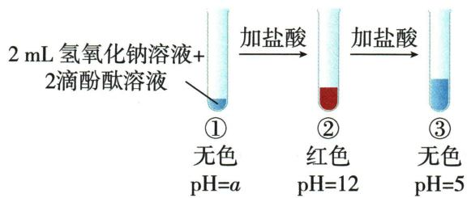
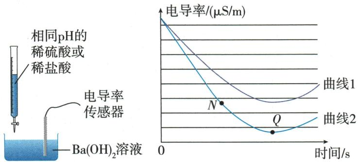
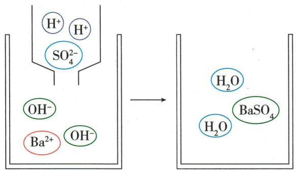
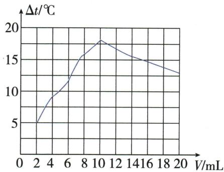

## 讲解

### 判据

反应无直观沉淀或气泡时，温度或导电变化可用，但须先检查物理影响。

### 流程

中和温升用稀酸稀碱并设混合空白，排浓酸稀释/固碱溶解热；温峰受散热不总精确终点。电导下降看自由离子减少与稀释，生成难溶$BaSO_{4}$更少离子，而生成可溶$BaCl_{2}$仍导电；不把蒸馏水灯不亮称零离子。

## 例题

### 中和可视化与高pH酚酞

> 来源ID Q10-05；第十单元常见的酸碱盐；101-150/full.md 第2662–2682行。原答案与解析定位：101-150/full.md 第2684–2690行。

例3 (2024 辽宁中考节选)为实现氢氧化钠溶液和盐酸反应现象的可视化,某兴趣小组设计如下实验。

【监测温度】(1)在稀氢氧化钠溶液和稀盐酸反应过程中,温度传感器监测到溶液温度升高,说明该反应\_\_\_\_(填“吸热”或“放热”),化学方程式为\_\_\_\_。

【观察颜色】(2)在试管中加入 2 mL 某浓度的氢氧化钠溶液,滴入 2 滴酚酞溶液作\_\_\_\_剂,再逐滴加入盐酸,振荡,该过程中溶液的颜色和 pH 记录如下图所示。

(3)在①中未观察到预期的红色,为探明原因,小组同学查阅到酚酞变色范围如下:

0<pH<8.2 时呈无色, ${8.2} \leq  \mathrm{{pH}} \leq  {13}$ 时呈红色,pH>13 时呈无色。

据此推断,①中 a 的取值范围是\_\_\_\_(填标号)。

A. $0 < a < 8.2$

B. $8.2 \leqslant a \leqslant 13$

C. $a > 13$

(4)一段时间后,重复(2)实验,观察到滴加盐酸的过程中有少量气泡生成,原因是\_\_\_\_。

**原资料答案与解析：**

解析（1）溶液温度升高，说明该反应是放热反应；氢氧化钠和盐酸反应生成氯化钠和水。

(2)酚酞溶液通常被用作指示剂。  
(3)结合实验图和酚酞变色范围,可知a的取值范围应大于13。  
(4)氢氧化钠变质产生的碳酸钠和盐酸反应产生二氧化碳,有少量气泡生成。

答案 (1) 放热 $\mathrm{HCl} + \mathrm{NaOH} = \mathrm{NaCl} + \mathrm{H}_{2} \mathrm{O}$ (2) 指示 (3) C (4) 氢氧化钠变质(或盐酸与碳酸钠发生反应)

**展开解析（依据原详解补足理由与步骤）：**

(1)放热，$HCl+NaOH=NaCl+H_2O$。(2)指示剂。(3)选C。题明确pH>13时也无色，①是尚未加酸的$NaOH$，随后加酸降到12反而红，因此a>13。A虽无色但酸性不符原液且加酸不会升到12；B区间应红，不符①无色；C唯一吻合。(4)久置吸收$CO_{2}$生成$Na_{2}CO_{3}$，再遇酸产气：$2NaOH+CO_2=Na_2CO_3+H_2O$，$Na_2CO_3+2HCl=2NaCl+CO_2\uparrow+H_2O$。不能把“无色”独自当中性或酸性证据。

### 酸共性差异与电导率

> 来源ID Q10-09；第十单元常见的酸碱盐；101-150/full.md 第2787–2806行。原答案与解析定位：101-150/full.md 第2759–2759行；101-150/full.md 第2823–2825行。

例3（2024山东潍坊中考）“宏观—微观—符号”是化学独特的表示物质及其变化的方法。某兴趣小组对盐酸和硫酸的共性和差异性进行以下研究。回答下列问题。

(1) 向稀盐酸和稀硫酸中分别滴加石蕊试液, 试液变红, 说明两种酸溶液中均存在 \_\_\_\_ (填微粒符号)。

(2)将表面生锈的铁钉(铁锈的主要成分为 $Fe_{2}O_{3}$ ) 投入到足量稀硫酸中, 铁锈脱落、溶解, 溶液变黄, 化学方程式为 \_\_\_\_; 铁钉表面产生气泡, 该气体为 \_\_\_\_; 一段时间后, 溶液慢慢变为黄绿色, 图1是对溶液变为黄绿色的一种微观解释, 参加反应的微粒是 \_\_\_\_ (填微粒符号)。

  
图1

(3) 分别向两份相同的 $\mathrm{Ba(OH)}_{2}$ 溶液中匀速滴加相同 pH 的稀盐酸和稀硫酸, 观察现象并绘制溶液电导率随时间变化曲线 (图 2) (电导率能衡量溶液导电能力大小,相同条件下,单位体积溶液中的离子总数越多,电导率越大)。

  
图 2

①图2中曲线1表示向 $\mathrm{Ba(OH)_2}$ 溶液中滴加\_\_\_\_；曲线2反应中的实验现象为\_\_\_\_；结合图3解释电导率Q点小于N点的原因\_\_\_\_。

  
图 3

②该实验说明,不同的酸中,由于\_\_\_\_不同,酸的性质也表现出差异。

**原资料答案与解析：**

例3 解析 (1) 石蕊试液变红, 说明两种酸溶液中均存在相同的阳离子即氢离子。(2) 铁锈脱落、溶解, 溶液变黄, 是由于氧化铁与硫酸反应生成硫酸铁和水; 铁钉表面产生气泡是由于裸露出来的铁与稀硫酸反应生成硫酸亚铁和氢气; 由图1可知, 铁与硫酸铁反应的微观实质是铁原子与铁离子反应生成亚铁离子。(3) ①稀硫酸与氢氧化钡反应生成硫酸钡沉淀和水, 当二者恰好完全反应时, 溶液中基本不存在自由移动的阴、阳离子, 此时电导率接近0; 而稀盐酸与氢氧化钡反应生成氯化钡和水, 反应过程无沉淀生成, 当二者恰好完全反应时, 溶液中离子浓度最小, 但此时电导率不会为0, 即滴加稀硫酸的溶液电导率的最小值小于滴加稀盐酸的溶液电导率的最小值, 结合图2可知,

曲线1表示向 $\mathrm{Ba(OH)_2}$ 溶液中滴加稀盐酸，曲线2表示向 $\mathrm{Ba(OH)_2}$ 溶液中滴加稀硫酸；曲线2反应中的实验现象为产生白色沉淀； $Q$ 点时稀硫酸与 $\mathrm{Ba(OH)_2}$ 恰好完全反应，溶液中离子浓度小于 $N$ 点。②不同的酸中，酸根（离子）不同，酸的性质不同。

答案 (1) $\mathrm{H}^{+}$ (2) $\mathrm{Fe}_{2} \mathrm{O}_{3} + 3 \mathrm{H}_{2} \mathrm{SO}_{4} = \mathrm{Fe}_{2} (\mathrm{SO}_{4})_{3} + 3 \mathrm{H}_{2} \mathrm{O}$ 氢气（或 $\mathrm{H}_{2}$ ） $\mathrm{Fe}, \mathrm{Fe}^{3+}$ (3) ①稀盐酸产生白色沉淀钡离子和硫酸根离子结合生成硫酸钡沉淀，氢离子和氢氧根离子结合生成水，硫酸钡、水几乎都不导电， $Q$ 点溶液中离子总数小于 $N$ 点 ②酸根（或酸根离子）

**展开解析（依据原详解补足理由与步骤）：**

(1)$H^{+}$。(2)$Fe_2O_3+3H_2SO_4=Fe_2(SO_4)_3+3H_2O$，黄来自$Fe^{3+}$。酸继续遇铁产H₂：$Fe+H_2SO_4=FeSO_4+H_2\uparrow$。图1另一过程$Fe+2Fe^{3+}\longrightarrow3Fe^{2+}$，参与Fe、$Fe^{3+}$，硫酸根前后保留；不是铁把硫酸根变成亚铁。(3)曲线1盐酸：$2HCl+Ba(OH)_2=BaCl_2+2H_2O$，可溶$BaCl_{2}$仍提供离子。曲线2硫酸出现白色$BaSO_{4}$；Q点$H^{+}$与$OH^{-}$成水、$Ba^{2+}$与$SO_4^{2-}$成沉淀，留液自由离子少于N，电导较低但不宣称绝对零。实际离子种类、迁移率、温度也影响电导，题给为可比条件模型。(4)酸根不同，产生沉淀等特性不同。

### 中和温升数据四选项

> 来源ID Q10-11；第十单元常见的酸碱盐；151-200/full.md 第7–19行。原答案与解析定位：151-200/full.md 第1–3行。

例5 (2024 山西中考)室温下,向一定体积 10% 的氢氧化钠溶液中滴加 10% 的盐酸,测得溶液温度变化与加入盐酸体积的关系如下( $\Delta t$ 为溶液实时温度与初始温度差),其中表述正确的是()

| 盐酸体积V/mL | 2 | 4 | 6 | 8 | 10 | 12 | 14 | 16 | 18 | 20 |
| --- | --- | --- | --- | --- | --- | --- | --- | --- | --- | --- |
| 溶液温度变化Δt/°C | 5.2 | 9.6 | 12.0 | 16.0 | 18.2 | 16.7 | 15.7 | 14.7 | 13.7 | 12.9 |

A.滴加盐酸的全过程中,持续发生反应并放出热量

B.滴加盐酸的过程中,溶液的碱性逐渐增强

C. 滴加盐酸的全过程中,氯化钠的溶解度逐渐增大

D. 反应过程中, 氢氧化钠在混合溶液中的浓度逐渐减小

**原资料答案与解析：**

例5 解析 A(×) 根据图示可知, 当加入盐酸的量为 2 mL 至 10 mL 时, 溶液温度升高, 发生反应并放出热量; 当加入盐酸的量大于 10 mL 小于或等于 20 mL 时, 盐酸过量, 溶液的温度下降, 没有发生化学反应。B(×) 盐酸和氢氧化钠反应生成氯化钠和水, 滴加盐酸的过程中, 氢氧化钠不断被消耗, 溶液的碱性逐渐减弱。C(×) 盐酸和氢氧化钠反应过程中放出热量, 溶液的温度升高, 完全反应后, 溶液温度下降, 滴加盐酸的全过程中, 氯化钠的溶解度先逐渐增大后逐渐减小。D(√) 滴加盐酸的过程中, 氢氧化钠不断被消耗, 氢氧化钠在混合溶液中的浓度逐渐减小。

答案 D

**展开解析（依据原详解补足理由与步骤）：**

选D。A10mL附近温升达峰后降，碱已耗尽后再滴酸不再持续中和，错；B碱不断消耗且被稀释，碱性减弱而非增强，错；C温度先升后降，$NaCl$溶解度在本温区随温度先增后减，不能说全过程只增；D碱质量不断减且液总量增，其质量分数减，正确。散热、稀释热等实际会影响最高温的位置；按本题测得数据与初中模型将峰值作中和终点近似，不将任何真实峰都当精确等量点。

### 原酸碱导电实验

> 来源ID Q10-25；第十单元常见的酸碱盐；101-150/full.md 第2477–2483行。原答案与解析定位：101-150/full.md 第2477–2483行。

| 待测液 | 稀盐酸 | 稀硫酸 | 蒸馏水 | 乙醇 |
| --- | --- | --- | --- | --- |
| 灯泡是否亮 | 亮 | 亮 | 不亮 | 不亮 |
| 结论 | 导电 | 导电 | 不导电 | 不导电 |
| 分析 | 溶于水能产生自由移动的离子9,通电后阴、阳离子定向移动形成电流 | 溶于水能产生自由移动的离子9,通电后阴、阳离子定向移动形成电流 | 没有产生自由移动的离子 | 没有产生自由移动的离子 |

(2)酸具有相似化学性质的原因:酸在水中都能解离出 $H^{+}$ 和酸根离子, 即在不同酸的溶液中都含有 $H^{+}$ , 所以, 酸有一些相似的化学性质。

# 知识点 ③ 常见的碱★★☆

1. 碱的定义：碱是指在水中解离出的阴离子全部是 $OH^{-}$ 的化合物。

**原资料答案与解析：**

| 待测液 | 稀盐酸 | 稀硫酸 | 蒸馏水 | 乙醇 |
| --- | --- | --- | --- | --- |
| 灯泡是否亮 | 亮 | 亮 | 不亮 | 不亮 |
| 结论 | 导电 | 导电 | 不导电 | 不导电 |
| 分析 | 溶于水能产生自由移动的离子9,通电后阴、阳离子定向移动形成电流 | 溶于水能产生自由移动的离子9,通电后阴、阳离子定向移动形成电流 | 没有产生自由移动的离子 | 没有产生自由移动的离子 |

(2)酸具有相似化学性质的原因:酸在水中都能解离出 $H^{+}$ 和酸根离子, 即在不同酸的溶液中都含有 $H^{+}$ , 所以, 酸有一些相似的化学性质。

# 知识点 ③ 常见的碱★★☆

1. 碱的定义：碱是指在水中解离出的阴离子全部是 $OH^{-}$ 的化合物。

**展开解析（依据原详解补足理由与步骤）：**

原电路案例。酸和可溶碱溶液有可自由移动离子，能导电；蒸馏水与乙醇在该灯泡装置未见发光，只说明导电太弱，蒸馏水并非绝对没有离子。灯不亮还需排电路问题，不能由有无发光判断纯净混合分类。

## 易错

先交代题设条件，再沿现象和物质账推理，不以一种颜色或气泡唯一认物。
