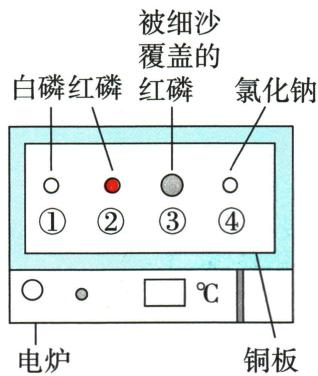
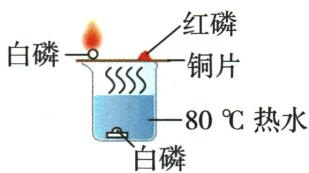
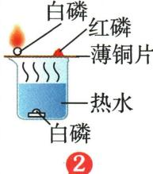
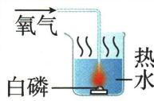

## 讲解

### 判据

两处燃烧现象不同，先列物质、实际温度与供氧状态。

### 流程

查原料是否可燃；确认温度相同并分别比较着火点；探究氧条件宜同种可燃物同温，只改供氧。不同材料对照需题给着火点解释。读传感器曲线的终平台判断氧仍有但不足，阈值只归此实验。

## 例题

### 电炉探究燃烧条件

> 来源ID Q07-01；第七单元能源的合理利用与开发；51-100/full.md 第2362–2369行。原答案与解析定位：51-100/full.md 第2371–2373行。

例 为探究燃烧的条件,利用可调节温度的电炉设计如图所示装置进行实验。已知白磷的着火点是 $40^{\circ} \mathrm{C}$ ,红磷的着火点是 $260^{\circ} \mathrm{C}$ ,氯化钠不是可燃物。下列说法错误的是 ( )

A. 当温度为 $60^{\circ}$ C 时, 只有①处白磷燃烧  
B.为控制变量,①②③④处所取白磷、红磷、氯化钠的质量应相等  
C. 当温度为 $260^{\circ}$ C 时, ②处红磷燃烧、③处红磷不燃烧, 说明燃烧需要氧气  
D. 当温度升至 $500^{\circ}$ C 时, ④处氯化钠可能燃烧

**原资料答案与解析：**

解析 A(√)60 ℃ 只达到了白磷的着火点,氯化钠不属于可燃物,故只有①处白磷燃烧;B(√)根据控制变量的原则,该实验中①②③④处所取白磷、红磷、氯化钠的质量应相等;C(√)260 ℃ 达到了红磷的着火点,②处红磷接触氧气燃烧,③处红磷被细沙覆盖,隔绝了氧气,不能燃烧,说明燃烧需要氧气;D(×)氯化钠不属于可燃物,故当温度升至 500 ℃ 时,④处氯化钠不可能燃烧。

答案 D

**展开解析（依据原详解补足理由与步骤）：**

选错误项D。A60℃高于白磷40℃却低于红磷260℃，①有空气，③又被沙隔空气，④不可燃，所以只有①烧。B同质量有利于控制实验用量，原题说法正确；但质量相等不能代替温度与供氧一致。C260℃时②达着火点并接触氧气，③虽温度足够却隔空气，对照支持氧气条件。D氯化钠不是本题可燃物，升温到500℃也不能让它按此模型燃烧。没有哪个单一条件可以代替其余条件。

### 生火有道跨段探究

> 来源ID Q07-02；第七单元能源的合理利用与开发；51-100/full.md 第2387–2415；另接101-150/full.md 第3–18行行。原答案与解析定位：51-100/full.md 第2419–2433行；101-150/full.md 第1–1行。

例1（2024 山东青岛中考节选）化学反应需要一定的条件,控制条件可以调控化学反应。“启航”小组以“调控化学反应”为主题展开探究，请回答下列问题。

# 【生火有道】

(1) 观察生活: 小组同学观察到天然气、木炭能燃烧, 而水和石头不能燃烧, 得出燃烧的条件之一是 \_\_\_\_。

实验探究:为继续探究燃烧的条件,小组同学设计并完成了图1所示实验。

已知:白磷着火点 $40^{\circ}$ C, 红磷着火点 $260^{\circ}$ C。磷燃烧时产生污染空气的五氧化二磷白烟。

  
图1

# 【现象与结论】

(2)①铜片上的白磷燃烧,红磷不燃烧,得出燃烧的条件之一是\_\_\_\_。

②小红根据\_\_\_\_现象,得出燃烧的条件之一是可燃物与氧气接触。

# 【评价与反思】

(3)①实验中小组同学认为图1装置存在不足,于是设计了图2所示装置。图2装置的优点为\_\_\_\_。

②小明对小红的结论提出疑问,设计了图3

所示装置,对燃烧过程中的氧气含量进行测定,得到图4所示图像。

  
图 2

  
图 3

  
图 4

结合图像分析,“可燃物与氧气接触”应准确地表述为\_\_\_\_。

【应用有方】

(5)通过探究,小组同学认识到,生活中也可以通过控制条件促进或抑制化学反应。

①用天然气做饭,发现炉火火焰呈黄色,锅底出现黑色物质,这时需要\_\_\_\_(填“调大”或“调小”)灶具的进风口。  
②炒菜时如果油锅着火,可采取的灭火措施是

(写一条即可)。

**原资料答案与解析：**

例1 解析 (1) 燃烧的条件之一是可燃物, 天然气、木炭具有可燃性, 而水和石头不具有可燃性。

(2) ①铜片上的白磷和红磷都属于可燃物, 且都与氧气接触, 白磷燃烧, 红磷不燃烧, 得出燃烧的条件之一是温度达到可燃物的着火点。

②铜片上的白磷和水中的白磷属于同一种物质, 着火点相同, 铜片上的白磷燃烧, 而热水中的白磷不燃烧, 得出燃烧的条件之一是可燃物与氧气接触。

(3) ①图2装置在密闭环境中进行实验, 不会污染环境, 装置的优点为环保。

②由图3和图4可知, 当氧气浓度小于10%时, 白磷不再燃烧, 应准确地表述为可燃物与足够浓度的氧气接触。

(5) ①黑色物质为不完全燃烧生成的炭黑, 说明氧气不充足, 需要调大灶具进风口, 使燃烧更充分。

②油锅着火, 应用锅盖盖灭, 隔绝空气, 从而灭火。

答案 (1) 可燃物 (2) ① 温度达到可燃物的着火点 ② 铜片上的白磷燃烧, 而热水中的白磷不燃烧

(3)①环保 ②可燃物与足够浓度的氧气接触 (5)①调大 ②用锅盖盖灭(合理即可)

**展开解析（依据原详解补足理由与步骤）：**

(1)可燃物。(2)①铜片白磷燃烧而红磷不燃，二者都接触空气、温度相近，但80℃只达到白磷着火点，说明温度要达到对应着火点。②铜片与水中同种白磷都达着火点，但前者接触空气、后者被水隔开，现象支持氧气条件。(3)①封闭图2减少白烟逸散，较环保，仍须规范装置防热压风险。②图4降到约10%后不再下降而白磷已熄灭，表明不是有一点氧就一定持续燃烧，要足够浓度；这里10%只对应此装置条件，不能作为通用安全阈值。(5)①调大进风口提高空气供应，针对题述正常灶具的不完全燃烧情境；实际设备故障应由成人专业处理。②锅盖隔绝空气，不能向热油浇水。若有蔓延立即撤离报警，不由学生操作明火。

### 原磷燃烧条件案例

> 来源ID Q07-09；第七单元能源的合理利用与开发；51-100/full.md 第2223–2227行。原答案与解析定位：51-100/full.md 第2223–2227行。

2. 燃烧条件的探究. 采用控制变量法

| 实验图示 | 现象 | 分析 | 结论 |
| --- | --- | --- | --- |
|  | 铜片上的白磷燃烧 | 温度达到了白磷的着火点 | 可燃物燃烧需要与氧气接触且温度达到其着火点 |
|  | 铜片上的红磷不燃烧 | 温度未达到红磷的着火点 | 可燃物燃烧需要与氧气接触且温度达到其着火点 |
|  | 热水中的白磷不燃烧 | 热水中的白磷未与空气(或氧气)接触 | 可燃物燃烧需要与氧气接触且温度达到其着火点 |
|  | 通入少量氧气后,热水中的白磷燃烧 | 热水中的白磷与氧气接触,且温度达到了白磷的着火点 | 可燃物燃烧需要与氧气接触且温度达到其着火点 |

特别说明 白磷燃烧生成的白烟(五氧化二磷)有毒,逸散到空气中会危害人体健康,所以本实验需在通风橱或排风设备下进行,也可将实验改在封闭容器中进行,如图所示。

**原资料答案与解析：**

2. 燃烧条件的探究. 采用控制变量法

| 实验图示 | 现象 | 分析 | 结论 |
| --- | --- | --- | --- |
|  | 铜片上的白磷燃烧 | 温度达到了白磷的着火点 | 可燃物燃烧需要与氧气接触且温度达到其着火点 |
|  | 铜片上的红磷不燃烧 | 温度未达到红磷的着火点 | 可燃物燃烧需要与氧气接触且温度达到其着火点 |
|  | 热水中的白磷不燃烧 | 热水中的白磷未与空气(或氧气)接触 | 可燃物燃烧需要与氧气接触且温度达到其着火点 |
|  | 通入少量氧气后,热水中的白磷燃烧 | 热水中的白磷与氧气接触,且温度达到了白磷的着火点 | 可燃物燃烧需要与氧气接触且温度达到其着火点 |

特别说明 白磷燃烧生成的白烟(五氧化二磷)有毒,逸散到空气中会危害人体健康,所以本实验需在通风橱或排风设备下进行,也可将实验改在封闭容器中进行,如图所示。

**展开解析（依据原详解补足理由与步骤）：**

这是原知识表案例。铜片白磷与铜片红磷比较温度是否达到各自着火点；同种白磷在水中与铜片比较供氧；水中白磷通氧后烧再支持氧必要。热水提供热并隔空气，铜片导热。不同物质对照存在结构差别，结论应结合已知着火点，不能只凭任意两个不同物质一个燃一个不燃就定温度原因。磷实验须学校规范防白烟，不在家庭复现。

## 易错

控制变量不是只把质量相等；安全适用范围先核对。
