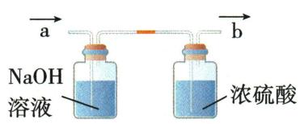
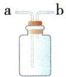
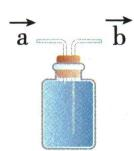
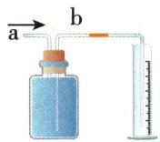
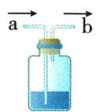
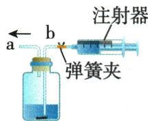
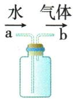
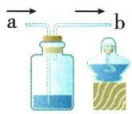

## 错法

见洗气学过长进短出便给排水集气和轻气空瓶也选长进。

## 正解

用途决定物理过程。洗气需入液，排水需在上方积气并从长管排水；轻气空瓶从上方短入。原C a短b长，$O_{2}$由b入而在a验满，字母不可套。

## 例题

### 四装置制气集气与尿素

> 来源ID Q12-01；专题一气体的制取；151-200/full.md 第999–1016行。原答案与解析定位：151-200/full.md 第1018–1028行。

例1 (2024 江苏宿迁中考)化学实践小组利用以下装置完成部分气体的相关实验,请你参与。

  
A

  
B

  
C

  
D

(1)实验室用稀盐酸和块状石灰石反应制取二氧化碳的化学方程式是\_\_\_\_。其发生装置可选用装置A或B,与装置B相比,装置A具有的优点是\_\_\_\_。  
(2)若选用装置 B 和 C 制取并收集氧气,证明氧气已收集满的操作和现象是\_\_\_\_。  
(3)常温常压下,氨气是一种无色、有刺激性气味,极易溶于水,密度比空气小的气体。实验室常用氯化铵和熟石灰两种固体混合物共热的方法制取氨气。若选用装置D测定产生氨气的体积,水面需加一层植物油,其目的是\_\_\_\_。  
(4)二氧化碳和氨气在一定条件下可以合成尿素[化学式为 $\mathrm{CO(NH_{2})_{2}}$ ]，同时生成水。该反应的化学方程式是 \_\_\_\_。

**原资料答案与解析：**

解析（1）石灰石的主要成分碳酸钙和盐酸反应生成氯化钙、二氧化碳和水；装置 A 可以控制反应的发生与停止；

(2)氧气密度比空气的大,故集气时,气体长进短出,通过观察出气端口带火星的木条复燃,说明氧气已集满;  
(3) 氨气极易溶于水, 加植物油防止氨气溶于水;  
(4)二氧化碳和氨气在一定条件下反应生成尿素和水,写出化学方程式并配平。

答案（1） $\mathrm{CaCO_3 + 2HCl = CaCl_2 + H_2O + CO_2\uparrow}$ 可以控制反应的发生与停止

(2) 将带火星的木条放在 a 端, 木条复燃, 说明已收集满氧气  
(3)防止氨气溶于水   
(4) $\mathrm{CO}_{2} + 2\mathrm{NH}_{3}\xlongequal{\text{一定条件}}\mathrm{CO(NH_{2})_{2} + H_{2}O}$

**展开解析（依据原详解补足理由与步骤）：**

(1)$CaCO_3+2HCl=CaCl_2+H_2O+CO_2\uparrow$。A多孔隔板支撑块固体，夹闭后气压使酸退回与固体分离可停；B分液漏斗可控滴速，停止滴加却未必让原酸与固体分离，A优势发生停止。(2)C图a短b长，氧密度大应b长进、a短出；在a出气口放带火星木条复燃验满。不是盲记a一定进。(3)D气从短管接油面上，水从长管排量筒。油隔$NH_{3}$与水减溶解，量排水近似气体体积；还需检查漏气、温度压差，不说油可完全消除所有溶解误差。(4)$CO_2+2NH_3\xlongequal{\text{一定条件}}CO(NH_2)_2+H_2O$。由右$N_{2}$取左2$NH_{3}$，右H4+水H2合6，左6，C1/$O_{2}$两边守恒。

### 原多功能瓶七用途

> 来源ID Q12-09；专题一气体的制取；151-200/full.md 第946–997行。原答案与解析定位：151-200/full.md 第946–997行。

# 1. 洗气(除杂)

操作: 洗气瓶内装有吸收杂质的液体, 混合气体从长管进、短管出(即长进短出)。如除去 $CO$ 中混有的 $CO_{2}$ 和水蒸气, 应先通过 $NaOH$ 溶液, 再通过浓硫酸, 混合气体从 a 端进, 两次洗气后 $CO$ 从 b 端出(如图 1)。

  
图1

  
图2

  
图3

  
图4

# 2.集气(贮气)

(1) 排空气法收集气体: 收集密度比空气大的气体 (如 $O_{2}$ 、 $CO_{2}$ 等), 气体从 a 端通入, 空气从 b 端导出, 即长进短出; 收集密度比空气小的气体 (如 $H_{2}$ 等), 气体从 b 端通入, 空气从 a 端导出, 即短进长出 (如图 2)。  
(2) 排水法收集气体: 瓶中盛满水, 气体从 a 端进, 水从 b 端出, 即短进长出 (如图 3)。

# 3.量气

操作:瓶内先装满水,气体(不溶于水,也不与水反应)从a端进入集气瓶,水从b端进入右侧量筒(即短进长出),通过读取进入量筒内水的体积从而得到生成气体的体积(如图4)。

# 4.检验气体

瓶内装有检验某气体所需试剂,检验时必须要有明显现象。气体流向:a 进 b 出,即长进短出(如图 5)。

  
图5

  
图6

  
图7

  
图8

# 5. 制取气体

操作:瓶内装入固体试剂,塞紧橡胶塞,推动注射器活塞,液体从b端流入后立即夹紧弹簧夹,产生的气体从a端导出(如图6)。如制取 $O_{2}$ 或 $CO_{2}$ 。

# 6. 使用气体

若利用“多功能瓶”中贮存的气体进行实验,需将瓶内气体(不溶于水,也不与水反应)排出,应从a端注水,水流入瓶内后使气体由b端排出(如图7)。

# 7. 安全瓶

点燃可燃气体时,瓶内装少量水,将被点燃的气体与发生装置产生的气体分隔开,气体从a端进,从b端出,即长进短出,并在b管口处点燃气体(如图8)。

**原资料答案与解析：**

# 1. 洗气(除杂)

操作: 洗气瓶内装有吸收杂质的液体, 混合气体从长管进、短管出(即长进短出)。如除去 $CO$ 中混有的 $CO_{2}$ 和水蒸气, 应先通过 $NaOH$ 溶液, 再通过浓硫酸, 混合气体从 a 端进, 两次洗气后 $CO$ 从 b 端出(如图 1)。

  
图1

  
图2

  
图3

  
图4

# 2.集气(贮气)

(1) 排空气法收集气体: 收集密度比空气大的气体 (如 $O_{2}$ 、 $CO_{2}$ 等), 气体从 a 端通入, 空气从 b 端导出, 即长进短出; 收集密度比空气小的气体 (如 $H_{2}$ 等), 气体从 b 端通入, 空气从 a 端导出, 即短进长出 (如图 2)。  
(2) 排水法收集气体: 瓶中盛满水, 气体从 a 端进, 水从 b 端出, 即短进长出 (如图 3)。

# 3.量气

操作:瓶内先装满水,气体(不溶于水,也不与水反应)从a端进入集气瓶,水从b端进入右侧量筒(即短进长出),通过读取进入量筒内水的体积从而得到生成气体的体积(如图4)。

# 4.检验气体

瓶内装有检验某气体所需试剂,检验时必须要有明显现象。气体流向:a 进 b 出,即长进短出(如图 5)。

  
图5

  
图6

  
图7

  
图8

# 5. 制取气体

操作:瓶内装入固体试剂,塞紧橡胶塞,推动注射器活塞,液体从b端流入后立即夹紧弹簧夹,产生的气体从a端导出(如图6)。如制取 $O_{2}$ 或 $CO_{2}$ 。

# 6. 使用气体

若利用“多功能瓶”中贮存的气体进行实验,需将瓶内气体(不溶于水,也不与水反应)排出,应从a端注水,水流入瓶内后使气体由b端排出(如图7)。

# 7. 安全瓶

点燃可燃气体时,瓶内装少量水,将被点燃的气体与发生装置产生的气体分隔开,气体从a端进,从b端出,即长进短出,并在b管口处点燃气体(如图8)。

**展开解析（依据原详解补足理由与步骤）：**

同一长短管瓶按内装物和目标决定：液洗/检气长入短出；空瓶集重气长入，集轻气短入；装满水排水集气短入长排水；量排水同样短入长出至量筒。排出原存气从长管入水、短管出气。制气与安全瓶另依图液路，字母a/b未必固定长短；安全瓶不是不验纯仍能防一切爆炸。
