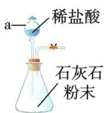
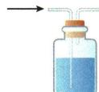

## 讲解

### 是什么

稀盐酸制得$CO_{2}$可能夹带$HCl$和水蒸气；净化和干燥分别处理对应杂质。

### 怎么来的

先过饱和$NaHCO_{3}$溶液去$HCl$，产生的气体仍是$CO_{2}$；再过浓硫酸吸水。洗气长进短出让气体与液体接触，若倒接便可能直接旁路或把液体推出。

### 什么时候能用

不能用$NaOH$洗$CO_{2}$主气，也不能用会与$CO_{2}$反应的碱性干燥剂。先干燥再过水溶液又湿润，顺序目标未达到。干燥剂选择依所有气体兼容性，不是只凭“能吸水”。

## 例题

### 制取净化纸花综合

> 来源ID Q06-12；第六单元碳和碳的氧化物；51-100/full.md 第2151–2180行。原答案与解析定位：51-100/full.md 第2108–2111行。

例3 (2024 江苏苏州中考)实验室用下图所示装置制取 $\mathrm{CO}_{2}$ 气体, 并进行相关性质研究。

  
A

  
B

  
C

已知: $CO_{2}$ 与饱和 $NaHCO_{3}$ 溶液不发生反应。

(1)仪器 a 的名称是\_\_\_\_。

(2) 连接装置 A、B, 向锥形瓶内逐滴加入稀盐酸。

①锥形瓶内发生反应的化学方程式为\_\_\_\_。  
②若装置 B 内盛放饱和 $NaHCO_{3}$ 溶液, 其作用是 \_\_\_\_。  
(3)若装置 B 用来干燥 $CO$ $_{2}$ ,装置 B 中应盛放的试剂是\_\_\_\_。

(3)将纯净干燥的 $\mathrm{CO}_{2}$ 缓慢通入装置 C, 观察到现象:

a.玻璃管内的干燥纸花始终未变色；  
b.塑料瓶内的下方纸花先变红色,上方纸花后变红色。

①根据上述现象,得出关于 $CO_{2}$ 性质的结论是 \_\_\_\_、\_\_\_\_。  
②将变红的石蕊纸花取出,加热一段时间,纸花重新变成紫色,原因是\_\_\_\_(用化学方程式表示)。

(4) 将 $\mathrm{CO}_{2}$ 通入澄清石灰水, 生成白色沉淀, 该过程参加反应的离子有 \_\_\_\_ (填离子符号)。

**原资料答案与解析：**

例3 解析（2）② $NaHCO_{3}$ 与 $CO_{2}$ 不反应，与 $HCl$ 反应生成氯化钠、水和二氧化碳，饱和 $NaHCO_{3}$ 溶液能除去 $CO_{2}$ 中混有的 $HCl$。③ 浓硫酸具有吸水性，与二氧化碳不反应，可干燥二氧化碳。(3)② 加热变红的石蕊纸花，纸花重新变成紫色，说明碳酸受热分解。(4)二氧化碳与氢氧化钙反应的化学方程式为 $\mathrm{CO}_{2} + \mathrm{Ca(OH)}_{2} = \mathrm{CaCO}_{3} \downarrow + \mathrm{H}_{2}\mathrm{O}$ 。根据化学方程式可知，该过程参加反应的离子有钙离子和氢氧根离子。

答案（1）分液漏斗 （2）① $CaCO_{3}$ + 2$HCl$=CaCl $_{2}$ +$CO$ $_{2}$ ↑+H $_{2}$ O ②除去 $CO$ $_{2}$ 中混有的 $HCl$ ③浓硫酸 （3）①$CO$ $_{2}$ 与水反应生成酸性物质 $CO$ $_{2}$ 密度比空气大 ②H $_{2}$ $CO$ $_{3}$ =△
$CO$ $_{2}$ ↑+H $_{2}$ O （4）Ca $^{2+}$ 、OH $^{-}$

**展开解析（依据原详解补足理由与步骤）：**

(1)a为分液漏斗，可控制滴液。(2)①$CaCO_3+2HCl=CaCl_2+CO_2\uparrow+H_2O$；Ca、C各1，Cl2，H2，两侧O3，式平衡。②B饱和$NaHCO_{3}$去挥发$HCl$，$NaHCO_3+HCl=NaCl+H_2O+CO_2\uparrow$，不损本题$CO_{2}$。③浓硫酸吸水且本题不与$CO_{2}$反应，适合干燥；气体从长管入使其接触液体。原题此小项被OCR另标(3)，含义按原答案③说明。(3)①干花不变、湿花变红证明水参与形成酸性物质；下湿花先红说明$CO_{2}$密度比空气大。②$H_2CO_3\xlongequal{\triangle}CO_2\uparrow+H_2O$，酸性物质分解，纸花恢复紫色。(4)溶液里参与反应的离子$Ca^{2+}$、$OH^{-}$；$CO_{2}$作为气体也参与，只是题问的是离子。不要写本来尚未生成的$CO_3^{2-}$作加入前离子。

## 易错

把实验条件、主要气体与杂质、化学变化与物理利用分清。
