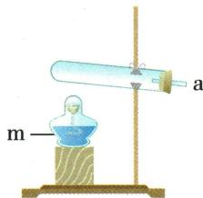
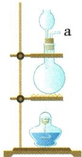
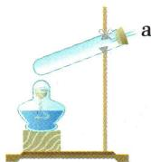
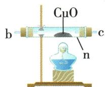
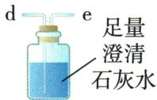
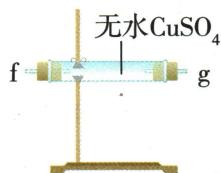
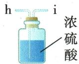
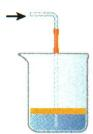
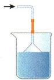

## 讲解

### 是什么

尾气处理减少有毒污染或可燃气外逸；防倒吸避免吸液回到热器或反应器，两者不能互替。

### 怎么来的

极易溶气迅速溶解使局部压降，倒扣漏斗/隔离层等可缓解；$CO$难溶水不能只通水。收集袋隔离气体，后续仍需处理，合规燃烧将$CO$转$CO_{2}$则需排空气等条件。

### 什么时候能用

气球容量有限，不当作大量废气设施；安全瓶不取消验纯与控压。本文原学校图仅解释原理，不供学生自行搭有毒气实验。

## 例题

### 草酸分解产物串联装置

> 来源ID Q12-02；专题一气体的制取；151-200/full.md 第1034–1066行。原答案与解析定位：151-200/full.md 第1068–1075行。

例2 (2024 山东济宁中考)已知草酸( $\mathrm{H_{2}C_{2}O_{4}}$ )常温下为固体,熔点为189.5℃,具有还原性,常用作染料还原剂;加热易分解,反应的化学方程式为 $\mathrm{H_{2}C_{2}O_{4}} \xlongequal{\triangle} \mathrm{CO} \uparrow + \mathrm{CO_{2}} \uparrow + \mathrm{H_{2}O}$ 。某化学研究性小组为验证分解产物进行实验,用到的仪器装置如图所示(组装实验装置时可重复选择仪器)。

【实验装置】

  
A $_{1}$

  
$A_{2}$

  
A $_{3}$

  
B

  
C

  
D

  
E

请回答：

(1)仪器 m 的名称是\_\_\_\_, 仪器 n 的名称是\_\_\_\_;  
(2)加热分解草酸的装置需选用\_\_\_\_（填“A $_{1}$ ”“A $_{2}$ ”或“A $_{3}$ ”）；实验前，按接口连接顺序a-\_\_\_\_-de（从左到右填写接口字母）组装实验装置；  
(3) B 装置中出现\_\_\_\_现象可证明产物中有 $CO$ 生成;  
(4)写出 C 装置中发生反应的化学方程式: \_\_\_\_；  
(5) D 装置中出现 \_\_\_\_ 现象可证明产物中有 $H_{2}O$ 生成;  
(6)该小组交流讨论后,得出该装置存在一定缺陷,需在最后的 e 接口连接一瘪的气球,其作用是\_\_\_\_。

**原资料答案与解析：**

解析 (2) 草酸熔点为 $189.5^{\circ} \mathrm{C}$ , 熔点较低, 加热分解时, 熔化成液体, 为防止液体流出, 选用 $\mathrm{A}_{3}$ 装置。草酸分解产生一氧化碳、水和二氧化碳, 先用 D 装置中无水硫酸铜检验水, 再用 C 装置检验二氧化碳, 用 E 装置对气体进行干燥, 接着用 B、C 装置验证一氧化碳; 其中 C、E 装置中气体都是“长进短出”, 接口顺序为 a-fg(gf)-de-hi-bc(cb)-de。

(3) B装置中一氧化碳与氧化铜反应生成铜和二氧化碳, 黑色固体变成红色, 说明生成了 $\mathrm{CO}$ 。  
(4) C 装置中二氧化碳与石灰水中的氢氧化钙反应生成碳酸钙和水。  
(5)水能使无色硫酸铜变蓝,D装置中白色粉末变蓝,说明生成水。  
(6)实验时排放的尾气中含有一氧化碳,一氧化碳有毒,会污染空气,连接气球,对尾气进行收集,防止污染空气。

答案 (1) 酒精灯 硬质玻璃管 (2) $\mathrm{A}_{3} \quad \mathrm{fg(gf)} - \mathrm{de-hi-bc(cb)}$ (3) 黑色固体变成红色 (4) $\mathrm{CO}_{2} + \mathrm{Ca(OH)}_{2} = \mathrm{CaCO}_{3} \downarrow + \mathrm{H}_{2} \mathrm{O}$ (5) 白色粉末变蓝 (6) 收集一氧化碳, 防止污染空气

**展开解析（依据原详解补足理由与步骤）：**

(1)m酒精灯、n硬质玻璃管。(2)草酸189.5℃先可熔液，再加热分解，选A₃口上倾防流出；A₁口下倾不合此熔液条件、A₂有分液漏斗不是原固体草酸加热需要。顺序a→f/g→g/f→d→e→h→i→b/c→c/b→d→e，D和B可左右互换，C/E洗气必须长进短出。D先白无水$CuSO_{4}$检原水，首C足量石灰水检并充分除原$CO_{2}$，E浓硫酸干燥，B热$CuO$遇$CO$变红，尾C检新$CO_{2}$。原首C明确足量，须保证$CO_{2}$已充分去除，尾C才能支持新生。(3)黑变红支持$CO$还原$CuO$，在题给产物候选$CO$/$CO_{2}$/$H_{2}O$中排其他还原性候选，不把此颜色对所有未知气唯一认$CO$。(4)$CO_2+Ca(OH)_2=CaCO_3\downarrow+H_2O$。(5)白粉变蓝证水，原解“无色硫酸铜”应白色无水固体。(6)末端气球收未反应$CO$，收集后还需安全处理，不等于袋装即消毒；先通气排空气再热$CuO$、停热后续通至冷却，防爆与氧化。

### 原尾气装置案例

> 来源ID Q12-08；专题一气体的制取；151-200/full.md 第915–932行。原答案与解析定位：151-200/full.md 第915–932行。

有毒和有污染的尾气必须适当处理。常用装置如下图所示：

  
A

  
B

  
C

  
D

(1)装置 A 中下层液体与尾气不反应,且尾气不溶于该液体;上层液体(与下层液体不互溶)能溶解尾气或与尾气发生反应,这样不易引起倒吸。  
(2)装置 B 用于收集少量气体然后进行处理,如可用于多余的 $CO$ 的收集。  
(3)装置 C 用于吸收极易溶解的气体,如 $NH_{3}$ 等。这种装置可以增大气体与吸收液的接触面积,有利于吸收液对气体的吸收,同时由于漏斗容积较大,可有效防止吸收液的倒吸。  
(4)装置 D 用于处理难以吸收(或有毒)的可燃气体,如 $H_{2}$ 、$CO$ 等。

**原资料答案与解析：**

有毒和有污染的尾气必须适当处理。常用装置如下图所示：

  
A

  
B

  
C

  
D

(1)装置 A 中下层液体与尾气不反应,且尾气不溶于该液体;上层液体(与下层液体不互溶)能溶解尾气或与尾气发生反应,这样不易引起倒吸。  
(2)装置 B 用于收集少量气体然后进行处理,如可用于多余的 $CO$ 的收集。  
(3)装置 C 用于吸收极易溶解的气体,如 $NH_{3}$ 等。这种装置可以增大气体与吸收液的接触面积,有利于吸收液对气体的吸收,同时由于漏斗容积较大,可有效防止吸收液的倒吸。  
(4)装置 D 用于处理难以吸收(或有毒)的可燃气体,如 $H_{2}$ 、$CO$ 等。

**展开解析（依据原详解补足理由与步骤）：**

原A互不混溶液层减少倒吸，B收集少量$CO$，C倒扣漏斗吸易溶$NH_{3}$，D合规条件下燃烧处理可燃尾气。收集只是暂隔离，仍需后处理；水不能有效吸收难溶$CO$，$NH_{3}$吸收快易压差倒吸。点火尾气需先排净空气、流量稳定、教师安全装置，不能作为家庭通用燃烧法。

## 易错

先气路液路再字母；主物不被净化剂耗掉；有毒可燃气限学校安全操作。
