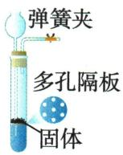
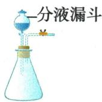
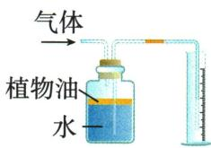
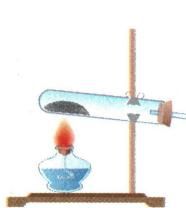
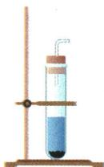
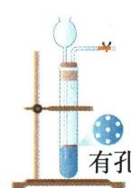
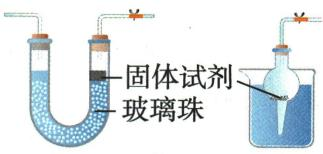

## 讲解

### 是什么

发生装置按反应状态和温度：固体加热、固液常温；控滴速与固液分离启停是不同控制。

### 怎么来的

分液漏斗少量连续供液改变接触供给速率；隔板型关闭后压强使液退下，块固体与液分离才停。停滴加但瓶内仍有酸时反应可继续。

### 什么时候能用

加热熔化固体要考虑液体会流动，如原草酸A₃口上倾，不能只“固体加热”便必口向下。气路不可盲封升压；适用药品、支架与空间必须给定。

## 例题

### 四装置制气集气与尿素

> 来源ID Q12-01；专题一气体的制取；151-200/full.md 第999–1016行。原答案与解析定位：151-200/full.md 第1018–1028行。

例1 (2024 江苏宿迁中考)化学实践小组利用以下装置完成部分气体的相关实验,请你参与。

  
A

  
B

  
C

  
D

(1)实验室用稀盐酸和块状石灰石反应制取二氧化碳的化学方程式是\_\_\_\_。其发生装置可选用装置A或B,与装置B相比,装置A具有的优点是\_\_\_\_。  
(2)若选用装置 B 和 C 制取并收集氧气,证明氧气已收集满的操作和现象是\_\_\_\_。  
(3)常温常压下,氨气是一种无色、有刺激性气味,极易溶于水,密度比空气小的气体。实验室常用氯化铵和熟石灰两种固体混合物共热的方法制取氨气。若选用装置D测定产生氨气的体积,水面需加一层植物油,其目的是\_\_\_\_。  
(4)二氧化碳和氨气在一定条件下可以合成尿素[化学式为 $\mathrm{CO(NH_{2})_{2}}$ ]，同时生成水。该反应的化学方程式是 \_\_\_\_。

**原资料答案与解析：**

解析（1）石灰石的主要成分碳酸钙和盐酸反应生成氯化钙、二氧化碳和水；装置 A 可以控制反应的发生与停止；

(2)氧气密度比空气的大,故集气时,气体长进短出,通过观察出气端口带火星的木条复燃,说明氧气已集满;  
(3) 氨气极易溶于水, 加植物油防止氨气溶于水;  
(4)二氧化碳和氨气在一定条件下反应生成尿素和水,写出化学方程式并配平。

答案（1） $\mathrm{CaCO_3 + 2HCl = CaCl_2 + H_2O + CO_2\uparrow}$ 可以控制反应的发生与停止

(2) 将带火星的木条放在 a 端, 木条复燃, 说明已收集满氧气  
(3)防止氨气溶于水   
(4) $\mathrm{CO}_{2} + 2\mathrm{NH}_{3}\xlongequal{\text{一定条件}}\mathrm{CO(NH_{2})_{2} + H_{2}O}$

**展开解析（依据原详解补足理由与步骤）：**

(1)$CaCO_3+2HCl=CaCl_2+H_2O+CO_2\uparrow$。A多孔隔板支撑块固体，夹闭后气压使酸退回与固体分离可停；B分液漏斗可控滴速，停止滴加却未必让原酸与固体分离，A优势发生停止。(2)C图a短b长，氧密度大应b长进、a短出；在a出气口放带火星木条复燃验满。不是盲记a一定进。(3)D气从短管接油面上，水从长管排量筒。油隔$NH_{3}$与水减溶解，量排水近似气体体积；还需检查漏气、温度压差，不说油可完全消除所有溶解误差。(4)$CO_2+2NH_3\xlongequal{\text{一定条件}}CO(NH_2)_2+H_2O$。由右$N_{2}$取左2$NH_{3}$，右H4+水H2合6，左6，C1/$O_{2}$两边守恒。

### 草酸分解产物串联装置

> 来源ID Q12-02；专题一气体的制取；151-200/full.md 第1034–1066行。原答案与解析定位：151-200/full.md 第1068–1075行。

例2 (2024 山东济宁中考)已知草酸( $\mathrm{H_{2}C_{2}O_{4}}$ )常温下为固体,熔点为189.5℃,具有还原性,常用作染料还原剂;加热易分解,反应的化学方程式为 $\mathrm{H_{2}C_{2}O_{4}} \xlongequal{\triangle} \mathrm{CO} \uparrow + \mathrm{CO_{2}} \uparrow + \mathrm{H_{2}O}$ 。某化学研究性小组为验证分解产物进行实验,用到的仪器装置如图所示(组装实验装置时可重复选择仪器)。

【实验装置】

  
A $_{1}$

  
$A_{2}$

  
A $_{3}$

  
B

  
C

  
D

  
E

请回答：

(1)仪器 m 的名称是\_\_\_\_, 仪器 n 的名称是\_\_\_\_;  
(2)加热分解草酸的装置需选用\_\_\_\_（填“A $_{1}$ ”“A $_{2}$ ”或“A $_{3}$ ”）；实验前，按接口连接顺序a-\_\_\_\_-de（从左到右填写接口字母）组装实验装置；  
(3) B 装置中出现\_\_\_\_现象可证明产物中有 $CO$ 生成;  
(4)写出 C 装置中发生反应的化学方程式: \_\_\_\_；  
(5) D 装置中出现 \_\_\_\_ 现象可证明产物中有 $H_{2}O$ 生成;  
(6)该小组交流讨论后,得出该装置存在一定缺陷,需在最后的 e 接口连接一瘪的气球,其作用是\_\_\_\_。

**原资料答案与解析：**

解析 (2) 草酸熔点为 $189.5^{\circ} \mathrm{C}$ , 熔点较低, 加热分解时, 熔化成液体, 为防止液体流出, 选用 $\mathrm{A}_{3}$ 装置。草酸分解产生一氧化碳、水和二氧化碳, 先用 D 装置中无水硫酸铜检验水, 再用 C 装置检验二氧化碳, 用 E 装置对气体进行干燥, 接着用 B、C 装置验证一氧化碳; 其中 C、E 装置中气体都是“长进短出”, 接口顺序为 a-fg(gf)-de-hi-bc(cb)-de。

(3) B装置中一氧化碳与氧化铜反应生成铜和二氧化碳, 黑色固体变成红色, 说明生成了 $\mathrm{CO}$ 。  
(4) C 装置中二氧化碳与石灰水中的氢氧化钙反应生成碳酸钙和水。  
(5)水能使无色硫酸铜变蓝,D装置中白色粉末变蓝,说明生成水。  
(6)实验时排放的尾气中含有一氧化碳,一氧化碳有毒,会污染空气,连接气球,对尾气进行收集,防止污染空气。

答案 (1) 酒精灯 硬质玻璃管 (2) $\mathrm{A}_{3} \quad \mathrm{fg(gf)} - \mathrm{de-hi-bc(cb)}$ (3) 黑色固体变成红色 (4) $\mathrm{CO}_{2} + \mathrm{Ca(OH)}_{2} = \mathrm{CaCO}_{3} \downarrow + \mathrm{H}_{2} \mathrm{O}$ (5) 白色粉末变蓝 (6) 收集一氧化碳, 防止污染空气

**展开解析（依据原详解补足理由与步骤）：**

(1)m酒精灯、n硬质玻璃管。(2)草酸189.5℃先可熔液，再加热分解，选A₃口上倾防流出；A₁口下倾不合此熔液条件、A₂有分液漏斗不是原固体草酸加热需要。顺序a→f/g→g/f→d→e→h→i→b/c→c/b→d→e，D和B可左右互换，C/E洗气必须长进短出。D先白无水$CuSO_{4}$检原水，首C足量石灰水检并充分除原$CO_{2}$，E浓硫酸干燥，B热$CuO$遇$CO$变红，尾C检新$CO_{2}$。原首C明确足量，须保证$CO_{2}$已充分去除，尾C才能支持新生。(3)黑变红支持$CO$还原$CuO$，在题给产物候选$CO$/$CO_{2}$/$H_{2}O$中排其他还原性候选，不把此颜色对所有未知气唯一认$CO$。(4)$CO_2+Ca(OH)_2=CaCO_3\downarrow+H_2O$。(5)白粉变蓝证水，原解“无色硫酸铜”应白色无水固体。(6)末端气球收未反应$CO$，收集后还需安全处理，不等于袋装即消毒；先通气排空气再热$CuO$、停热后续通至冷却，防爆与氧化。

### 原发生装置特点表

> 来源ID Q12-04；专题一气体的制取；151-200/full.md 第817–817行。原答案与解析定位：151-200/full.md 第817–817行。

|  | 固体加热型 | 固液常温型 | 固液常温型 | 固液常温型 | 固液常温型 |
| --- | --- | --- | --- | --- | --- |
| 实验装置 |  |  |  |  | .塑料板 |
| 装置特点 | — | 装置简单,操作方便 | 便于添加试剂 | 可通过控制液体滴加的速率控制反应速率 | 可随时控制反应的发生和停止 |
| 适用范围 | 加热固体制取少量气体 | 制取少量气体 | 可用于较为平稳的反应和制取较多气体 | 可用于较为剧烈的反应和制取较多气体 | 可用于较为平稳的反应和持续时间较长的反应 |

**原资料答案与解析：**

|  | 固体加热型 | 固液常温型 | 固液常温型 | 固液常温型 | 固液常温型 |
| --- | --- | --- | --- | --- | --- |
| 实验装置 |  |  |  |  | .塑料板 |
| 装置特点 | — | 装置简单,操作方便 | 便于添加试剂 | 可通过控制液体滴加的速率控制反应速率 | 可随时控制反应的发生和停止 |
| 适用范围 | 加热固体制取少量气体 | 制取少量气体 | 可用于较为平稳的反应和制取较多气体 | 可用于较为剧烈的反应和制取较多气体 | 可用于较为平稳的反应和持续时间较长的反应 |

**展开解析（依据原详解补足理由与步骤）：**

原表区分简单固液、长颈补液、分液控滴速、隔板固液分离启停。隔板型须块状不易溶固体与液反应、无必要加热；$H_{2}O_{2}$溶液催化剂混在液中，关闭出口不会像块石灰石酸分离那样可靠停。不能把关阀普遍作停止反应办法。

### 原隔板启停模型

> 来源ID Q12-11；专题一气体的制取；151-200/full.md 第825–827行。原答案与解析定位：151-200/full.md 第825–827行。

1.为了使“固+液→气”的发生装置使用更方便,也为了节约试剂,可设计如图所示装置,这些装置都可控制反应的发生与停止。当打开弹簧夹时,液体与固体试剂接触,开始反应;当关闭弹簧夹时,反应产生的气体使液体与固体试剂分离,反应停止。

**原资料答案与解析：**

1.为了使“固+液→气”的发生装置使用更方便,也为了节约试剂,可设计如图所示装置,这些装置都可控制反应的发生与停止。当打开弹簧夹时,液体与固体试剂接触,开始反应;当关闭弹簧夹时,反应产生的气体使液体与固体试剂分离,反应停止。

**展开解析（依据原详解补足理由与步骤）：**

原块固体与酸接触反应产气；闭夹后气压推液与固体分离，开夹减压液回到固体再反应。须有回液空间、块固体支架且反应条件适用，不能任何粉末催化液都套。

## 易错

先气路液路再字母；主物不被净化剂耗掉；有毒可燃气限学校安全操作。
