## 讲解

### 是什么

锌与稀硫酸生成$ZnSO_{4}$和H₂，固液常温发生；氢密度小、难溶水，可合适排水或向下排空气收。

### 怎么来的

金属在氢前且稀酸条件适用，原反应Zn+$H_{2}SO_{4}$=$ZnSO_{4}$+H₂。难溶水适合排水；密度小则将空气自低端推出。与氧空气混合点火危险，先排空气及少量验纯。

### 什么时候能用

不用硝酸浓硫酸替代该放氢模型。尖锐爆鸣说明所取样混空气，声音小也只是教材较纯判断，非仪器纯度认证。点火检验只能教师安全条件下少量气，不试未知大瓶。

## 例题

### 原三气制备比较表

> 来源ID Q12-03；专题一气体的制取；151-200/full.md 第803–803行。原答案与解析定位：151-200/full.md 第803–803行。

|  |  | 氧气( $O_2$ ) | 氧气( $O_2$ ) | 二氧化碳( $CO_2$ ) | 氢气( $H_2$ ) |
| --- | --- | --- | --- | --- | --- |
| 试剂 | 试剂 | 高锰酸钾 | 过氧化氢溶液和二氧化锰 | 大理石(或石灰石)和稀盐酸 | 锌粒和稀硫酸 |
| 反应原理 | 反应原理 | $2KMnO_4\xlongequal{\Delta}K_2MnO_4+MnO_2+O_2\uparrow$ | $2H_2O_2\xlongequal{MnO_2}2H_2O+O_2\uparrow$ | $CaCO_3+2HCl=CaCl_2+CO_2\uparrow+H_2O$ | $Zn+H_2SO_4\xlongequal{}ZnSO_4+H_2\uparrow$ |
| 反应类型 | 反应类型 | 分解反应 | 分解反应 | 复分解反应 | 置换反应 |
| 实验装置 | 发生装置 | 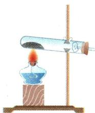 | 长颈漏斗 分液漏斗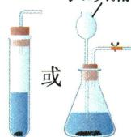 或 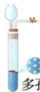(该装置不适用于制取 $O_2$ )隔板 | 长颈漏斗 分液漏斗 或 (该装置不适用于制取 $O_2$ )隔板 | 长颈漏斗 分液漏斗 或 (该装置不适用于制取 $O_2$ )隔板 |
| 实验装置 | 收集装置 | 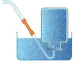 或 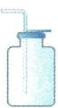 |  或  | 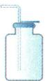 |  或 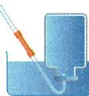 |
| 净化 | 净化 | 用浓硫酸或碱石灰干燥 | 用浓硫酸或碱石灰干燥 | 用 $NaHCO_3$ 溶液除去$HCl$,然后用浓硫酸干燥 | 用浓硫酸干燥 |
| 检验 | 检验 | 将带火星的木条插入集气瓶中,木条复燃,证明是氧气 | 将带火星的木条插入集气瓶中,木条复燃,证明是氧气 | 通入澄清石灰水中,石灰水变浑浊,证明是 $CO_2$ | 点燃,产生淡蓝色火焰,将干燥的烧杯罩在火焰上方,内壁有水雾,证明是氢气 |
| 验满或验纯 | 验满或验纯 | 向上排空气法:将带火星的木条放在集气瓶口,木条复燃,证明已满;排水法:有大气泡不断从集气瓶口冒出,证明已满 | 向上排空气法:将带火星的木条放在集气瓶口,木条复燃,证明已满;排水法:有大气泡不断从集气瓶口冒出,证明已满 | 将燃着的木条放在集气瓶口,木条熄灭,证明已满 | 用拇指堵住收集满氢气的试管口,管口向下,靠近火焰,移开拇指点火,若发出尖锐的爆鸣声,说明氢气不纯;若声音很小,则说明氢气较纯 |
| 注意事项 | 注意事项 | 1.先检查装置的气密性;2.试管口略向下倾斜;3.先使试管均匀受热,然后再对准试剂所在的部位加热;4.用排水法收集完氧气后,先移出导管,后停止加热,以防倒吸 | 1.先检查装置的气密性;2.用排水法收集时,待气泡连续均匀冒出时再开始收集 | 1.先检查装置的气密性;2.长颈漏斗下端管口要伸入液面以下;3.收集满二氧化碳的集气瓶正放保存 | 1.先检查装置的气密性;2.先验纯再收集;3.收集满 $H_2$ 的集气瓶倒放保存 |
| 注意事项 | 注意事项 | 收集满氧气的集气瓶正放保存 | 收集满氧气的集气瓶正放保存 | 1.先检查装置的气密性;2.长颈漏斗下端管口要伸入液面以下;3.收集满二氧化碳的集气瓶正放保存 | 1.先检查装置的气密性;2.先验纯再收集;3.收集满 $H_2$ 的集气瓶倒放保存 |

**原资料答案与解析：**

|  |  | 氧气( $O_2$ ) | 氧气( $O_2$ ) | 二氧化碳( $CO_2$ ) | 氢气( $H_2$ ) |
| --- | --- | --- | --- | --- | --- |
| 试剂 | 试剂 | 高锰酸钾 | 过氧化氢溶液和二氧化锰 | 大理石(或石灰石)和稀盐酸 | 锌粒和稀硫酸 |
| 反应原理 | 反应原理 | $2KMnO_4\xlongequal{\Delta}K_2MnO_4+MnO_2+O_2\uparrow$ | $2H_2O_2\xlongequal{MnO_2}2H_2O+O_2\uparrow$ | $CaCO_3+2HCl=CaCl_2+CO_2\uparrow+H_2O$ | $Zn+H_2SO_4\xlongequal{}ZnSO_4+H_2\uparrow$ |
| 反应类型 | 反应类型 | 分解反应 | 分解反应 | 复分解反应 | 置换反应 |
| 实验装置 | 发生装置 |  | 长颈漏斗 分液漏斗 或 (该装置不适用于制取 $O_2$ )隔板 | 长颈漏斗 分液漏斗 或 (该装置不适用于制取 $O_2$ )隔板 | 长颈漏斗 分液漏斗 或 (该装置不适用于制取 $O_2$ )隔板 |
| 实验装置 | 收集装置 |  或  |  或  |  |  或  |
| 净化 | 净化 | 用浓硫酸或碱石灰干燥 | 用浓硫酸或碱石灰干燥 | 用 $NaHCO_3$ 溶液除去$HCl$,然后用浓硫酸干燥 | 用浓硫酸干燥 |
| 检验 | 检验 | 将带火星的木条插入集气瓶中,木条复燃,证明是氧气 | 将带火星的木条插入集气瓶中,木条复燃,证明是氧气 | 通入澄清石灰水中,石灰水变浑浊,证明是 $CO_2$ | 点燃,产生淡蓝色火焰,将干燥的烧杯罩在火焰上方,内壁有水雾,证明是氢气 |
| 验满或验纯 | 验满或验纯 | 向上排空气法:将带火星的木条放在集气瓶口,木条复燃,证明已满;排水法:有大气泡不断从集气瓶口冒出,证明已满 | 向上排空气法:将带火星的木条放在集气瓶口,木条复燃,证明已满;排水法:有大气泡不断从集气瓶口冒出,证明已满 | 将燃着的木条放在集气瓶口,木条熄灭,证明已满 | 用拇指堵住收集满氢气的试管口,管口向下,靠近火焰,移开拇指点火,若发出尖锐的爆鸣声,说明氢气不纯;若声音很小,则说明氢气较纯 |
| 注意事项 | 注意事项 | 1.先检查装置的气密性;2.试管口略向下倾斜;3.先使试管均匀受热,然后再对准试剂所在的部位加热;4.用排水法收集完氧气后,先移出导管,后停止加热,以防倒吸 | 1.先检查装置的气密性;2.用排水法收集时,待气泡连续均匀冒出时再开始收集 | 1.先检查装置的气密性;2.长颈漏斗下端管口要伸入液面以下;3.收集满二氧化碳的集气瓶正放保存 | 1.先检查装置的气密性;2.先验纯再收集;3.收集满 $H_2$ 的集气瓶倒放保存 |
| 注意事项 | 注意事项 | 收集满氧气的集气瓶正放保存 | 收集满氧气的集气瓶正放保存 | 1.先检查装置的气密性;2.长颈漏斗下端管口要伸入液面以下;3.收集满二氧化碳的集气瓶正放保存 | 1.先检查装置的气密性;2.先验纯再收集;3.收集满 $H_2$ 的集气瓶倒放保存 |

**展开解析（依据原详解补足理由与步骤）：**

原比较表。H₂锌与稀硫酸，固液常温、难溶水且密度小；$O_{2}$与$CO_{2}$条件按前章各法。原排空气法“干燥”说法纠正：是否带水取决于制气与干燥步骤，排空气只减少接触收集水，不自动除水。氢气点火验纯限学校少量试管，不点燃未知大容器混气。

### 原三种收集法

> 来源ID Q12-05；专题一气体的制取；151-200/full.md 第821–821行。原答案与解析定位：151-200/full.md 第821–821行。

|  | 排水(集气)法 | 向上排空气法 | 向下排空气法 |
| --- | --- | --- | --- |
| 实验装置 | 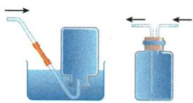 | 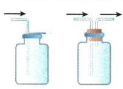 | 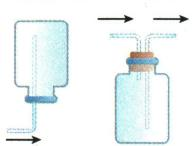 |
| 适用范围 | 不易溶于水且不与水反应的气体,如 $O_{2}$ 、 $H_{2}$ 、$CO$、 $CH_{4}$ 等 | 不与空气中的成分反应且密度比空气大的气体,如 $O_{2}$ 、 $CO_{2}$ 等 | 不与空气中的成分反应且密度比空气小的气体,如 $H_{2}$ 、 $NH_{3}$ 、 $CH_{4}$ 等 |
| 特点 | 收集到的气体纯净但不干燥 | 收集到的气体干燥但不纯净 | 收集到的气体干燥但不纯净 |
| 注意事项 | 1.使用排水(集气)法时需要将集气瓶内装满水,并等到导管口有气泡连续均匀冒出再收集,否则会使收集到的气体不纯。2.当有大气泡从集气瓶口冒出时,表明气体已经集满 | 1.使用排空气法收集气体时,要将长导管伸到接近集气瓶瓶底的位置。2.需要根据收集气体的性质进行验满或验纯(可燃气体收集前一定要验纯) | 1.使用排空气法收集气体时,要将长导管伸到接近集气瓶瓶底的位置。2.需要根据收集气体的性质进行验满或验纯(可燃气体收集前一定要验纯) |

**原资料答案与解析：**

|  | 排水(集气)法 | 向上排空气法 | 向下排空气法 |
| --- | --- | --- | --- |
| 实验装置 |  |  |  |
| 适用范围 | 不易溶于水且不与水反应的气体,如 $O_{2}$ 、 $H_{2}$ 、$CO$、 $CH_{4}$ 等 | 不与空气中的成分反应且密度比空气大的气体,如 $O_{2}$ 、 $CO_{2}$ 等 | 不与空气中的成分反应且密度比空气小的气体,如 $H_{2}$ 、 $NH_{3}$ 、 $CH_{4}$ 等 |
| 特点 | 收集到的气体纯净但不干燥 | 收集到的气体干燥但不纯净 | 收集到的气体干燥但不纯净 |
| 注意事项 | 1.使用排水(集气)法时需要将集气瓶内装满水,并等到导管口有气泡连续均匀冒出再收集,否则会使收集到的气体不纯。2.当有大气泡从集气瓶口冒出时,表明气体已经集满 | 1.使用排空气法收集气体时,要将长导管伸到接近集气瓶瓶底的位置。2.需要根据收集气体的性质进行验满或验纯(可燃气体收集前一定要验纯) | 1.使用排空气法收集气体时,要将长导管伸到接近集气瓶瓶底的位置。2.需要根据收集气体的性质进行验满或验纯(可燃气体收集前一定要验纯) |

**展开解析（依据原详解补足理由与步骤）：**

原排水需气体难溶不与水反应并先排空气；排空气按密度与空气反应性选择，气会混有空气。原“排水纯净”仅相对较纯仍带水；原“排空气干燥”过宽，湿气没经过干燥仍湿。

### 原检验验满及先检水

> 来源ID Q12-07；专题一气体的制取；151-200/full.md 第909–909；911–911行。原答案与解析定位：151-200/full.md 第909–909行；151-200/full.md 第911–911行。

|  | 检验 / 图示 | 检验 / 现象 | 验满或验纯 / 图示 | 验满或验纯 / 现象 |
| --- | --- | --- | --- | --- |
| 氧气 | 火星的木条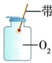 | 木条复燃 | 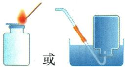 | 向上排空气法:放在集气瓶口的带火星的木条复燃;排水法:有大气泡不断从集气瓶口冒出 |
| 二氧化碳 | $\overrightarrow{CO_2}$ 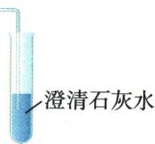 | 澄清石灰水变浑浊 | 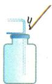 | 放在集气瓶口的燃着的木条熄灭 |
| 氢气 | 干燥的烧杯-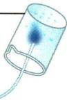 $H_2$ | 纯净气体能安静地燃烧,产生淡蓝色火焰,烧杯内壁有水雾 | 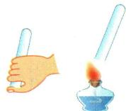 | 若发出尖锐的爆鸣声,说明氢气不纯;若声音很小,则说明氢气较纯 |

特别说明 检验多种气体时,若有水蒸气,一般先检验水蒸气。有多种气体需要检验时,应尽量避免前步检验对后步检验的干扰。如被检验的气体中含有 $\mathrm{CO}_{2}$ 和水蒸气时,应先通过无水 $\mathrm{CuSO}_{4}$ 检验水蒸气,再通过澄清石灰水检验 $\mathrm{CO}_{2}$ 。

**原资料答案与解析：**

|  | 检验 / 图示 | 检验 / 现象 | 验满或验纯 / 图示 | 验满或验纯 / 现象 |
| --- | --- | --- | --- | --- |
| 氧气 | 火星的木条 | 木条复燃 |  | 向上排空气法:放在集气瓶口的带火星的木条复燃;排水法:有大气泡不断从集气瓶口冒出 |
| 二氧化碳 | $\overrightarrow{CO_2}$  | 澄清石灰水变浑浊 |  | 放在集气瓶口的燃着的木条熄灭 |
| 氢气 | 干燥的烧杯- $H_2$ | 纯净气体能安静地燃烧,产生淡蓝色火焰,烧杯内壁有水雾 |  | 若发出尖锐的爆鸣声,说明氢气不纯;若声音很小,则说明氢气较纯 |

特别说明 检验多种气体时,若有水蒸气,一般先检验水蒸气。有多种气体需要检验时,应尽量避免前步检验对后步检验的干扰。如被检验的气体中含有 $\mathrm{CO}_{2}$ 和水蒸气时,应先通过无水 $\mathrm{CuSO}_{4}$ 检验水蒸气,再通过澄清石灰水检验 $\mathrm{CO}_{2}$ 。

**展开解析（依据原详解补足理由与步骤）：**

原表$O_{2}$带火星木条入瓶检身份、瓶口验满；$CO_{2}$石灰水检身份、瓶口燃木条熄灭验满，熄灭单独不能唯一认$CO_{2}$。H₂先用少量验纯才作燃烧，水产物只在候选范围支持身份，不能点火测试任意未知气。若需原气水证据，先无水$CuSO_{4}$后液体检验，否则新增水蒸气使证据混淆。

## 易错

先气路液路再字母；主物不被净化剂耗掉；有毒可燃气限学校安全操作。
