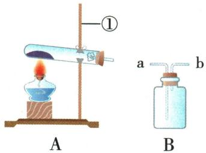

## 讲解

### 判据

收集看溶水性与密度，检验或验满看带火星木条位置。

### 流程

氧气不易溶水且不与水反应，可用排水法较纯收集；密度比空气略大，可向上排空气较干燥收集。排空气瓶正放长管进气，先积在底部。检验木条入瓶；排空气验满木条在瓶口；排水验满看瓶内水排尽与瓶口大气泡。

## 例题

### 高锰酸钾制氧装置

> 来源ID Q02-13；第二单元空气和氧气；1-50/full.md 第1958–1966行。原答案与解析定位：1-50/full.md 第1972–1975行。

例1（2024 内蒙古兴安盟中考改编）化学是一门以实验为基础的科学。请根据下列实验装置回答问题。

(1)写出仪器①的名称：\_\_\_\_。

(2)实验室选用 A 装置制取氧气,反应的文字表达式为 \_\_\_\_,固定装置时试管口略向下倾斜的原因是 \_\_\_\_。

(3)若用 B 装置收集氧气,气体应从\_\_\_\_(填“a”或“b”)端通入集气瓶。

**原资料答案与解析：**

例1 解析 (1) 由图可知, 仪器①为铁架台。(2) A 装置为固体加热型发生装置, 管口有棉花团, 选用高锰酸钾制氧气, 加热高锰酸钾生成锰酸钾、二氧化锰和氧气; 为防止冷凝水回流到热的试管底部, 导致试管炸裂, 所以加热固体试剂时试管口应略向下倾斜。(3) 氧气的密度比空气大, 若用 B 装置收集氧气, 气体应长进短出, 即从 a 端通入。

答案（1）铁架台 （2）高锰酸钾
$\xrightarrow{\text{加热}}$ 锰酸钾+二氧化锰+氧气（箭头位置按原PDF实际第34页恢复） 防止冷凝水回流到热的试管底部，炸裂试管 （3）a

**展开解析（依据原详解补足理由与步骤）：**

(1)标号①指铁架台。(2)A是加热固体且管口有棉花的发生装置，对应高锰酸钾。原PDF实际第34页的正确文字表达式为高锰酸钾$\xrightarrow{\text{加热}}$锰酸钾+二氧化锰+氧气。full.md第1975行把产物挪到箭头上，是识别错排，不是原书错误。试管口略向下防止冷凝水回流至受热底部而使热玻璃炸裂。(3)B正放，a为长管，b为短管。氧气密度较空气大，a入气使氧气从底部积聚，空气由短管排出；故选a。若瓶中先装满水或倒放，必须按实际流体重新判断，不能背“永远长进短出”。

### 过氧化氢制取收集验满

> 来源ID Q02-14；第二单元空气和氧气；1-50/full.md 第1990–2010行。原答案与解析定位：1-50/full.md 第1977–1979行。

例2 (2023 陕西中考改编)下图是实验室常见的气体制备装置。

  
A

  
B

  
C

  
D

(1)写出标有字母 a 的仪器名称：\_\_\_\_。

(2)用过氧化氢溶液和二氧化锰制氧气时,应选择的气体发生装置是\_\_\_\_(填字母),该反应的基本反应类型为\_\_\_\_。

(3)用 C 装置收集氧气时,验满方法是\_\_\_\_;

用 D 装置收集氧气时,验满方法是\_\_\_\_。

**原资料答案与解析：**

例2 解析（2）用过氧化氢溶液和二氧化锰制氧气，应选用固液常温型装置；过氧化氢分解制氧气符合“一变多”的特点，是分解反应。

答案 (1) 集气瓶 (2) B 分解反应 (3) 将带火星的木条放在集气瓶口, 若木条复燃, 说明已集满 当集气瓶口有大气泡冒出时, 说明氧气已集满

**展开解析（依据原详解补足理由与步骤）：**

(1)a标注集气瓶。(2)过氧化氢溶液与二氧化锰在常温下反应，不需加热，因此选B；A为固体加热发生装置，不适合这里。一个反应物过氧化氢变成水和氧气，属于分解反应，催化剂不计为反应物。(3)C是向上排空气收集，带火星木条放瓶口，复燃表示已满；放瓶内只能作检验。D倒扣于水中，瓶内水被排完、瓶口出现大气泡，表示收集满。开始阶段导管口气泡是空气排出，不能据此开始收集或认定已满。

## 易错

不能只记答案字母；条件、分母、仪器位置改变时重新判断。
