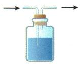
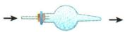
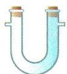
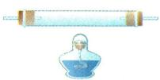
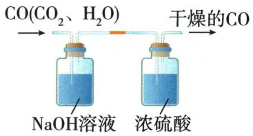

## 讲解

### 判据

目标气和杂气给定，净化剂既要去杂也不能耗主气。

### 流程

逐剂写与主/杂各能否反应溶解，再看后步会增加水或新气；液洗后常需干燥，热$CuO$去$CO$生成$CO_{2}$适合$CO_{2}$主物，去H₂却产水则应后干。检原水的证据步骤必须在液洗之前，最终收气需要干燥时最后检查全气路。

## 例题

### 草酸分解产物串联装置

> 来源ID Q12-02；专题一气体的制取；151-200/full.md 第1034–1066行。原答案与解析定位：151-200/full.md 第1068–1075行。

例2 (2024 山东济宁中考)已知草酸( $\mathrm{H_{2}C_{2}O_{4}}$ )常温下为固体,熔点为189.5℃,具有还原性,常用作染料还原剂;加热易分解,反应的化学方程式为 $\mathrm{H_{2}C_{2}O_{4}} \xlongequal{\triangle} \mathrm{CO} \uparrow + \mathrm{CO_{2}} \uparrow + \mathrm{H_{2}O}$ 。某化学研究性小组为验证分解产物进行实验,用到的仪器装置如图所示(组装实验装置时可重复选择仪器)。

【实验装置】

  
A $_{1}$

  
$A_{2}$

  
A $_{3}$

  
B

  
C

  
D

  
E

请回答：

(1)仪器 m 的名称是\_\_\_\_, 仪器 n 的名称是\_\_\_\_;  
(2)加热分解草酸的装置需选用\_\_\_\_（填“A $_{1}$ ”“A $_{2}$ ”或“A $_{3}$ ”）；实验前，按接口连接顺序a-\_\_\_\_-de（从左到右填写接口字母）组装实验装置；  
(3) B 装置中出现\_\_\_\_现象可证明产物中有 $CO$ 生成;  
(4)写出 C 装置中发生反应的化学方程式: \_\_\_\_；  
(5) D 装置中出现 \_\_\_\_ 现象可证明产物中有 $H_{2}O$ 生成;  
(6)该小组交流讨论后,得出该装置存在一定缺陷,需在最后的 e 接口连接一瘪的气球,其作用是\_\_\_\_。

**原资料答案与解析：**

解析 (2) 草酸熔点为 $189.5^{\circ} \mathrm{C}$ , 熔点较低, 加热分解时, 熔化成液体, 为防止液体流出, 选用 $\mathrm{A}_{3}$ 装置。草酸分解产生一氧化碳、水和二氧化碳, 先用 D 装置中无水硫酸铜检验水, 再用 C 装置检验二氧化碳, 用 E 装置对气体进行干燥, 接着用 B、C 装置验证一氧化碳; 其中 C、E 装置中气体都是“长进短出”, 接口顺序为 a-fg(gf)-de-hi-bc(cb)-de。

(3) B装置中一氧化碳与氧化铜反应生成铜和二氧化碳, 黑色固体变成红色, 说明生成了 $\mathrm{CO}$ 。  
(4) C 装置中二氧化碳与石灰水中的氢氧化钙反应生成碳酸钙和水。  
(5)水能使无色硫酸铜变蓝,D装置中白色粉末变蓝,说明生成水。  
(6)实验时排放的尾气中含有一氧化碳,一氧化碳有毒,会污染空气,连接气球,对尾气进行收集,防止污染空气。

答案 (1) 酒精灯 硬质玻璃管 (2) $\mathrm{A}_{3} \quad \mathrm{fg(gf)} - \mathrm{de-hi-bc(cb)}$ (3) 黑色固体变成红色 (4) $\mathrm{CO}_{2} + \mathrm{Ca(OH)}_{2} = \mathrm{CaCO}_{3} \downarrow + \mathrm{H}_{2} \mathrm{O}$ (5) 白色粉末变蓝 (6) 收集一氧化碳, 防止污染空气

**展开解析（依据原详解补足理由与步骤）：**

(1)m酒精灯、n硬质玻璃管。(2)草酸189.5℃先可熔液，再加热分解，选A₃口上倾防流出；A₁口下倾不合此熔液条件、A₂有分液漏斗不是原固体草酸加热需要。顺序a→f/g→g/f→d→e→h→i→b/c→c/b→d→e，D和B可左右互换，C/E洗气必须长进短出。D先白无水$CuSO_{4}$检原水，首C足量石灰水检并充分除原$CO_{2}$，E浓硫酸干燥，B热$CuO$遇$CO$变红，尾C检新$CO_{2}$。原首C明确足量，须保证$CO_{2}$已充分去除，尾C才能支持新生。(3)黑变红支持$CO$还原$CuO$，在题给产物候选$CO$/$CO_{2}$/$H_{2}O$中排其他还原性候选，不把此颜色对所有未知气唯一认$CO$。(4)$CO_2+Ca(OH)_2=CaCO_3\downarrow+H_2O$。(5)白粉变蓝证水，原解“无色硫酸铜”应白色无水固体。(6)末端气球收未反应$CO$，收集后还需安全处理，不等于袋装即消毒；先通气排空气再热$CuO$、停热后续通至冷却，防爆与氧化。

### 原净化装置和顺序

> 来源ID Q12-06；专题一气体的制取；151-200/full.md 第889–891；897–905行。原答案与解析定位：151-200/full.md 第889–891行；151-200/full.md 第897–905行。

| 实验装置 | 洗气瓶 /  | 球形干燥管 /  | U形干燥管 /  | 硬质玻璃管、酒精灯 /  |
| --- | --- | --- | --- | --- |
| 盛放试剂与适用气体 | 浓硫酸:吸收水蒸气;氢氧化钠溶液:吸收 $CO_2$ 、$HCl$等气体 | 碱石灰、氢氧化钠固体:吸收水蒸气、二氧化碳、氯化氢;无水氯化钙:吸收水蒸气 | 碱石灰、氢氧化钠固体:吸收水蒸气、二氧化碳、氯化氢;无水氯化钙:吸收水蒸气 | 灼热的铜网:吸收 $O_2$ ;灼热的$CuO$:吸收 $H_2$ 、$CO$ |

②转化法:通过化学反应,将杂质气体转化为所要得到的气体。如除去 $CO_{2}$ 中混有的少量 $CO$, 可将混合气体通过足量的灼热氧化铜, 发生反应: $CO + CuO \xlongequal{\Delta} Cu + CO_{2}$ 。

a. 若用洗气装置除杂,一般除杂在前,干燥在后。

原因:用液体除杂之后的气体通常混有水蒸气,干燥在后可将水蒸气完全除去。如除去 $CO$ 中混有的 $CO_{2}$ 和水蒸气,应将气体先通过 $NaOH$ 溶液,再通过浓硫酸。

b. 若用加热装置除杂,一般是干燥在前,除杂在后。如除去 $CO_{2}$ 中混有的 $CO$ 和水蒸气,应将气体先通过浓硫酸,再通过灼热的 $CuO$。

②除去多种杂质气体的顺序: 如 $N_{2}$ 中混有 $HCl$(气)、 $H_{2}O$ (气)、 $O_{2}$ 时, 应先除去 $HCl$(气), 再除去 $H_{2}O$ (气), 最后除去 $O_{2}$ (用灼热的铜网)。

**原资料答案与解析：**

| 实验装置 | 洗气瓶 /  | 球形干燥管 /  | U形干燥管 /  | 硬质玻璃管、酒精灯 /  |
| --- | --- | --- | --- | --- |
| 盛放试剂与适用气体 | 浓硫酸:吸收水蒸气;氢氧化钠溶液:吸收 $CO_2$ 、$HCl$等气体 | 碱石灰、氢氧化钠固体:吸收水蒸气、二氧化碳、氯化氢;无水氯化钙:吸收水蒸气 | 碱石灰、氢氧化钠固体:吸收水蒸气、二氧化碳、氯化氢;无水氯化钙:吸收水蒸气 | 灼热的铜网:吸收 $O_2$ ;灼热的$CuO$:吸收 $H_2$ 、$CO$ |

②转化法:通过化学反应,将杂质气体转化为所要得到的气体。如除去 $CO_{2}$ 中混有的少量 $CO$, 可将混合气体通过足量的灼热氧化铜, 发生反应: $CO + CuO \xlongequal{\Delta} Cu + CO_{2}$ 。

a. 若用洗气装置除杂,一般除杂在前,干燥在后。

原因:用液体除杂之后的气体通常混有水蒸气,干燥在后可将水蒸气完全除去。如除去 $CO$ 中混有的 $CO_{2}$ 和水蒸气,应将气体先通过 $NaOH$ 溶液,再通过浓硫酸。

b. 若用加热装置除杂,一般是干燥在前,除杂在后。如除去 $CO_{2}$ 中混有的 $CO$ 和水蒸气,应将气体先通过浓硫酸,再通过灼热的 $CuO$。

②除去多种杂质气体的顺序: 如 $N_{2}$ 中混有 $HCl$(气)、 $H_{2}O$ (气)、 $O_{2}$ 时, 应先除去 $HCl$(气), 再除去 $H_{2}O$ (气), 最后除去 $O_{2}$ (用灼热的铜网)。

**展开解析（依据原详解补足理由与步骤）：**

洗气需长管入液让气泡接触。先选只去杂不耗主气的试剂：$CO$中的$CO_{2}$可$NaOH$后浓硫酸干燥；$CO_{2}$中的$CO$用热$CuO$转成$CO_{2}$。顺序依每步会添什么：液洗后常带水，所以末干燥；热除杂若生成水则不能一律干燥放前，例如去H₂时生成水。原“加热除杂一般前干燥”仅所举$CO$转$CO_{2}$不产水情境，不作死规则。

### 原化学除杂和固液气实例

> 来源ID Q13-12；专题二共存鉴别分离除杂；151-200/full.md 第1166–1166；1172–1172；1176–1176；1180–1180行。原答案与解析定位：151-200/full.md 第1166–1166行；151-200/full.md 第1172–1172行；151-200/full.md 第1176–1176行；151-200/full.md 第1180–1180行。

|  | 除杂原理 | 实例 |
| --- | --- | --- |
| 沉淀法 | 将杂质转化为沉淀过滤除去 | 除去$NaCl$溶液中的 $Na_2SO_4$ ,可加适量的 $BaCl_2$ 溶液: $Na_2SO_4 + BaCl_2 = BaSO_4 \downarrow + 2NaCl$ |
| 置换法 | 将杂质通过置换反应除去 | 除去 $FeSO_4$ 溶液中的 $CuSO_4$ ,可加过量的铁粉,再过滤: $CuSO_4 + Fe = Cu + FeSO_4$ |
| 溶解法 | 用酸或碱把杂质转化为可溶于水的物质而除去 | 除去炭粉中的$CuO$粉末,可加适量稀硫酸,再过滤: $CuO + H_2SO_4 = CuSO_4 + H_2O$ |
| 化气法 | 加入试剂,使溶液中的杂质转化为气体逸出 | 除去$NaCl$溶液中的 $Na_2CO_3$ ,可加适量稀盐酸: $Na_2CO_3 + 2HCl = 2NaCl + H_2O + CO_2 \uparrow$ |
| 洗气法 | 将混合气体通入某种试剂中,使杂质气体与试剂发生反应而除去 | 除去$CO$中的 $CO_2$ ,可通过$NaOH$溶液,再通过浓硫酸干燥: $2NaOH + CO_2 = Na_2CO_3 + H_2O$ |
| 加热法 | 若杂质受热易分解,可通过加热或高温将杂质除去 | 除去$CaO$中的 $CaCO_3$ ,可高温煅烧: $CaCO_3 \xlongequal{\text{高温}} CaO + CO_2 \uparrow$ |

| 物质(括号内为杂质) | 除杂方法 | 除杂原理 |
| --- | --- | --- |
| $CO_{2}(H_{2}O)$ | 通过浓硫酸洗气 | 浓硫酸具有吸水性 |
| $CO_{2}(HCl)$ | 通过饱和 $NaHCO_{3}$ 溶液后再通过浓硫酸干燥 | $NaHCO_{3}+HCl=NaCl+CO_{2}\uparrow+H_{2}O$ |
| $CO_{2}(CO)$ | 通过灼热的氧化铜 | $CO+CuO\xlongequal{\Delta}Cu+CO_{2}$ |
| $CO(CO_{2})$ | 通过足量的$NaOH$溶液后再通过浓硫酸干燥 | $CO_{2}+2NaOH=Na_{2}CO_{3}+H_{2}O$ |
| $CO(H_2O)$ | 通过浓硫酸或氢氧化钠固体等 | 浓硫酸、氢氧化钠固体具有吸水性 |
| $H_2(HCl)$ | 通过足量的$NaOH$溶液后再通过浓硫酸干燥 | $HCl + NaOH = NaCl + H_2O$ |
| $H_2(H_2O)$ | 通过浓硫酸或氢氧化钠固体等 | 浓硫酸、氢氧化钠固体具有吸水性 |
| $N_2(O_2)$ | 通过灼热的铜网 | $2Cu + O_2 \xlongequal{\Delta} 2CuO$ |

| 物质(括号内为杂质) | 除杂方法 | 除杂原理 |
| --- | --- | --- |
| $CuO$(C) | 在空气(或氧气流)中点燃混合物 | $\text{C} + \text{O}_2 \xlongequal{\text{点燃}} \text{CO}_2$ |
| C($CuO$) | 加入足量稀盐酸后过滤、洗涤、干燥 | $\text{CuO} + 2\text{HCl} = \text{CuCl}_2 + \text{H}_2\text{O}$ |
| Cu(Fe) | 加入足量稀硫酸后过滤、洗涤、干燥 | $\text{Fe} + \text{H}_2\text{SO}_4 = \text{FeSO}_4 + \text{H}_2 \uparrow$ |
| Cu($CuO$) | 加入足量稀硫酸后过滤、洗涤、干燥 | $\text{CuO} + \text{H}_2\text{SO}_4 = \text{CuSO}_4 + \text{H}_2\text{O}$ |
| $\text{CaCO}_3(\text{CaO})$ | 加水溶解后过滤、洗涤、干燥 | $\text{CaO} + \text{H}_2\text{O} = \text{Ca(OH)}_2$ |
| $\text{CaCO}_3(\text{CaCl}_2 \text{或} \text{KNO}_3)$ | 加水溶解后过滤、洗涤、干燥 | $\text{CaCO}_3 \text{难溶于水, CaCl}_2 \text{和} \text{KNO}_3 \text{易溶于水}$ |
| $\text{CaO(CaCO}_3)$ | 高温煅烧 | $\text{CaCO}_3 \xlongequal{\text{高温}} \text{CaO} + \text{CO}_2 \uparrow$ |
| $NaCl$固体(泥沙等不溶物) | 加水溶解后过滤、蒸发结晶 | 泥沙不溶于水, $NaCl$易溶于水 |
| $NaCl$固体( $\text{Na}_2\text{CO}_3$ ) | 加入适量稀盐酸,蒸发结晶 | $\text{Na}_2\text{CO}_3 + 2\text{HCl} = 2\text{NaCl} + \text{CO}_2 \uparrow + \text{H}_2\text{O}$ |
| $NaCl$固体(少量 $\text{KNO}_3$ ) | 加水溶解,蒸发,当有较多固体析出时趁热过滤、洗涤、干燥 | $NaCl$的溶解度受温度影响不大 |
| 木炭(Fe粉) | 磁铁吸引 | Fe粉有磁性 |
| $\text{Na}_2\text{CO}_3(\text{NaHCO}_3)$ | 加热 | $2\text{NaHCO}_3 \xlongequal{\Delta} \text{Na}_2\text{CO}_3 + \text{CO}_2 \uparrow + \text{H}_2\text{O}$ |

| 物质(括号内为杂质) | 除杂方法 | 除杂原理 |
| --- | --- | --- |
| $NaOH$溶液( $Na_{2}CO_{3}$ ) | 加入适量的 $Ca(OH)_{2}$ 溶液,过滤 | $Na_{2}CO_{3} + Ca(OH)_{2} = CaCO_{3} \downarrow + 2NaOH$ |
| $NaCl$溶液( $Na_{2}CO_{3}$ ) | 加入适量稀盐酸 | $Na_{2}CO_{3} + 2HCl = 2NaCl + CO_{2} \uparrow + H_{2}O$ |
| $NaCl$溶液( $Na_{2}SO_{4}$ ) | 加入适量 $BaCl_{2}$ 溶液,过滤 | $Na_{2}SO_{4} + BaCl_{2} = BaSO_{4} \downarrow + 2NaCl$ |
| $NaCl$溶液( $MgCl_{2}$ ) | 加入适量$NaOH$溶液,过滤 | $MgCl_{2} + 2NaOH = Mg(OH)_{2} \downarrow + 2NaCl$ |
| $NaCl$溶液($NaOH$) | 加入适量稀盐酸 | $NaOH + HCl = NaCl + H_{2}O$ |
| $NaCl$溶液( $NH_{4}Cl$ ) | 加入适量浓$NaOH$溶液,加热 | $NH_{4}Cl + NaOH \xlongequal{\Delta} NaCl + NH_{3} \uparrow + H_{2}O$ |
| $FeSO_{4}$ 溶液( $CuSO_{4}$ ) | 加入足量铁粉,过滤 | $Fe + CuSO_{4} = Cu + FeSO_{4}$ |
| $CuSO_{4}$ 溶液( $H_{2}SO_{4}$ ) | 加入足量氧化铜粉末,过滤 | $CuO + H_{2}SO_{4} = CuSO_{4} + H_{2}O$ |
| $Cu(NO_{3})_{2}$ 溶液( $AgNO_{3}$ ) | 加入足量铜粉,过滤 | $Cu + 2AgNO_{3} = 2Ag + Cu(NO_{3})_{2}$ |

**原资料答案与解析：**

|  | 除杂原理 | 实例 |
| --- | --- | --- |
| 沉淀法 | 将杂质转化为沉淀过滤除去 | 除去$NaCl$溶液中的 $Na_2SO_4$ ,可加适量的 $BaCl_2$ 溶液: $Na_2SO_4 + BaCl_2 = BaSO_4 \downarrow + 2NaCl$ |
| 置换法 | 将杂质通过置换反应除去 | 除去 $FeSO_4$ 溶液中的 $CuSO_4$ ,可加过量的铁粉,再过滤: $CuSO_4 + Fe = Cu + FeSO_4$ |
| 溶解法 | 用酸或碱把杂质转化为可溶于水的物质而除去 | 除去炭粉中的$CuO$粉末,可加适量稀硫酸,再过滤: $CuO + H_2SO_4 = CuSO_4 + H_2O$ |
| 化气法 | 加入试剂,使溶液中的杂质转化为气体逸出 | 除去$NaCl$溶液中的 $Na_2CO_3$ ,可加适量稀盐酸: $Na_2CO_3 + 2HCl = 2NaCl + H_2O + CO_2 \uparrow$ |
| 洗气法 | 将混合气体通入某种试剂中,使杂质气体与试剂发生反应而除去 | 除去$CO$中的 $CO_2$ ,可通过$NaOH$溶液,再通过浓硫酸干燥: $2NaOH + CO_2 = Na_2CO_3 + H_2O$ |
| 加热法 | 若杂质受热易分解,可通过加热或高温将杂质除去 | 除去$CaO$中的 $CaCO_3$ ,可高温煅烧: $CaCO_3 \xlongequal{\text{高温}} CaO + CO_2 \uparrow$ |

| 物质(括号内为杂质) | 除杂方法 | 除杂原理 |
| --- | --- | --- |
| $CO_{2}(H_{2}O)$ | 通过浓硫酸洗气 | 浓硫酸具有吸水性 |
| $CO_{2}(HCl)$ | 通过饱和 $NaHCO_{3}$ 溶液后再通过浓硫酸干燥 | $NaHCO_{3}+HCl=NaCl+CO_{2}\uparrow+H_{2}O$ |
| $CO_{2}(CO)$ | 通过灼热的氧化铜 | $CO+CuO\xlongequal{\Delta}Cu+CO_{2}$ |
| $CO(CO_{2})$ | 通过足量的$NaOH$溶液后再通过浓硫酸干燥 | $CO_{2}+2NaOH=Na_{2}CO_{3}+H_{2}O$ |
| $CO(H_2O)$ | 通过浓硫酸或氢氧化钠固体等 | 浓硫酸、氢氧化钠固体具有吸水性 |
| $H_2(HCl)$ | 通过足量的$NaOH$溶液后再通过浓硫酸干燥 | $HCl + NaOH = NaCl + H_2O$ |
| $H_2(H_2O)$ | 通过浓硫酸或氢氧化钠固体等 | 浓硫酸、氢氧化钠固体具有吸水性 |
| $N_2(O_2)$ | 通过灼热的铜网 | $2Cu + O_2 \xlongequal{\Delta} 2CuO$ |

| 物质(括号内为杂质) | 除杂方法 | 除杂原理 |
| --- | --- | --- |
| $CuO$(C) | 在空气(或氧气流)中点燃混合物 | $\text{C} + \text{O}_2 \xlongequal{\text{点燃}} \text{CO}_2$ |
| C($CuO$) | 加入足量稀盐酸后过滤、洗涤、干燥 | $\text{CuO} + 2\text{HCl} = \text{CuCl}_2 + \text{H}_2\text{O}$ |
| Cu(Fe) | 加入足量稀硫酸后过滤、洗涤、干燥 | $\text{Fe} + \text{H}_2\text{SO}_4 = \text{FeSO}_4 + \text{H}_2 \uparrow$ |
| Cu($CuO$) | 加入足量稀硫酸后过滤、洗涤、干燥 | $\text{CuO} + \text{H}_2\text{SO}_4 = \text{CuSO}_4 + \text{H}_2\text{O}$ |
| $\text{CaCO}_3(\text{CaO})$ | 加水溶解后过滤、洗涤、干燥 | $\text{CaO} + \text{H}_2\text{O} = \text{Ca(OH)}_2$ |
| $\text{CaCO}_3(\text{CaCl}_2 \text{或} \text{KNO}_3)$ | 加水溶解后过滤、洗涤、干燥 | $\text{CaCO}_3 \text{难溶于水, CaCl}_2 \text{和} \text{KNO}_3 \text{易溶于水}$ |
| $\text{CaO(CaCO}_3)$ | 高温煅烧 | $\text{CaCO}_3 \xlongequal{\text{高温}} \text{CaO} + \text{CO}_2 \uparrow$ |
| $NaCl$固体(泥沙等不溶物) | 加水溶解后过滤、蒸发结晶 | 泥沙不溶于水, $NaCl$易溶于水 |
| $NaCl$固体( $\text{Na}_2\text{CO}_3$ ) | 加入适量稀盐酸,蒸发结晶 | $\text{Na}_2\text{CO}_3 + 2\text{HCl} = 2\text{NaCl} + \text{CO}_2 \uparrow + \text{H}_2\text{O}$ |
| $NaCl$固体(少量 $\text{KNO}_3$ ) | 加水溶解,蒸发,当有较多固体析出时趁热过滤、洗涤、干燥 | $NaCl$的溶解度受温度影响不大 |
| 木炭(Fe粉) | 磁铁吸引 | Fe粉有磁性 |
| $\text{Na}_2\text{CO}_3(\text{NaHCO}_3)$ | 加热 | $2\text{NaHCO}_3 \xlongequal{\Delta} \text{Na}_2\text{CO}_3 + \text{CO}_2 \uparrow + \text{H}_2\text{O}$ |

| 物质(括号内为杂质) | 除杂方法 | 除杂原理 |
| --- | --- | --- |
| $NaOH$溶液( $Na_{2}CO_{3}$ ) | 加入适量的 $Ca(OH)_{2}$ 溶液,过滤 | $Na_{2}CO_{3} + Ca(OH)_{2} = CaCO_{3} \downarrow + 2NaOH$ |
| $NaCl$溶液( $Na_{2}CO_{3}$ ) | 加入适量稀盐酸 | $Na_{2}CO_{3} + 2HCl = 2NaCl + CO_{2} \uparrow + H_{2}O$ |
| $NaCl$溶液( $Na_{2}SO_{4}$ ) | 加入适量 $BaCl_{2}$ 溶液,过滤 | $Na_{2}SO_{4} + BaCl_{2} = BaSO_{4} \downarrow + 2NaCl$ |
| $NaCl$溶液( $MgCl_{2}$ ) | 加入适量$NaOH$溶液,过滤 | $MgCl_{2} + 2NaOH = Mg(OH)_{2} \downarrow + 2NaCl$ |
| $NaCl$溶液($NaOH$) | 加入适量稀盐酸 | $NaOH + HCl = NaCl + H_{2}O$ |
| $NaCl$溶液( $NH_{4}Cl$ ) | 加入适量浓$NaOH$溶液,加热 | $NH_{4}Cl + NaOH \xlongequal{\Delta} NaCl + NH_{3} \uparrow + H_{2}O$ |
| $FeSO_{4}$ 溶液( $CuSO_{4}$ ) | 加入足量铁粉,过滤 | $Fe + CuSO_{4} = Cu + FeSO_{4}$ |
| $CuSO_{4}$ 溶液( $H_{2}SO_{4}$ ) | 加入足量氧化铜粉末,过滤 | $CuO + H_{2}SO_{4} = CuSO_{4} + H_{2}O$ |
| $Cu(NO_{3})_{2}$ 溶液( $AgNO_{3}$ ) | 加入足量铜粉,过滤 | $Cu + 2AgNO_{3} = 2Ag + Cu(NO_{3})_{2}$ |

**展开解析（依据原详解补足理由与步骤）：**

原各表多种主杂。固体过滤后要洗除表面盐液并按目标干燥，目标溶液只过滤残固体。Cu除Fe足酸后Cu留渣，$FeSO_{4}$除$CuSO_{4}$过量铁后铁和铜一起滤。$CaCO_{3}$中$CaO$遇水先生成微溶$Ca(OH)_{2}$，要足够水并充分洗去，少水并非一次全部去净。$CuO$除炭需供足氧防炭还原主$CuO$；$Na_{2}CO_{3}$去$NaHCO_{3}$可加热转成主物但防损失。每例依据具体条件，非“无污染”便可产任何气不处理。

## 易错

检验须排干扰，尾气处理与防倒吸配套。
