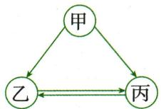
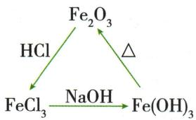
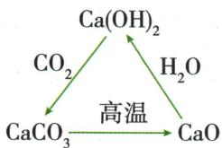
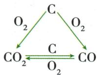
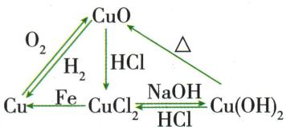
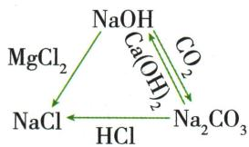
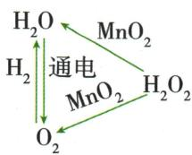
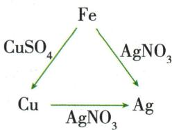
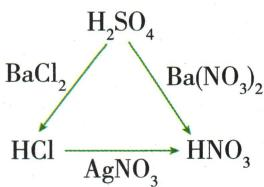

## 错法

找到$CaCl_{2}$满足$CaCO_{3}$互转便说丙只能$CaCl_{2}$，或只检一箭头忽略甲也须能转丙。

## 正解

把所有图线作为共同约束；$Ca(NO_{3})_{2}$等亦可能满足且原未给阴离子限定，应承认可用多解。给一个有效方程式回答不是证明唯一身份。

## 例题

### 含同一元素双情境三角转化

> 来源ID Q14-02；专题三物质的推断；151-200/full.md 第1533–1539行。原答案与解析定位：151-200/full.md 第1541–1547行。

例2 (2024 河南中考) 甲、乙、丙三种物质都含同一种元素, 它们之间的转化关系如图 (“→” 表示反应一步实现, 部分物质和反应条件略去)。

(1)已知甲、乙组成元素相同,丙在空气中含量居第二位。甲转化为乙的化学方程式为\_;从分子角度解释,甲、乙性质有差异的原因是

(2)已知三种物质都含钙元素,甲可用来改良酸性土壤,乙难溶于水且相对分子质量为100。甲的化学式为\_\_\_\_;乙转化为丙的化学方程式为\_\_\_\_。

**原资料答案与解析：**

解析 (1)丙在空气中含量居第二位,丙是 $\mathrm{O}_{2}$ , 则甲、乙、丙都含有氧元素; 甲、乙组成元素相同, 且甲能生成乙或者氧气, 乙和氧气能相互转化, 故甲是过氧化氢、乙是水, 代入关系图, 推断正确。

(2)甲能用来改良酸性土壤,故甲是氢氧化钙;乙难溶于水且相对分子质量为100,故乙为碳酸钙;氢氧化钙能生成丙,碳酸钙可以与丙相互转化,故丙可以是氯化钙或硝酸钙等,代入关系图,推断正确。

答案 (1) $2H_{2}O_{2}\xlongequal{MnO_{2}}2H_{2}O+O_{2}\uparrow$ 它们的分子构成不同

(2) $\mathrm{Ca(OH)}_{2} \quad \mathrm{CaCO}_{3} + 2\mathrm{HCl} = \mathrm{CaCl}_{2} + \mathrm{CO}_{2} \uparrow + \mathrm{H}_{2}\mathrm{O}$ 等

**展开解析（依据原详解补足理由与步骤）：**

(1)丙空气含量第二在原模型为$O_{2}$。甲乙组成元素相同且甲一步给乙/$O_{2}$，取甲$H_{2}O_{2}$、乙$H_{2}O$。$2H_2O_2\xlongequal{MnO_2}2H_2O+O_2\uparrow$；两种分子构成不同，虽元素同性质异。验证乙通电可给丙，丙与H₂点燃可给乙。(2)甲$Ca(OH)_{2}$用于酸土；乙钙物难溶Mr100匹配$CaCO_{3}$。丙可$CaCl_{2}$：$CaCO_3+2HCl=CaCl_2+CO_2\uparrow+H_2O$；反向$CaCl_{2}$+$Na_{2}CO_{3}$沉$CaCO_{3}$；甲也能$HCl$成$CaCl_{2}$。丙$Ca(NO_{3})_{2}$等亦可，原题未限定阴离子，不把一个有效解叫唯一。两个小问是两套独立身份，不能沿(1)把$O_{2}$带到(2)。

### 原八组转化图

> 来源ID Q14-07；专题三物质的推断；151-200/full.md 第1475–1497行。原答案与解析定位：151-200/full.md 第1475–1497行。

  
①

  
②

  
③

  
④

  
⑤

  
⑥

  
⑦

  
⑧

**原资料答案与解析：**

  
①

  
②

  
③

  
④

  
⑤

  
⑥

  
⑦

  
⑧

**展开解析（依据原详解补足理由与步骤）：**

原图是转化网络，各箭头指能在对应试剂条件下一步取得目标，并不声明产物只有该目标。①$Fe_2O_3+6HCl=2FeCl_3+3H_2O$；$FeCl_3+3NaOH=Fe(OH)_3\downarrow+3NaCl$；$2Fe(OH)_3\xlongequal{\Delta}Fe_2O_3+3H_2O$。②$Ca(OH)_2+CO_2=CaCO_3\downarrow+H_2O$；$CaCO_3\xlongequal{\text{高温}}CaO+CO_2\uparrow$；$CaO+H_2O=Ca(OH)_2$。③C足氧成$CO_{2}$、不足氧模型成$CO$，$C+O_2\xlongequal{\text{点燃}}CO_2$、$2C+O_2\xlongequal{\text{点燃}}2CO$；$C+CO_2\xlongequal{\text{高温}}2CO$；$2CO+O_2\xlongequal{\text{点燃}}2CO_2$。④$2Cu+O_2\xlongequal{\Delta}2CuO$；$CuO+H_2\xlongequal{\Delta}Cu+H_2O$；$CuO+2HCl=CuCl_2+H_2O$；$CuCl_2+2NaOH=Cu(OH)_2\downarrow+2NaCl$；$Cu(OH)_2+2HCl=CuCl_2+2H_2O$；$Cu(OH)_2\xlongequal{\Delta}CuO+H_2O$；$Fe+CuCl_2=FeCl_2+Cu$。⑤$2NaOH+MgCl_2=Mg(OH)_2\downarrow+2NaCl$；$2NaOH+CO_2=Na_2CO_3+H_2O$；$Na_2CO_3+Ca(OH)_2=CaCO_3\downarrow+2NaOH$；$Na_2CO_3+2HCl=2NaCl+CO_2\uparrow+H_2O$。⑥$2H_2O_2\xlongequal{MnO_2}2H_2O+O_2\uparrow$；$2H_2O\xlongequal{\text{通电}}2H_2\uparrow+O_2\uparrow$；$2H_2+O_2\xlongequal{\text{点燃}}2H_2O$。⑦$Fe+CuSO_4=FeSO_4+Cu$；$Fe+2AgNO_3=Fe(NO_3)_2+2Ag$；$Cu+2AgNO_3=Cu(NO_3)_2+2Ag$。⑧$H_2SO_4+BaCl_2=BaSO_4\downarrow+2HCl$；$H_2SO_4+Ba(NO_3)_2=BaSO_4\downarrow+2HNO_3$；$HCl+AgNO_3=AgCl\downarrow+HNO_3$。氢氧化物受热属原资料拓展转化，不要求高中机理。每式由原箭头、试剂和常见产物补出，配平后原子守恒；并非新增习题。
