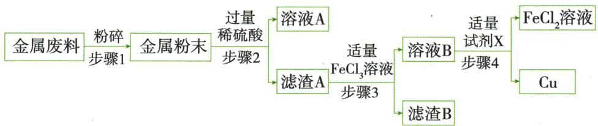

## 错法

记铜银不与稀硫酸反应，就否定题给它们与氯化铁溶液反应，或硬套金属置换酸产氢。

## 正解

不与某一种试剂反应不等于对全部试剂惰性。本题提供Cu、Ag与$FeCl_{3}$的反应，应直接按信息跟踪$CuCl_{2}$、$AgCl$和$FeCl_{2}$；金属活动性表中熟悉规则有对象条件，不能取代新给的反应事实。

## 例题

### 含铁银废铜分步回收

> 来源ID Q15-04；专题四化学工艺流程；151-200/full.md 第1776–1786行。原答案与解析定位：151-200/full.md 第1788–1794行。

例4 (2024 四川遂宁中考) 回收利用废旧金属既可以保护环境, 又能节约资源。现有一份废铜料(含有金属铜及少量铁和银), 化学兴趣小组欲回收其中的铜, 设计并进行了如下实验:

已知: $Cu + 2FeCl_{3} = CuCl_{2} + 2FeCl_{2}; Ag + FeCl_{3} = AgCl + FeCl_{2}$

完成下列各题:

(1) 步骤 2 中涉及的操作名称是  
(2)溶液 A 中的溶质是 \_\_\_\_。  
(3) 步骤 4 中反应的化学方程式是

**原资料答案与解析：**

解析 废铜料中有铜、铁、银,稀硫酸可以和铁反应生成硫酸亚铁和氢气,和铜、银不反应。溶液 A 中溶质是过量的硫酸和生成的硫酸亚铁,滤渣 A 中有银和铜。加入适量氯化铁溶液,氯化铁和铜反应生成氯化铜和氯化亚铁,和银反应生成氯化银(不溶于水)和氯化亚铁,所以滤渣 B 为氯化银,溶液 B 中有氯化铜、氯化亚铁,加入试剂 X 得到氯化亚铁和铜,则试剂 X 和氯化铜反应生成氯化亚铁和铜,试剂 X 是铁。

(1) 步骤 2 为固液分离操作, 即过滤;   
(2)根据上述分析知,溶液 A 中溶质是硫酸、硫酸亚铁;  
(3) 步骤 4 是铁与氯化铜反应生成氯化亚铁和铜。

答案 (1) 过滤 (2) 硫酸、硫酸亚铁 (3) $\mathrm{Fe} + \mathrm{CuCl}_{2} = \mathrm{FeCl}_{2} + \mathrm{Cu}$

**展开解析（依据原详解补足理由与步骤）：**

(1)步骤2得滤液和滤渣，过滤；粉碎本身不是过滤。(2)稀硫酸过量，$Fe+H_2SO_4=FeSO_4+H_2\uparrow$，所以溶液A含$FeSO_{4}$与剩余$H_{2}SO_{4}$；Cu、Ag按原条件不被稀酸消耗，留滤渣A。(3)本题特别给定Cu、Ag能与$FeCl_{3}$反应：铜成可溶$CuCl_{2}$，银成不溶$AgCl$，均另产$FeCl_{2}$。步骤3过滤后B有$CuCl_{2}$和$FeCl_{2}$；X应为Fe，用$Fe+CuCl_2=FeCl_2+Cu$取得铜。原“适量”模型让Fe反应后不混入过量铁，不能照抄过量Fe而仍称产物为纯铜。Cu、Ag不与稀硫酸反应，不能推成它们不与任何盐液反应；必须用本题新给资料判断。
