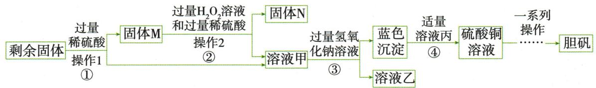

## 讲解

### 是什么

流程图表示原料怎样经操作和反应得到目标产品。进出线追物料，主线追目标，支线追其它产物或杂质，回流线表示回收再用。

### 怎么来的

先从末端产品确定需要保住的成分，反向追原料，再顺向逐步记录。一次过滤将难溶固体放滤渣、已溶物放滤液；反应后两相都可能含生成物与未反应物，因此“滤液”不等于纯溶液。原含铜料先酸浸，$CuO$转盐而$Cu_{2}O$又生成Cu，说明同一节点同时有转化和分相。

### 什么时候能用

题给物质性质、试剂量和操作条件是模型依据。流程箭头可只是溶解过滤，不都表示化学反应。工业真实流程的能耗、浓度控制等若题未给，不自行补作已知事实。

## 例题

### 含铜剩余固体制胆矾

> 来源ID Q15-01；专题四化学工艺流程；151-200/full.md 第1694–1709行。原答案与解析定位：151-200/full.md 第1711–1715行。

例1 (2024 江西中考)研究小组利用炭粉与氧化铜反应后的剩余固体(含 $\mathrm{Cu} 、 \mathrm{Cu}_{2} \mathrm{O} 、 \mathrm{CuO}$ 和 $\mathrm{C}$ )为原料制备胆矾(硫酸铜晶体),操作流程如图:

资料: $\mathrm{Cu}_{2}\mathrm{O}+\mathrm{H}_{2}\mathrm{SO}_{4}=\mathrm{CuSO}_{4}+\mathrm{Cu}+\mathrm{H}_{2}\mathrm{O}$

(1)步骤①中进行反应时用玻璃棒搅拌的目的是  
(2)步骤②中反应的化学方程式为 $\mathrm{Cu}+\mathrm{H}_{2}\mathrm{SO}_{4}+\mathrm{H}_{2}\mathrm{O}_{2}=$ $CuSO_{4}+2X$ ，则 X 的化学式为 \_\_\_\_。  
(3)步骤③中生成蓝色沉淀的化学方程式为\_\_\_\_。

(4)下列分析不正确的是\_\_\_\_（填字母,双选）。

A. 操作 1 和操作 2 的名称是过滤  
B. 固体 N 的成分是炭粉  
C. 步骤④中加入的溶液丙是 $Na_{2}SO_{4}$ 溶液   
D.“一系列操作”中包含降温结晶,说明硫酸铜的溶解度随温度的升高而减小

**原资料答案与解析：**

解析 (1) 反应过程中搅拌的目的是使反应物之间充分接触, 加快反应速率, 使反应更快、更充分。

(2)根据质量守恒定律,化学反应前后原子的种类和个数不变,反应前有6个氧原子、1个铜原子、4个氢原子、1个硫原子,反应后已有4个氧原子、1个铜原子、1个硫原子,所以2X中共有2个氧原子、4个氢原子,故一个X分子中有1个氧原子、2个氢原子,化学式为 $H_{2}O$ 。(3)溶液甲中含有硫酸铜,加入过量氢氧化钠溶液后,氢氧化钠和硫酸铜反应生成氢氧化铜沉淀和硫酸钠,据此书写化学方程式。(4)A(√)通过操作1和操作2均得到溶液和固体,属于固液分离操作,即过滤;B(√)剩余固体中含Cu、 $Cu_{2}O$ 、$CuO$和C,加入过量稀硫酸后得到的固体M中含铜和炭粉,加入过量过氧化氢溶液和过量稀硫酸后,得到的固体N为不反应的炭粉;C(×)步骤③得到的蓝色沉淀为氢氧化铜沉淀,加入适量溶液丙得到硫酸铜溶液,而 $Na_{2}SO_{4}$ 不与氢氧化铜反应,丙应为硫酸,与氢氧化铜反应生成硫酸铜和水;D(×)“一系列操作”中包含降温结晶,可通过降温结晶获得晶体,说明硫酸铜的溶解度随温度的降低而减小。

答案 (1)加快化学反应速率(或使反应更充分等) (2) $H_{2}O$ (3) $CuSO_{4}+2NaOH=Cu(OH)_{2}\downarrow+Na_{2}SO_{4}$ (4)CD

**展开解析（依据原详解补足理由与步骤）：**

(1)玻璃棒搅拌使固液接触更充分，反应更快；不是改变最终理论可制得的铜量。(2)左侧Cu₁、S₁、O₆、H₄，已有$CuSO_{4}$含Cu₁S₁O₄，故2X合含O₂H₄，每个X是$H_{2}O$。补全为$Cu+H_2SO_4+H_2O_2=CuSO_4+2H_2O$。(3)$CuSO_4+2NaOH=Cu(OH)_2\downarrow+Na_2SO_4$，2$NaOH$既供两个OH也供$Na_{2}SO_{4}$的两个Na。(4)A正确，两操作均把液和不溶固体分开，是过滤；B正确，①$CuO$与酸成铜盐，原给定$Cu_{2}O$与酸同时成$CuSO_{4}$及Cu，故M含Cu和C；②铜由酸与$H_{2}O_{2}$转为可溶铜盐，C未反应，N是炭粉。C错误，$Cu(OH)_{2}$需加硫酸转$CuSO_{4}$和水，$Na_{2}SO_{4}$不能完成该反应；D错误，冷却才析晶说明在该区间降温溶解度减小，即升温溶解度增大。题目双选不正确项，选CD。③过量$NaOH$后溶液乙还可能有剩余$NaOH$，不能只列生成的$Na_{2}SO_{4}$；取得沉淀再与适量酸反应，隔开该杂质。

### 含铁银废铜分步回收

> 来源ID Q15-04；专题四化学工艺流程；151-200/full.md 第1776–1786行。原答案与解析定位：151-200/full.md 第1788–1794行。

例4 (2024 四川遂宁中考) 回收利用废旧金属既可以保护环境, 又能节约资源。现有一份废铜料(含有金属铜及少量铁和银), 化学兴趣小组欲回收其中的铜, 设计并进行了如下实验:

已知: $Cu + 2FeCl_{3} = CuCl_{2} + 2FeCl_{2}; Ag + FeCl_{3} = AgCl + FeCl_{2}$

完成下列各题:

(1) 步骤 2 中涉及的操作名称是  
(2)溶液 A 中的溶质是 \_\_\_\_。  
(3) 步骤 4 中反应的化学方程式是

**原资料答案与解析：**

解析 废铜料中有铜、铁、银,稀硫酸可以和铁反应生成硫酸亚铁和氢气,和铜、银不反应。溶液 A 中溶质是过量的硫酸和生成的硫酸亚铁,滤渣 A 中有银和铜。加入适量氯化铁溶液,氯化铁和铜反应生成氯化铜和氯化亚铁,和银反应生成氯化银(不溶于水)和氯化亚铁,所以滤渣 B 为氯化银,溶液 B 中有氯化铜、氯化亚铁,加入试剂 X 得到氯化亚铁和铜,则试剂 X 和氯化铜反应生成氯化亚铁和铜,试剂 X 是铁。

(1) 步骤 2 为固液分离操作, 即过滤;   
(2)根据上述分析知,溶液 A 中溶质是硫酸、硫酸亚铁;  
(3) 步骤 4 是铁与氯化铜反应生成氯化亚铁和铜。

答案 (1) 过滤 (2) 硫酸、硫酸亚铁 (3) $\mathrm{Fe} + \mathrm{CuCl}_{2} = \mathrm{FeCl}_{2} + \mathrm{Cu}$

**展开解析（依据原详解补足理由与步骤）：**

(1)步骤2得滤液和滤渣，过滤；粉碎本身不是过滤。(2)稀硫酸过量，$Fe+H_2SO_4=FeSO_4+H_2\uparrow$，所以溶液A含$FeSO_{4}$与剩余$H_{2}SO_{4}$；Cu、Ag按原条件不被稀酸消耗，留滤渣A。(3)本题特别给定Cu、Ag能与$FeCl_{3}$反应：铜成可溶$CuCl_{2}$，银成不溶$AgCl$，均另产$FeCl_{2}$。步骤3过滤后B有$CuCl_{2}$和$FeCl_{2}$；X应为Fe，用$Fe+CuCl_2=FeCl_2+Cu$取得铜。原“适量”模型让Fe反应后不混入过量铁，不能照抄过量Fe而仍称产物为纯铜。Cu、Ag不与稀硫酸反应，不能推成它们不与任何盐液反应；必须用本题新给资料判断。

### 原工艺主支回流结构

> 来源ID Q15-06；专题四化学工艺流程；151-200/full.md 第1589–1597；1639–1649行。原答案与解析定位：151-200/full.md 第1589–1597行；151-200/full.md 第1639–1649行。

工艺流程题以真实的工业生产过程为背景,用框图的形式表述生产过程。试题一般由题目概述(题头)、流程图(题干)、问题(题尾)三部分组成,而流程图一般具有以下结构:

1. 关注 “箭头”：箭头尾部连接的是反应物，箭头指向的是生成物（包括主产物和副产物）。

2. 关注 “三线”：出线和进线表示物料流向或操作流程, 主线表示主产品, 支线表示副产品; 回头线表示物质循环利用(有些可循环利用的物质没有回头线, 但前后均出现该物质的名称或化学式)。

3. 关注 “核心化学反应”。

4. 判断可循环利用的物质

  
图 1

  
图 2

图 1 中, 物质 A 为可循环利用的物质。

某设备或流程中的生成物,为另一设备或流程中的反应物,则该物质为可循环利用的物质。图2中反应生成物质B,同时物质B参与前面的反应,物体B为可循环利用的物质。

**原资料答案与解析：**

工艺流程题以真实的工业生产过程为背景,用框图的形式表述生产过程。试题一般由题目概述(题头)、流程图(题干)、问题(题尾)三部分组成,而流程图一般具有以下结构:

1. 关注 “箭头”：箭头尾部连接的是反应物，箭头指向的是生成物（包括主产物和副产物）。

2. 关注 “三线”：出线和进线表示物料流向或操作流程, 主线表示主产品, 支线表示副产品; 回头线表示物质循环利用(有些可循环利用的物质没有回头线, 但前后均出现该物质的名称或化学式)。

3. 关注 “核心化学反应”。

4. 判断可循环利用的物质

  
图 1

  
图 2

图 1 中, 物质 A 为可循环利用的物质。

某设备或流程中的生成物,为另一设备或流程中的反应物,则该物质为可循环利用的物质。图2中反应生成物质B,同时物质B参与前面的反应,物体B为可循环利用的物质。

**展开解析（依据原详解补足理由与步骤）：**

原示意案例，不是独立考试题。主线追目标，支线追被分开物，回头线追回用物。箭头可以只是物料转移、过滤或蒸发，不一定发生化学反应。图1A回流；图2B在后端生成、前端使用，可回用须实际能回收且规格符合前端要求，不是名称重复就保证全部无损回用。

## 易错

不漏过量试剂，也不把支线全当无用废物。
