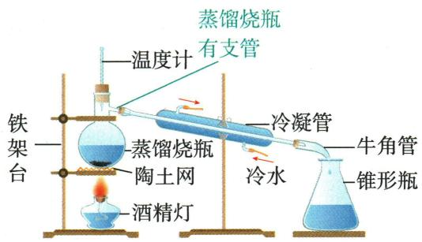

## 讲解

### 是什么

蒸馏经过汽化与冷凝，从液体混合物中分离组分或去掉不易挥发杂质。

### 怎么来的

加热产生蒸气；冷凝管把热量带走使蒸气变回液体。冷却水下进上出使夹套充满，温度计测支管口蒸气；沸石提供气泡形成位置以减少暴沸。

### 什么时候能用

适用时须有可利用的挥发性差异。共蒸、飞溅夹带和容器污染会降低纯度；初中“蒸馏水为纯净物”是简化模型，不等于所有真实一次蒸馏水绝对无杂质。FDA列蒸馏为瓶装饮用水的一种净化工艺，[核查来源](https://www.fda.gov/consumers/consumer-updates/bottled-water-everywhere-keeping-it-safe)，不能仅以缺矿物质得出一律不能饮用。

## 例题

### 原蒸馏装置案例

> 来源ID Q04-18；第四单元自然界的水；51-100/full.md 第116–131行。原答案与解析定位：51-100/full.md 第118–131行。

# 知识点 5 蒸馏★☆☆

1.原理：蒸馏是根据混合物中各成分的沸点不同进行分离的一种方法。⑦  
2.适用范围: 蒸馏适用于分离和提纯液态混合物,或除去混在液体中的杂质,如实验室采用蒸馏的方法制取蒸馏水⑧。

# 3. 蒸馏装置

  
实验室常用的蒸馏装置

  
制取蒸馏水的简易装置 9

特别说明

| 蒸馏操作注意事项 | 目的 |
| --- | --- |
| 在蒸馏烧瓶(或圆底烧瓶)中加入几粒沸石(或碎瓷片) | 防止加热时出现暴沸 |
| 蒸馏烧瓶(或圆底烧瓶)下面一定要垫陶土网 | 防止受热不均,炸裂烧瓶 |
| 使温度计水银球与蒸馏烧瓶支管口位于同一水平线 | 以便测量蒸气温度 |
| 冷凝管中水的流向应是下口进、上口出 | 以便蒸气充分冷却 |
| 弃去最开始蒸馏出的部分液体 | 防止其中含有低沸点的杂质 |

**原资料答案与解析：**

1.原理：蒸馏是根据混合物中各成分的沸点不同进行分离的一种方法。⑦  
2.适用范围: 蒸馏适用于分离和提纯液态混合物,或除去混在液体中的杂质,如实验室采用蒸馏的方法制取蒸馏水⑧。

# 3. 蒸馏装置

  
实验室常用的蒸馏装置

  
制取蒸馏水的简易装置 9

特别说明

| 蒸馏操作注意事项 | 目的 |
| --- | --- |
| 在蒸馏烧瓶(或圆底烧瓶)中加入几粒沸石(或碎瓷片) | 防止加热时出现暴沸 |
| 蒸馏烧瓶(或圆底烧瓶)下面一定要垫陶土网 | 防止受热不均,炸裂烧瓶 |
| 使温度计水银球与蒸馏烧瓶支管口位于同一水平线 | 以便测量蒸气温度 |
| 冷凝管中水的流向应是下口进、上口出 | 以便蒸气充分冷却 |
| 弃去最开始蒸馏出的部分液体 | 防止其中含有低沸点的杂质 |

**展开解析（依据原详解补足理由与步骤）：**

这是原方法图，不是考试题。加热使水汽化，蒸气经冷凝恢复为液水，利用沸点和挥发性差异留下不易挥发杂质。温度计球与支管口齐平是测离开烧瓶的蒸气温度；冷凝水下口进上口出使夹套充满，提高冷却效率；沸石促进平稳沸腾，不用于增大纯度；陶土网让受热更均匀。弃初馏分针对低沸点杂质。能共蒸的挥发物、夹带与收集污染仍可能残留，不能保证去掉“所有杂质”。

## 易错

先核对物质身份、符号位置和题目给定条件，不能按关键词省略依据。
