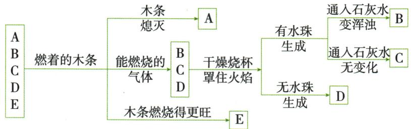

## 讲解

### 判据

候选明确为$O_{2}$、$CO_{2}$、H₂、$CO$、$CH_{4}$，支持/不支持燃烧与可燃先分组。

### 流程

在教材纯净候选模型中先找$O_{2}$助燃、$CO_{2}$熄灭；余三气比较是否生成水、是否生成使石灰水浑浊气体。H₂只有水，$CO$只有$CO_{2}$，$CH_{4}$两者都有。判据依题给范围，实际不能对未知混合气直接点燃。

## 例题

### 五种已知气体鉴别树

> 来源ID Q07-05；第七单元能源的合理利用与开发；101-150/full.md 第181–192行。原答案与解析定位：101-150/full.md 第194–196行。

例 有 A、B、C、D、E 五种气体, 它们分别是氧气、氢气、一氧化碳、二氧化碳、甲烷中的一种, 对其进行如图所示的实验:

请回答下列问题。

(1) B 气体的化学式是\_\_\_\_。  
(2) D 气体在空气中燃烧的化学方程式是 \_\_\_\_。

(3) 固态 A 物质在生活中的一种用途是 \_\_\_\_。

(4)实验室制取 E 气体的化学方程式是 \_\_\_\_。

**原资料答案与解析：**

解析 氧气、氢气、一氧化碳、二氧化碳、甲烷这五种气体中,氧气有助燃性,能使燃着的木条燃烧得更旺,则 E 为氧气;二氧化碳一般不可燃也不助燃,能使燃着的木条熄灭,则 A 为二氧化碳;氢气、一氧化碳、甲烷都有可燃性,但是燃烧产物不同,一氧化碳燃烧只生成二氧化碳,氢气燃烧只生成水,甲烷燃烧生成水和二氧化碳,则 B 为甲烷,C 为氢气,D 为一氧化碳。

答案 (1) $\mathrm{CH}_4$ (2) $2\mathrm{CO} + \mathrm{O}_2 \xlongequal{\text{点燃}} 2\mathrm{CO}_2$ (3) 人工增雨(或作制冷剂) (4) $2\mathrm{H}_2\mathrm{O}_2 \xlongequal{\mathrm{MnO}_2} 2\mathrm{H}_2\mathrm{O} + \mathrm{O}_2 \uparrow$ (或 $2\mathrm{KMnO}_4 \xlongequal{\triangle} \mathrm{K}_2\mathrm{MnO}_4 + \mathrm{MnO}_2 + \mathrm{O}_2 \uparrow$ )

**展开解析（依据原详解补足理由与步骤）：**

按限定候选五气，木条更旺的E为$O_{2}$，熄灭的A为$CO_{2}$，可燃的B/C/D须再区分产物。B燃烧有水且石灰水浑浊，含H、C，所以$CH_{4}$；C有水但不产使石灰水浑浊的气体，H₂；D无水，$CO$燃烧成$CO_{2}$。故(1)$CH_{4}$。(2)$2CO+O_2\xlongequal{\text{点燃}}2CO_2$。(3)干冰制冷或合适气象条件人工增雨。(4)可写$2H_2O_2\xlongequal{MnO_2}2H_2O+O_2\uparrow$。产物检验用干燥烧杯并防水汽、原有$CO_{2}$干扰；候选明确且气体纯净的题模型不能推广成对任意未知可燃混合气直接点火。实际实验先按规范检验纯度。

## 易错

控制变量不是只把质量相等；安全适用范围先核对。
