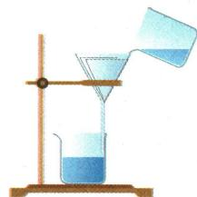

## 讲解

### 判据

题给浑浊、异味、硬度或微生物，先确定要去的成分。

### 流程

列成分→找性质差异→选分离操作；再检查过滤各接触位置和液面。浑浊先排查固体绕过滤纸，流慢排查孔堵气泡。选择净水器层序时按流路由粗到细，再吸附，不能按图上材料名字的熟悉程度选。

## 例题

### 湖水过滤操作

> 来源ID Q04-01；第四单元自然界的水；51-100/full.md 第154–159行。原答案与解析定位：51-100/full.md 第161–171行。

例 某同学将浑浊的湖水样品倒入烧杯中,先加入明矾粉末,搅拌溶解,静置一会儿后,采用如图所示装置进行过滤。请回答下列问题。

(1) 明矾的作用是\_\_\_\_\_, 图中还缺少的一种仪器是\_\_\_\_。  
(2)操作过程中,他发现过滤速率太慢,原因可能是\_\_\_\_。  
(3) 过滤后, 观察发现滤液仍然浑浊, 可能的原因是 \_\_\_\_ (答一条)。  
(4)经改进后再过滤,得到澄清透明的水,他兴奋地宣布:“我终于制得了纯水!”对此你是否同意?理由是\_\_\_\_。若要制得纯水,还需采用的净化方法是\_\_\_\_(若上述说法合理,该空不填)。

**原资料答案与解析：**

解析（1）明矾溶于水形成的胶状物可以吸附水中的悬浮物，使之沉降；图中还缺少玻璃棒，过滤时要用玻璃棒进行引流。

(2) 过滤速率太慢可能是因为滤纸没有紧贴漏斗内壁, 使滤纸与漏斗内壁之间有气泡; 也可能是滤纸上的小孔被堵塞。  
(3) 过滤后仍然浑浊,说明没有起到过滤作用,可能是滤纸破损、液面高于滤纸边缘、盛接滤液的烧杯不干净等。  
(4) 过滤只能除去液体中的不溶性固体物质, 可溶性物质并没有除去, 故过滤后的水不是纯水; 要想得到纯水, 应该采取蒸馏的方法, 蒸馏时, 水变为水蒸气, 水蒸气又冷凝成液态的水, 这样就可以除去液体中的可溶性物质。

答案 (1)使水中悬浮的杂质较快沉降,使水逐渐澄清 玻璃棒

(2) 滤纸和漏斗内壁之间有气泡(合理即可)   
(3) 滤纸破损(或过滤时液面高于滤纸边缘, 合理即可)  
(4)不同意,过滤后的水中还含有可溶性物质 蒸馏

**展开解析（依据原详解补足理由与步骤）：**

(1)明矾溶于水形成的胶状物吸附悬浮杂质并促进沉降，不是消毒剂。缺少玻璃棒，应引流以防液体冲破滤纸或溅出。(2)速度慢可因滤纸不贴壁留气泡，或孔被杂质堵塞。(3)浑浊意味着固体进入滤液，可因滤纸破损、液面高于滤纸边缘绕过过滤，或接液烧杯原有污物。(4)不同意：过滤只能去不溶固体，透明不证明没有溶解物。按本题杂质模型，进一步蒸馏可取得净化程度更高的水；不能把任何真实水样一次蒸馏都视为绝对纯净。

### 运河水净化器

> 来源ID Q04-04；第四单元自然界的水；51-100/full.md 第221–236行。原答案与解析定位：51-100/full.md 第187–193行。

(2024 江苏常州中考)兴趣小组取京杭大运河水样进行净化实验。

(1)设计:运河水中含有泥沙等不溶性杂质以及色素、异味、矿物质、微生物等。

①可以通过\_\_\_\_（填操作名称）去除泥沙等不溶性杂质。  
②右图为活性炭吸附后的微观图示,活性炭具有\_\_\_\_结构,可以吸附色素和异味分子。

(2)净化:将饮用水瓶和纱布、活性炭等组合成如图所示装置进行水的净化。其中,装置制作较合理的是\_\_\_\_(选填“A”或“B”)。通过该装置净化后的水\_\_\_\_(选填“适宜”或“不宜”)直接饮用。

(3)总结:①混合物分离的一般思路和方法是(将序号排序)\_\_\_\_。  
a. 分析混合物成分 b. 找到分离方法 c. 寻找成分性质差异
②自制净水器净水材料的选择需要考虑的因素有\_\_\_\_（写一条）。

**原资料答案与解析：**

例3 解析（1）①过滤可去除泥沙等不溶性杂质。②活性炭具有疏松多孔结构，可以吸附色素和异味分子。

(2) 按由上到下的顺序排列: 用小砾石除去较大的颗粒, 再用石英砂除去较小的颗粒, 接着用活性炭除去色素和异味, 最后是蓬松棉, 起支撑作用, 故装置制作较合理的是 A。通过该装置净化后的水还含有可溶性杂质、细菌和微生物, 不适宜直接饮用。

答案 (1) ① 过滤 ② 疏松多孔
(2) A 不宜 (3) acb 操作简便
(或过滤装置制作简单, 材料易得、廉价、耐用等, 合理即可)

**展开解析（依据原详解补足理由与步骤）：**

(1)①过滤，分离泥沙与水；②疏松多孔，表面积较大，可以吸附色素和异味成分。(2)选A：流路先经小砾石去大颗粒，再石英砂去较小颗粒，再活性炭吸附，底部蓬松棉支撑；B把活性炭置最上方，先受较大颗粒堵塞，不如A顺序合理。两者净水都不宜直接饮用，仍可能含溶解物及微生物，图示没有消毒保证。(3)先a分析成分，再c找性质差异，再b选分离方法，即acb。材料可考虑易得、廉价、耐用或操作简便，回答一个相关因素即可。

## 易错

原子个数比、质量比、气体体积比各有不同依据；勿混用。
