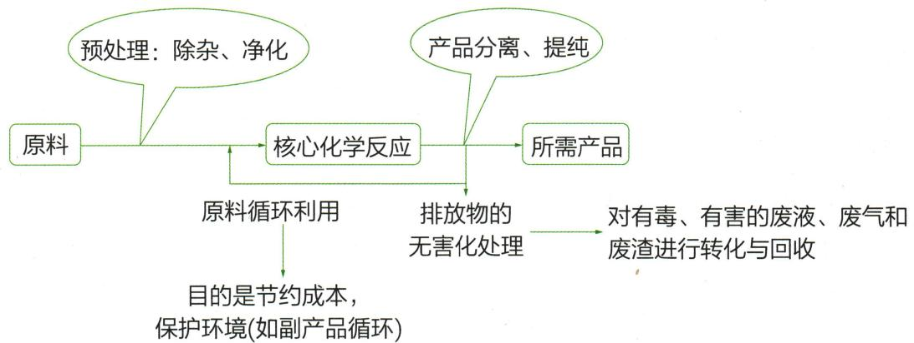
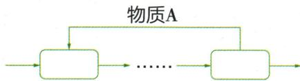
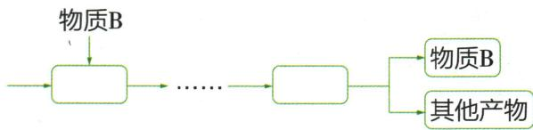
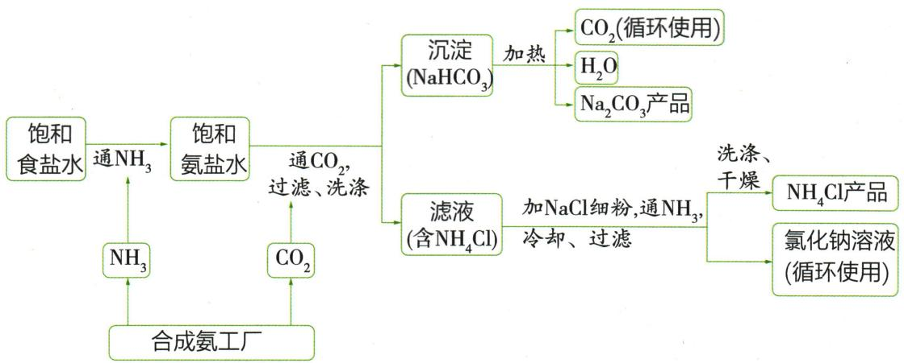

## 讲解

### 判据

题图有回头线，或前端用料与后端可回收物名称相同。

### 流程

逐节点列产出和输入，先找哪一步得到该物，再指出它回到哪一步承担哪项作用。侯氏$NaHCO_{3}$分解产$CO_{2}$，回碳化步骤；滤液析$NH_{4}Cl$后余盐水回氨化。确认分离纯度和条件允许，不把催化剂不消耗、产品反复出现与回流混为一谈。解释意义限节约相应原料或减少部分排放。

## 例题

### 原工艺主支回流结构

> 来源ID Q15-06；专题四化学工艺流程；151-200/full.md 第1589–1597；1639–1649行。原答案与解析定位：151-200/full.md 第1589–1597行；151-200/full.md 第1639–1649行。

工艺流程题以真实的工业生产过程为背景,用框图的形式表述生产过程。试题一般由题目概述(题头)、流程图(题干)、问题(题尾)三部分组成,而流程图一般具有以下结构:

1. 关注 “箭头”：箭头尾部连接的是反应物，箭头指向的是生成物（包括主产物和副产物）。

2. 关注 “三线”：出线和进线表示物料流向或操作流程, 主线表示主产品, 支线表示副产品; 回头线表示物质循环利用(有些可循环利用的物质没有回头线, 但前后均出现该物质的名称或化学式)。

3. 关注 “核心化学反应”。

4. 判断可循环利用的物质

  
图 1

  
图 2

图 1 中, 物质 A 为可循环利用的物质。

某设备或流程中的生成物,为另一设备或流程中的反应物,则该物质为可循环利用的物质。图2中反应生成物质B,同时物质B参与前面的反应,物体B为可循环利用的物质。

**原资料答案与解析：**

工艺流程题以真实的工业生产过程为背景,用框图的形式表述生产过程。试题一般由题目概述(题头)、流程图(题干)、问题(题尾)三部分组成,而流程图一般具有以下结构:

1. 关注 “箭头”：箭头尾部连接的是反应物，箭头指向的是生成物（包括主产物和副产物）。

2. 关注 “三线”：出线和进线表示物料流向或操作流程, 主线表示主产品, 支线表示副产品; 回头线表示物质循环利用(有些可循环利用的物质没有回头线, 但前后均出现该物质的名称或化学式)。

3. 关注 “核心化学反应”。

4. 判断可循环利用的物质

  
图 1

  
图 2

图 1 中, 物质 A 为可循环利用的物质。

某设备或流程中的生成物,为另一设备或流程中的反应物,则该物质为可循环利用的物质。图2中反应生成物质B,同时物质B参与前面的反应,物体B为可循环利用的物质。

**展开解析（依据原详解补足理由与步骤）：**

原示意案例，不是独立考试题。主线追目标，支线追被分开物，回头线追回用物。箭头可以只是物料转移、过滤或蒸发，不一定发生化学反应。图1A回流；图2B在后端生成、前端使用，可回用须实际能回收且规格符合前端要求，不是名称重复就保证全部无损回用。

### 原联合制碱法循环模型

> 来源ID Q15-08；专题四化学工艺流程；151-200/full.md 第1670–1680行。原答案与解析定位：151-200/full.md 第1670–1680行。

2. 联合制碱法(又称“侯氏制碱法”)

联合制碱法的主要原理为在饱和食盐水中通入氨气,形成饱和氨盐水,再向其中通入足量的二氧化碳,之后溶液中就有了大量的钠离子、铵根离子、氯离子和碳酸氢根离子,碳酸氢钠在该状态下的溶解度较小,会以晶体的形式析出,将析出的碳酸氢钠加热分解即可制得纯碱。流程如下:

涉及的化学方程式为 $NH_{3}+CO_{2}+H_{2}O+NaCl\xlongequal{\Delta}NaHCO_{3}\downarrow+NH_{4}Cl,2NaHCO_{3}\xlongequal{\Delta}Na_{2}CO_{3}+H_{2}O+CO_{2}\uparrow$ 。

联合制碱法相较于氨碱法的改良点在于向滤出 $NaHCO_{3}$ 晶体后的滤液中加入 $NaCl$，使其中的 $NH_{4}Cl$ 单独结晶析出，用作氮肥，而 $NaCl$ 溶液循环使用。

联合制碱法的优点:联合生产氯化铵和纯碱两种产品,提高了氯化钠的利用率,缩短了生产流程,减少了对环境的污染,降低了纯碱的生产成本。

**原资料答案与解析：**

原资料文字：氨化的饱和食盐水再通二氧化碳，碳酸氢钠结晶，经加热得纯碱；滤液加$NaCl$使$NH_{4}Cl$结晶，作氮肥，$NaCl$溶液回用。图见原题。
公式按扫描原页恢复：$NH_3+CO_2+H_2O+NaCl=NaHCO_3\downarrow+NH_4Cl$，$2NaHCO_3\xlongequal{\Delta}Na_2CO_3+H_2O+CO_2\uparrow$。OCR原文及错误Δ仍完整保留在库外证据。

**展开解析（依据原详解补足理由与步骤）：**

原模型先氨化盐水，再通$CO_{2}$，析出$NaHCO_{3}$：$NH_3+CO_2+H_2O+NaCl=NaHCO_3\downarrow+NH_4Cl$。本分段PDF实际第41页第一式无Δ；full.md错加的Δ不沿用。过滤晶体后$2NaHCO_3\xlongequal{\Delta}Na_2CO_3+H_2O+CO_2\uparrow$，这一步才标加热。原图明确$CO_{2}$返回碳化步骤；滤液加$NaCl$、通$NH_{3}$、冷却使$NH_{4}Cl$析出，分出氮肥，$NaCl$溶液可回用。解释限本图过程，不能只凭“某盐溶解度较小”说任何混液它必先析出，也不称纯碱是碱类别，它是碳酸钠盐。循环可提高原料利用、减小部分排放，但不等于装置全流程零废弃物。

## 易错

同名出现只是寻找线索，仍需实际回收可行性。
