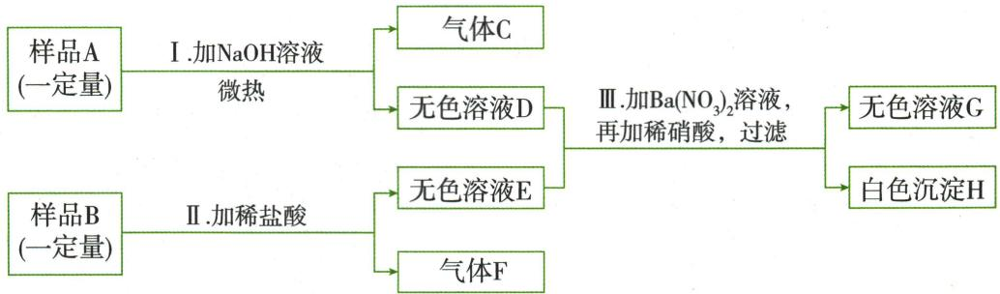
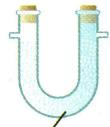
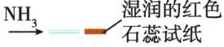
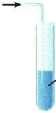

## 讲解

### 判据

待测液不是已知单一盐，白沉淀或气泡不唯一。

### 流程

碳酸根/碳酸氢根：加适量足酸，产气再用石灰水验证$CO_{2}$，排金属放氢；硫酸根先$HCl$排碳酸根等，再$BaCl_{2}$白耐酸沉淀；氯先$HNO_{3}$除碳酸根/碱，再$AgNO_{3}$白耐酸沉淀，不用$HCl$引$Cl^{-}$。检验取原独立样，别用已加目标离子的滤液。

## 例题

### NaOH杂质证据与原盐酸根

> 来源ID Q10-13；第十单元常见的酸碱盐；151-200/full.md 第294–298行。原答案与解析定位：151-200/full.md 第300–302行。

例2 (2024 江苏镇江中考)以海水为原料生产的 $NaOH$ 固体, 可能含有 $NaCl$、 $Na_{2}CO_{3}$ 、 $Na_{2}SO_{4}$ 、 $CaCl_{2}$ 、 $MgSO_{4}$ 中的一种或几种。进行如下实验。

(1)取适量固体加水溶解,得无色澄清溶液 A,则原固体中一定不含\_\_\_\_。  
(2)取适量 A 溶液,加入过量 $BaCl_{2}$ 溶液,过滤得白色固体 B。取固体 B,加入过量稀盐酸,固体全部溶解,产生气泡,则原固体中一定不含\_\_\_\_。生成固体 B 反应的化学方程式为\_\_\_\_。  
(3) 另取适量 A 溶液, 先加入过量的稀 \_\_\_\_ 酸化, 再滴加 $AgNO_{3}$ 溶液, 产生白色沉淀, 则原固体中一定含 \_\_\_\_ 。

**原资料答案与解析：**

解析 (1) $\mathrm{NaOH}$ 能与 $\mathrm{MgSO_4}$ 反应生成 $\mathrm{Mg(OH)_2}$ 沉淀, 而实验中得到无色澄清溶液, 说明原固体中一定不含 $\mathrm{MgSO_4}$ 。(2) 能与 $\mathrm{BaCl}_2$ 反应生成白色沉淀的物质有 $\mathrm{Na}_2\mathrm{CO}_3$ 、 $\mathrm{Na}_2\mathrm{SO}_4$ , 加入过量稀盐酸, 固体全部溶解, 产生气泡, 说明固体 B 是 $\mathrm{BaCO_3}$ 沉淀, 则原固体中一定不含 $\mathrm{Na}_2\mathrm{SO}_4$ , 一定含有 $\mathrm{Na}_2\mathrm{CO}_3$ ; 由于 $\mathrm{Na}_2\mathrm{CO}_3$ 能与 $\mathrm{CaCl}_2$ 反应生成 $\mathrm{CaCO_3}$ 沉淀, 所以原固体中一定不含 $\mathrm{CaCl}_2$ 。生成固体 B 的反应为 $\mathrm{BaCl}_2$ 与 $\mathrm{Na}_2\mathrm{CO}_3$ 反应生成 $\mathrm{BaCO_3}$ 沉淀和 $\mathrm{NaCl}$ 。(3) 根据上述分析, A 溶液中含有 $\mathrm{NaOH} 、 \mathrm{Na}_2\mathrm{CO}_3$ , 不含 $\mathrm{MgSO_4}$ 、 $\mathrm{Na}_2\mathrm{SO}_4$ 、 $\mathrm{CaCl}_2$ , 不确定是否含有 $\mathrm{NaCl}$ 。若要验证溶液 A 中是否存在 $\mathrm{NaCl}$ , 滴加 $\mathrm{AgNO_3}$ 溶液前, 需加入过量的稀硝酸酸化, $\mathrm{Na}_2\mathrm{CO}_3$ 与稀硝酸反应生成硝酸钠、二氧化碳、水, 硝酸钠不会干扰 $\mathrm{NaCl}$ 的检验; 再滴加 $\mathrm{AgNO_3}$ 溶液, 产生白色沉淀, 则原固体中一定含 $\mathrm{NaCl}$ 。

答案 (1) $MgSO_{4}$ (2) $Na_{2}SO_{4}$ 、 $CaCl_{2}$ $Na_{2}CO_{3} + BaCl_{2} = BaCO_{3} \downarrow + 2NaCl$ (3) $HNO_{3}$ $NaCl$

**展开解析（依据原详解补足理由与步骤）：**

(1)$NaOH$中若有$MgSO_{4}$会产$Mg(OH)_{2}$白沉淀；充分溶解为澄清且按本题各成分可观量模型，排$MgSO_{4}$。(2)过量$BaCl_{2}$白沉淀全溶于足量$HCl$并放气，B为$BaCO_{3}$，不含耐酸$BaSO_{4}$；原不含$Na_{2}SO_{4}$。原液有$Na_{2}CO_{3}$而清，按题设排$CaCl_{2}$。$Na_2CO_3+BaCl_2=BaCO_3\downarrow+2NaCl$。(3)另取原A而不是加过$BaCl_{2}$的滤液！过量$HNO_{3}$先除$OH^{-}$/$CO_3^{2-}$，不引入$Cl^{-}$，再加$AgNO_{3}$白沉淀才证原$NaCl$。若用$HCl$酸化，所加$Cl^{-}$本身可形成$AgCl$，证据失效。

### 五盐混合物逐步检验

> 来源ID Q10-14；第十单元常见的酸碱盐；151-200/full.md 第308–319行。原答案与解析定位：151-200/full.md 第321–323行。

例3 有一种固体混合物可能由 $NH_{4}NO_{3}$ 、$NaCl$、 $CuSO_{4}$ 、 $Na_{2}CO_{3}$ 、 $Na_{2}SO_{4}$ 中的一种或几种物质组成,为了测定其组成,进行下列实验:

①将固体混合物溶于水后得无色、透明、澄清溶液 A;  
②向 A 中加入足量 $BaCl_{2}$ 溶液, 完全反应后, 过滤, 得白色沉淀 X 和澄清溶液 B;  
③向白色沉淀 X 中加入足量盐酸,沉淀不减少;  
④向澄清溶液 B 中加入氢氧化钠溶液并微热,有刺激性气味的气体 Y 放出。

(1)写出 X、Y 的化学式: X\_\_\_\_, Y\_\_\_\_。

(2)推断原混合物一定含有的物质是\_\_\_\_,一定不含有的物质是\_\_\_\_,可能含有的物质是\_\_\_\_。

(3)该实验过程中涉及的化学方程式有：\_\_\_\_、\_\_\_\_，均属于基本反应类型中的\_\_\_\_。

**原资料答案与解析：**

解析 ①固体混合物溶于水后得无色、透明、澄清溶液,说明固体中无 $\mathrm{CuSO}_{4}$ ; ② $\mathrm{BaCl}_{2}$ 与 $\mathrm{Na}_{2} \mathrm{SO}_{4}$ 反应产生白色沉淀 $\mathrm{BaSO}_{4}, \mathrm{BaCl}_{2}$ 与 $\mathrm{Na}_{2} \mathrm{CO}_{3}$ 反应产生白色沉淀 $\mathrm{BaCO}_{3}$ ; ③加入足量盐酸,沉淀不减少,则白色沉淀 X 是 $\mathrm{BaSO}_{4}$ 沉淀; ④加入氢氧化钠溶液并微热,有刺激性气味的气体 Y 放出,Y 为 $\mathrm{NH}_{3}$ ,则固体中含有 $\mathrm{NH}_{4} \mathrm{NO}_{3}$ 。根据上述分析可知,固体中一定含有 $\mathrm{NH}_{4} \mathrm{NO}_{3}, \mathrm{Na}_{2} \mathrm{SO}_{4}$ ,一定不含 $\mathrm{CuSO}_{4}, \mathrm{Na}_{2} \mathrm{CO}_{3}$ ,可能含有 $\mathrm{NaCl}$ 。

答案 (1) $\text{BaSO}_4 \quad \text{NH}_3$ (2) $\text{NH}_4\text{NO}_3, \text{Na}_2\text{SO}_4 \quad \text{CuSO}_4, \text{Na}_2\text{CO}_3 \quad \text{NaCl}$ (3) $\text{Na}_2\text{SO}_4 + \text{BaCl}_2 = \text{BaSO}_4 \downarrow + 2\text{NaCl} \quad \text{NH}_4\text{NO}_3 + \text{NaOH} \xlongequal{\triangle} \text{NaNO}_3 + \text{NH}_3 \uparrow + \text{H}_2\text{O}$ 复分解反应

**展开解析（依据原详解补足理由与步骤）：**

①无色排$CuSO_{4}$，按题足量可观组分模型。②$BaCl_{2}$能使$Na_{2}CO_{3}$或$Na_{2}SO_{4}$沉淀；③足量$HCl$沉淀不減，所以X=$BaSO_{4}$，排碳酸钠，有$Na_{2}SO_{4}$。④$NaOH$微热放$NH_{3}$，Y=$NH_{3}$，原有$NH_{4}NO_{3}$。一定有$NH_{4}NO_{3}$、$Na_{2}SO_{4}$；无$CuSO_{4}$、$Na_{2}CO_{3}$；$NaCl$未有专门证据，可能有。$Na_2SO_4+BaCl_2=BaSO_4\downarrow+2NaCl$；$NH_4NO_3+NaOH\xlongequal{\Delta}NaNO_3+NH_3\uparrow+H_2O$，均复分解。后续液含$NaCl$不证明原有$NaCl$，因为前一步可新生成。

### 两样品合流分步检验

> 来源ID Q13-04；专题二共存鉴别分离除杂；151-200/full.md 第1269–1279行。原答案与解析定位：151-200/full.md 第1281–1283行。

例4 (2024 山东济南中考节选)已知某固体样品 A 可能含有 $KCl$、 $\mathrm{K}_{2} \mathrm{SO}_{4} 、 \mathrm{NH}_{4} \mathrm{NO}_{3}$ 三种物质中的一种或多种, 另有一固体样品 B 可能含有 $MgO$、Mg(OH) $_{2}$ 、 $\mathrm{Na}_{2} \mathrm{CO}_{3} 、 \mathrm{CuSO}_{4}$ 四种物质中的两种或多种。按下图所示进行探究实验,出现的现象如图中所述。(设过程中所有发生的反应都恰好完全反应)

结合上述信息进行分析推理,回答下列问题:

①常温下,气体 C 的水溶液 pH 7(填“>”“=”“<”)。  
②白色沉淀 H 为 （填化学式）。  
③步骤Ⅱ中生成气体 F 的化学方程式为  
④无色溶液 G 中,一定大量存在的阳离子为 (填离子符号)。  
⑤在固体样品 A 里,所述三种物质中,还不能确定是否存在的是\_\_\_\_(填化学式),要进一步确定其是否存在,另取少许样品 A 加水配成溶液后再进行实验,请简要说明实验操作步骤、发生的现象及结论:

**原资料答案与解析：**

解析 ①能与氢氧化钠微热产生气体的是硝酸铵,产生的气体是氨气,氨气的水溶液为氨水,显碱性,pH>7。②步骤Ⅲ中加入硝酸钡,又加入了稀硝酸,产生了不溶于稀硝酸的沉淀硫酸钡。③样品B中加入稀盐酸有气体产生,则样品B中含有碳酸钠,稀盐酸和碳酸钠反应生成氯化钠、水和二氧化碳。④步骤I中加入氢氧化钠并微热后产生了气体,则一定含有硝酸铵,两者反应产生硝酸钠、水和氨气;步骤Ⅲ中加入硝酸钡,又加入稀硝酸,产生硫酸钡,则样品A一定有硫酸钾,不能确定氯化钾的存在;由步骤Ⅱ可知,样品B中一定含有碳酸钠,且为无色溶液,一定没有硫酸铜,无法确定氧化镁和氢氧化镁的存在,则无色溶液G中一定大量存在的阳离子是钠离子和钾离子。⑤由④中分析可知不能确定氯化钾的存在;要证明氯化钾是否存在,另取少许样品A加水配成溶液后,向溶液中加入过量硝酸钡,除尽 $K_{2}SO_{4}$ ,防止干扰$KCl$的检验,过滤后,向滤液中加入硝酸银,若产生白色沉淀则含有氯化钾,反之则不含氯化钾。

答案 ①＞② $BaSO_{4}$ ③ $2HCl+Na_{2}CO_{3}=2NaCl+H_{2}O+CO_{2}\uparrow$ ④ $Na^{+}$ 、 $K^{+}$ ⑤$KCl$ 向溶液中加入过量硝酸钡,过滤后,向滤液中加入硝酸银,若产生白色沉淀则含有氯化钾,反之则不含氯化钾

**展开解析（依据原详解补足理由与步骤）：**

①$NH_{4}NO_{3}$与$NaOH$微热产$NH_{3}$，水液碱性，>7。②H耐稀硝酸白沉淀为$BaSO_{4}$，A有$K_{2}SO_{4}$。③F为$CO_{2}$，$Na_2CO_3+2HCl=2NaCl+H_2O+CO_2\uparrow$，B有$Na_{2}CO_{3}$。④原答案只Na⁺K⁺，应补$Mg^{2+}$：B至少两种，已知$Na_{2}CO_{3}$且E无色排$CuSO_{4}$，所以$MgO$、$Mg(OH)_{2}$至少一个存在；与$HCl$分别$MgO+2HCl=MgCl_2+H_2O$或$Mg(OH)_2+2HCl=MgCl_2+2H_2O$，都把$Mg^{2+}$带入E。D/E合流后硝酸钡只沉硫酸根，硝酸不去$Mg^{2+}$，且题各反应恰好不留$NaOH$，因此G必有$Mg^{2+}$。Na来自$NaOH$及$Na_{2}CO_{3}$，K来自$K_{2}SO_{4}$也必有。原资料未交代末加硝酸剩余量，$H^{+}$是否额外作为终液剩余离子须依酸化条件，不能编酸量；本纠正针对被漏的确定金属阳离子。⑤$KCl$尚不定，另取A溶水，过量$Ba(NO_{3})_{2}$去$SO_4^{2-}$，过滤后$AgNO_{3}$白沉淀为原$Cl^{-}$，无白沉淀按可观浓度模型排$KCl$。不用$BaCl_{2}$引入$Cl^{-}$。

### 原气体离子检验表

> 来源ID Q13-08；专题二共存鉴别分离除杂；151-200/full.md 第1106–1106；1110–1115行。原答案与解析定位：151-200/full.md 第1106–1106行；151-200/full.md 第1110–1115行。

| 物质 | 检验方法或图示 | 现象 | 化学方程式 |
| --- | --- | --- | --- |
| $O_2$ | 带火星的木条 | 木条复燃 | — |
| $CO_2$ | 通入澄清石灰水 | 澄清石灰水变浑浊 | $CO_2+Ca(OH)_2=CaCO_3\downarrow+H_2O$ |
| $H_2$ | 点燃,在火焰上方罩一个干燥的烧杯,迅速倒转后,注入少量的澄清石灰水 | 产生淡蓝色火焰,烧杯内壁有水珠生成,澄清石灰水不变浑浊 | $2H_2+O_2\xlongequal{\text{点燃}}2H_2O$ |
| $CO$ | 点燃,在火焰上方罩一个干燥的烧杯,迅速倒转后,注入少量的澄清石灰水 | 产生蓝色火焰,烧杯内壁无水珠,澄清石灰水变浑浊 | $2CO+O_2\xlongequal{\text{点燃}}2CO_2$  $CO_2+Ca(OH)_2=CaCO_3\downarrow+H_2O$ |
| $CH_4$ | 点燃,在火焰上方罩一个干燥的烧杯,迅速倒转后,注入少量的澄清石灰水 | 产生蓝色火焰,烧杯内壁有水珠生成,澄清石灰水变浑浊 | $CH_4+2O_2\xlongequal{\text{点燃}}CO_2+2H_2O$  $CO_2+Ca(OH)_2=CaCO_3\downarrow+H_2O$ |
| $H_2O$ (气) | 无水 $CuSO_4$ | 无水  $CuSO_4$  由白色变成蓝色 | $CuSO_4+5H_2O=CuSO_4\cdot5H_2O$ |
| 氨气( $NH_3$ ) | 1闻气味;2利用湿润的红色石蕊试纸检验 | 1有刺激性气味;2湿润的红色石蕊试纸变蓝 | $NH_3+H_2O=NH_3\cdot H_2O$ |
| $HCl$ | ,硝酸银和稀硝酸的混合溶液 | 产生白色沉淀 | $HCl+AgNO_3=AgCl\downarrow+HNO_3$ |

| 离子 | 试剂 | 方法 | 现象 |
| --- | --- | --- | --- |
| H+ | 紫色石蕊溶液 | 取少量待测液,滴加紫色石蕊溶液 | 紫色石蕊溶液变红 |
| H+ | pH试纸 | 用玻璃棒蘸取少量待测液点在pH试纸上 | 与标准比色卡对照,pH<7 |
| H+ | 活泼金属(K、Ca、Na除外),如Zn | 取少量待测液,加入盛有Zn粒的试管中 | 有气泡产生 |
| H+ | 金属氧化物,如$Fe_{2}O_{3}$ | 取少量待测液,加入盛有$Fe_{2}O_{3}$的试管中 | 固体逐渐溶解,溶液变黄 |
| H+ | 难溶性碱,如$Cu(OH)_{2}$ | 取少量待测液,加入盛有$Cu(OH)_{2}$的试管中 | 固体逐渐溶解,溶液变蓝 |
| OH- | 酸碱指示剂,如紫色石蕊溶液或无色酚酞溶液 | 取少量待测液,滴加紫色石蕊溶液或无色酚酞溶液 | 紫色石蕊溶液变蓝或无色酚酞溶液变红 |
| OH- | pH试纸 | 用玻璃棒蘸取少量待测液点在pH试纸上 | 与标准比色卡对照,pH>7 |
| OH- | 可溶性盐溶液,如$CuSO_{4}$溶液或$FeCl_{3}$溶液 | 取少量待测液,加入$CuSO_{4}$溶液或$FeCl_{3}$溶液 | 产生蓝色或红褐色沉淀 |
| $CO_3^{2-}$ | 稀盐酸和澄清石灰水 | 向待测液中加入稀盐酸,将产生的气体通入澄清石灰水 | 有无色、无臭的气体产生,澄清石灰水变浑浊 |
| $CO_3^{2-}$ | 可溶性钙盐或钡盐溶液和稀硝酸,如  $Ca(NO_3)_2$  或  $Ba(NO_3)_2$  和稀硝酸 | 向待测液中加入  $Ca(NO_3)_2$  或  $Ba(NO_3)_2$ ,再滴加稀硝酸 | 先生成白色沉淀,滴加稀硝酸后沉淀溶解,生成无色气体 |
| $Cl^-$ | 稀硝酸和  $AgNO_3$  溶液 | 将稀硝酸滴入待测液中,再加  $AgNO_3$  溶液 | 滴加稀硝酸无现象,滴加  $AgNO_3$  溶液生成白色沉淀 |
| $SO_4^{2-}$ | 稀盐酸和  $BaCl_2$  溶液 | 将稀盐酸滴入待测液中,再加  $BaCl_2$  溶液 | 滴加稀盐酸无现象,滴加  $BaCl_2$  溶液生成白色沉淀 |
| $NH_4^+$ | (若是固体)熟石灰 | 取样与熟石灰混合研磨 | 产生有刺激性气味的气体 |
| $NH_4^+$ | (若是液体)浓 $NaOH$ 溶液、湿润的红色石蕊试纸 | 取样与浓 $NaOH$ 溶液共热,用湿润的红色石蕊试纸检验生成的气体 | 产生有刺激性气味的气体,该气体使湿润的红色石蕊试纸变蓝 |
| $Ag^+$ | $NaCl$ 溶液和稀硝酸 | 向待测液中加入 $NaCl$ 溶液,再加入稀硝酸 | 有白色沉淀生成,且加入稀硝酸沉淀不溶解 |
| $Ba^{2+}$ | $Na_2SO_4$  溶液和稀盐酸 | 向待测液中加入稀盐酸,再加入  $Na_2SO_4$  溶液 | 滴加盐酸无现象,再加  $Na_2SO_4$  溶液生成白色沉淀 |
| $Cu^{2+}$ | $NaOH$ 溶液 | 将 $NaOH$ 溶液加入待测液中 | 产生蓝色沉淀 |
| $Fe^{3+}$ | $NaOH$ 溶液 | 将 $NaOH$ 溶液加入待测液中 | 产生红褐色沉淀 |

# 温馨提示

1. 向待测液中加入盐酸, 产生了无色、无臭、能使澄清石灰水变浑浊的气体, 该待测液中不一定含有 $\mathrm{CO}_{3}^{2-}$ , 也可能含有 $\mathrm{HCO}_{3}^{-}$ , 因为 $\mathrm{HCO}_{3}^{-}$ 和 $\mathrm{H}^{+}$ 也可以反应生成 $\mathrm{CO}_{2}$ 。  
2. 检验混合物的组成时, 应避免引入杂质, 以防影响实验结果。

**原资料答案与解析：**

| 物质 | 检验方法或图示 | 现象 | 化学方程式 |
| --- | --- | --- | --- |
| $O_2$ | 带火星的木条 | 木条复燃 | — |
| $CO_2$ | 通入澄清石灰水 | 澄清石灰水变浑浊 | $CO_2+Ca(OH)_2=CaCO_3\downarrow+H_2O$ |
| $H_2$ | 点燃,在火焰上方罩一个干燥的烧杯,迅速倒转后,注入少量的澄清石灰水 | 产生淡蓝色火焰,烧杯内壁有水珠生成,澄清石灰水不变浑浊 | $2H_2+O_2\xlongequal{\text{点燃}}2H_2O$ |
| $CO$ | 点燃,在火焰上方罩一个干燥的烧杯,迅速倒转后,注入少量的澄清石灰水 | 产生蓝色火焰,烧杯内壁无水珠,澄清石灰水变浑浊 | $2CO+O_2\xlongequal{\text{点燃}}2CO_2$  $CO_2+Ca(OH)_2=CaCO_3\downarrow+H_2O$ |
| $CH_4$ | 点燃,在火焰上方罩一个干燥的烧杯,迅速倒转后,注入少量的澄清石灰水 | 产生蓝色火焰,烧杯内壁有水珠生成,澄清石灰水变浑浊 | $CH_4+2O_2\xlongequal{\text{点燃}}CO_2+2H_2O$  $CO_2+Ca(OH)_2=CaCO_3\downarrow+H_2O$ |
| $H_2O$ (气) | 无水 $CuSO_4$ | 无水  $CuSO_4$  由白色变成蓝色 | $CuSO_4+5H_2O=CuSO_4\cdot5H_2O$ |
| 氨气( $NH_3$ ) | 1闻气味;2利用湿润的红色石蕊试纸检验 | 1有刺激性气味;2湿润的红色石蕊试纸变蓝 | $NH_3+H_2O=NH_3\cdot H_2O$ |
| $HCl$ | ,硝酸银和稀硝酸的混合溶液 | 产生白色沉淀 | $HCl+AgNO_3=AgCl\downarrow+HNO_3$ |

| 离子 | 试剂 | 方法 | 现象 |
| --- | --- | --- | --- |
| H+ | 紫色石蕊溶液 | 取少量待测液,滴加紫色石蕊溶液 | 紫色石蕊溶液变红 |
| H+ | pH试纸 | 用玻璃棒蘸取少量待测液点在pH试纸上 | 与标准比色卡对照,pH<7 |
| H+ | 活泼金属(K、Ca、Na除外),如Zn | 取少量待测液,加入盛有Zn粒的试管中 | 有气泡产生 |
| H+ | 金属氧化物,如$Fe_{2}O_{3}$ | 取少量待测液,加入盛有$Fe_{2}O_{3}$的试管中 | 固体逐渐溶解,溶液变黄 |
| H+ | 难溶性碱,如$Cu(OH)_{2}$ | 取少量待测液,加入盛有$Cu(OH)_{2}$的试管中 | 固体逐渐溶解,溶液变蓝 |
| OH- | 酸碱指示剂,如紫色石蕊溶液或无色酚酞溶液 | 取少量待测液,滴加紫色石蕊溶液或无色酚酞溶液 | 紫色石蕊溶液变蓝或无色酚酞溶液变红 |
| OH- | pH试纸 | 用玻璃棒蘸取少量待测液点在pH试纸上 | 与标准比色卡对照,pH>7 |
| OH- | 可溶性盐溶液,如$CuSO_{4}$溶液或$FeCl_{3}$溶液 | 取少量待测液,加入$CuSO_{4}$溶液或$FeCl_{3}$溶液 | 产生蓝色或红褐色沉淀 |
| $CO_3^{2-}$ | 稀盐酸和澄清石灰水 | 向待测液中加入稀盐酸,将产生的气体通入澄清石灰水 | 有无色、无臭的气体产生,澄清石灰水变浑浊 |
| $CO_3^{2-}$ | 可溶性钙盐或钡盐溶液和稀硝酸,如  $Ca(NO_3)_2$  或  $Ba(NO_3)_2$  和稀硝酸 | 向待测液中加入  $Ca(NO_3)_2$  或  $Ba(NO_3)_2$ ,再滴加稀硝酸 | 先生成白色沉淀,滴加稀硝酸后沉淀溶解,生成无色气体 |
| $Cl^-$ | 稀硝酸和  $AgNO_3$  溶液 | 将稀硝酸滴入待测液中,再加  $AgNO_3$  溶液 | 滴加稀硝酸无现象,滴加  $AgNO_3$  溶液生成白色沉淀 |
| $SO_4^{2-}$ | 稀盐酸和  $BaCl_2$  溶液 | 将稀盐酸滴入待测液中,再加  $BaCl_2$  溶液 | 滴加稀盐酸无现象,滴加  $BaCl_2$  溶液生成白色沉淀 |
| $NH_4^+$ | (若是固体)熟石灰 | 取样与熟石灰混合研磨 | 产生有刺激性气味的气体 |
| $NH_4^+$ | (若是液体)浓 $NaOH$ 溶液、湿润的红色石蕊试纸 | 取样与浓 $NaOH$ 溶液共热,用湿润的红色石蕊试纸检验生成的气体 | 产生有刺激性气味的气体,该气体使湿润的红色石蕊试纸变蓝 |
| $Ag^+$ | $NaCl$ 溶液和稀硝酸 | 向待测液中加入 $NaCl$ 溶液,再加入稀硝酸 | 有白色沉淀生成,且加入稀硝酸沉淀不溶解 |
| $Ba^{2+}$ | $Na_2SO_4$  溶液和稀盐酸 | 向待测液中加入稀盐酸,再加入  $Na_2SO_4$  溶液 | 滴加盐酸无现象,再加  $Na_2SO_4$  溶液生成白色沉淀 |
| $Cu^{2+}$ | $NaOH$ 溶液 | 将 $NaOH$ 溶液加入待测液中 | 产生蓝色沉淀 |
| $Fe^{3+}$ | $NaOH$ 溶液 | 将 $NaOH$ 溶液加入待测液中 | 产生红褐色沉淀 |

# 温馨提示

1. 向待测液中加入盐酸, 产生了无色、无臭、能使澄清石灰水变浑浊的气体, 该待测液中不一定含有 $\mathrm{CO}_{3}^{2-}$ , 也可能含有 $\mathrm{HCO}_{3}^{-}$ , 因为 $\mathrm{HCO}_{3}^{-}$ 和 $\mathrm{H}^{+}$ 也可以反应生成 $\mathrm{CO}_{2}$ 。  
2. 检验混合物的组成时, 应避免引入杂质, 以防影响实验结果。

**展开解析（依据原详解补足理由与步骤）：**

原表是候选体系检验清单，不是任意未知样品唯一身份证。酸产$CO_{2}$可能$CO_3^{2-}$或$HCO_3^{-}$；$NH_{3}$湿红纸蓝，未知强碱性气仍需其他证据；H₂/$CO$/$CH_{4}$燃烧产物组合只用于老师安全条件和已知候选，水珠来源需排环境水。检原气水先无水$CuSO_{4}$，气味不直接凑鼻。

## 易错

先交代题设条件，再沿现象和物质账推理，不以一种颜色或气泡唯一认物。
