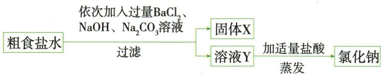
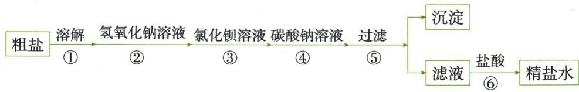

## 讲解

### 判据

Ca²⁺Mg²⁺SO₄²⁻溶水，过滤不能直接除，需要先转沉淀。

### 流程

$BaCl_{2}$除硫酸根，$NaOH$除$Mg^{2+}$，$Na_{2}CO_{3}$除$Ca^{2+}$及过量$Ba^{2+}$，故碳酸钠后于钡剂；$NaOH$可按题允许调整。滤去所有沉淀，再$HCl$除过量$OH^{-}$/$CO_3^{2-}$，最后蒸发。每步处理原杂与新带杂，不把试剂越多越好。

## 例题

### 粗盐可溶杂质完整流程

> 来源ID Q10-15；第十单元常见的酸碱盐；151-200/full.md 第348–354行。原答案与解析定位：151-200/full.md 第356–358行。

例4 粗食盐中含有泥沙和 $MgCl_{2}$ 、 $CaCl_{2}$ 、 $Na_{2}SO_{4}$ 杂质。某同学将粗食盐样品溶解、过滤，除去泥沙后，取粗食盐水按以下流程进行提纯。

(1)溶解、过滤、蒸发操作中都用到的一种玻璃仪器是\_\_\_\_。  
(2)固体 X 中所含的难溶物有 $\mathrm{BaSO}_{4}$ 、 $\mathrm{Mg(OH)}_{2}$ 、\_\_\_\_和 $\mathrm{BaCO}_{3}$ 。  
(3)加入盐酸的目的是除去溶液Y中的两种杂质,这两种杂质是\_\_\_\_。

**原资料答案与解析：**

解析 (1) 溶解、过滤、蒸发操作中都用到的玻璃仪器是玻璃棒; (2) 加入过量的碳酸钠能除去杂质氯化钙和过量的氯化钡, 所以难溶物中还有碳酸钙(由碳酸钠和氯化钙反应生成); (3) 溶液 Y 中含有过量的氢氧化钠和碳酸钠, 需要加适量盐酸除去这两种杂质。

答案 (1) 玻璃棒 (2) $\mathrm{CaCO}_{3}$ (3) $\mathrm{NaOH}$ 和 $\mathrm{Na}_{2} \mathrm{CO}_{3}$

**展开解析（依据原详解补足理由与步骤）：**

(1)玻璃棒：溶解搅拌、过滤引流、蒸发搅拌，不能三步都写同用途。(2)依次过量$BaCl_{2}$除$SO_4^{2-}$成$BaSO_{4}$、$NaOH$除$Mg^{2+}$成$Mg(OH)_{2}$、$Na_{2}CO_{3}$除$Ca^{2+}$和过量$Ba^{2+}$，X还含$CaCO_{3}$、$BaCO_{3}$。(3)过滤后Y中$NaCl$与过量$NaOH$、$Na_{2}CO_{3}$，$HCl$后两者分别成盐水或盐水$CO_{2}$。除杂目的让杂质变可分离形式并处理过量试剂，不是投入三种试剂就最终盐纯。$Na_{2}CO_{3}$必须后于$BaCl_{2}$；$HCl$必须滤沉淀后加，否则会溶$CaCO_{3}$/$BaCO_{3}$等。

### 粗盐三杂试剂次序

> 来源ID Q13-06；专题二共存鉴别分离除杂；151-200/full.md 第1312–1318行。原答案与解析定位：151-200/full.md 第1320–1328行。

例6 除去 $NaCl$ 溶液中 $CaCl_{2}$ 、 $MgCl_{2}$ 、 $Na_{2}SO_{4}$ 杂质的操作有:①加过量的 $NaOH$ 溶液;②加过量的 $BaCl_{2}$ 溶液;③过滤;④加适量的稀盐酸;⑤加过量的 $Na_{2}CO_{3}$ 溶液。

[提示: $\text{Mg(OH)}_2$ 、 $\text{BaSO}_4$ 、 $\text{BaCO}_3$ 难溶于水]

(1)以上操作合理的先后顺序为\_\_\_\_（数字序号不能重复使用）。  
(2)请写出 $BaCl_{2}$ 溶液与 $Na_{2}SO_{4}$ 溶液反应的化学方程式：\_\_\_\_。  
(3)上述试剂中的 $Na_{2}CO_{3}$ 不能用 $K_{2}CO_{3}$ 代替,请说明原因: \_\_\_\_。

**原资料答案与解析：**

解析 (1)为了将杂质彻底除去,所加试剂必须过量,过量的碳酸钠和氢氧化钠最后均可利用适量稀盐酸除去,而过量的氯化钡可用加入的碳酸钠除去,故碳酸钠溶液一定要在氯化钡溶液之后加入,因盐酸能与生成的沉淀反应,故盐酸要在过滤操作之后加入,因此合理的顺序为②⑤①③④或②①⑤③④或①②⑤③④。

(2)氯化钡和硫酸钠反应生成硫酸钡沉淀和氯化钠。  
(3)碳酸钠不能用碳酸钾代替,否则会产生新的杂质氯化钾。

答案 (1)①②⑤③④(或②①⑤③④或②⑤①③④)

(2) $\mathrm{BaCl}_2 + \mathrm{Na}_2\mathrm{SO}_4 = \mathrm{BaSO}_4\downarrow +2\mathrm{NaCl}$   
(3) $K_{2}CO_{3}$ 与 $CaCl_{2}$ 、 $BaCl_{2}$ 反应生成 $KCl$, 会引入新的杂质

**展开解析（依据原详解补足理由与步骤）：**

(1)①②⑤③④或②①⑤③④或②⑤①③④。$NaOH$除$Mg^{2+}$可灵活；$BaCl_{2}$后必须有$Na_{2}CO_{3}$除其过量$Ba^{2+}$；生成沉淀全部滤掉后再$HCl$除过量碱碳酸盐。(2)$BaCl_2+Na_2SO_4=BaSO_4\downarrow+2NaCl$。(3)$K_{2}CO_{3}$也能沉Ca/Ba，但带入$K^{+}$最终$KCl$，留新杂。不是能去原杂就够，要看试剂其它离子去哪。

### 粗盐去可溶杂质六步顺序

> 来源ID Q15-02；专题四化学工艺流程；151-200/full.md 第1739–1751行。原答案与解析定位：151-200/full.md 第1751–1753行。

例2（年份地区按原资料）为除去粗盐中的氯化镁、硫酸钠、氯化钙等杂质，加入过量氢氧化钠、氯化钡、碳酸钠，过滤后加适量盐酸，过程如图。

下列说法错误的是（ ）
A. 实验操作步骤也可以是①③④②⑤⑥。
B. 操作⑤得到的沉淀中共有三种物质。
C. 氯化钡和碳酸钠溶液添加顺序不可以颠倒。
D. 操作⑥加盐酸的目的是除去过量$NaOH$和$Na_{2}CO_{3}$，将滤液pH调为7。

**原资料答案与解析：**

D. 操作⑥中, 加入盐酸的目的是除去过量的氢氧化钠和碳酸钠, 将滤液的 $\mathrm{pH}$ 调为 7解析 A(√)过量的氢氧化钠溶液可以将镁离子沉淀,过量的氯化钡溶液可以将硫酸根离子沉淀;先除镁离子,还是先除硫酸根离子都可以;加入过量的碳酸钠溶液将钙离子转化为沉淀,但是加入碳酸钠溶液要放在加入氯化钡溶液之后,这样碳酸钠会除去反应剩余的氯化钡,实验操作步骤可以为①③④②⑤⑥。B(×)操作⑤得到的沉淀中共有氢氧化镁、硫酸钡、碳酸钡、碳酸钙四种物质。C(√)根据A选项的解析,在实验操作过程中,氯化钡和碳酸钠溶液的添加顺序不可以颠倒。D(√)滤液中含有过量的碳酸钠和氢氧化钠,操作⑥中,加入盐酸的目的是除去过量的氢氧化钠和碳酸钠,将滤液的pH调为7。

答案 B

**展开解析（依据原详解补足理由与步骤）：**

A正确，①溶解后②先沉硫酸根与③先沉镁离子可交换；④$Na_{2}CO_{3}$必须在②$BaCl_{2}$之后，且⑤过滤、⑥酸处理在后。B错误，四种沉淀分别$Mg(OH)_{2}$、$BaSO_{4}$、$CaCO_{3}$、$BaCO_{3}$；最后一种来自过量$BaCl_{2}$与$Na_{2}CO_{3}$，虽原粗盐没有钡，试剂引入后仍要除。C正确，先碳酸钠会被后加入的钡剂消耗，且不能保证后续多余钡都去掉。D正确，在原题精盐水酸量合适的模型中$HCl$消耗余$NaOH$、$Na_{2}CO_{3}$，形成$NaCl$；适量而非任意过量才能控制终点。$MgCl_2+2NaOH=Mg(OH)_2\downarrow+2NaCl$；$Na_2SO_4+BaCl_2=BaSO_4\downarrow+2NaCl$；$CaCl_2+Na_2CO_3=CaCO_3\downarrow+2NaCl$；$BaCl_2+Na_2CO_3=BaCO_3\downarrow+2NaCl$。选B。题干和原解析在L1751粘连，正文将D与解析分开。

## 易错

先交代题设条件，再沿现象和物质账推理，不以一种颜色或气泡唯一认物。
