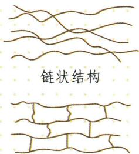

## 讲解

### 判据

原表纯纤维学校小样可用多项现象。

### 流程

棉烧纸味灰粉、羊毛烧焦羽毛味、涤纶等熔化结硬块；必须比较多项且只在老师安全条件进行，混纺阻燃会改变，不依单一黑色残渣唯一认。

## 例题

### 原材料分类结构及纤维表

> 来源ID Q11-15；第十一单元化学与社会；151-200/full.md 第679–690；702–719行。原答案与解析定位：151-200/full.md 第679–690行；151-200/full.md 第702–719行。

1 拓展延伸 高分子材料的结构如下

  
网状结构

② 拓展延伸

聚乙烯塑料无毒，聚氯乙烯塑料有毒。

3 易错警示 正确区分合成材料与复合材料

复合材料是两种或两种以上的不同材料复合而成的材料；合成材料是人工合成的有机高分子材料，主要成分是有机物。

1. 材料的分类

2. 常见的合成材料

(1)塑料:密度小,耐腐蚀,易加工。常见的类型:聚乙烯、聚丙烯、聚氯乙烯、聚苯乙烯、聚酯等。②  
(2) 合成橡胶: 弹性和绝缘性好。常见的类型: 顺丁橡胶、丁苯橡胶、异戊橡胶等。  
(3) 合成纤维: 强度高, 弹性好, 耐磨, 耐腐蚀。常见的类型: 聚丙烯纤维 (丙纶)、聚对苯二甲酸乙二酯纤维 (涤纶)、聚丙烯腈纤维 (腈纶) 等。

几种常见纤维的鉴别方法：

| 纤维种类 | 纤维种类 | 成分 | 鉴别方法 |
| --- | --- | --- | --- |
| 天然纤维 | 棉纤维 | 纤维素 | 易燃烧,燃烧时有烧纸的气味,灰烬呈灰色,手捻时全部成粉末 |
| 天然纤维 | 羊毛纤维 | 蛋白质 | 燃烧时有烧焦羽毛的气味,灰烬呈黑褐色 |
| 合成纤维(如涤纶、锦纶) | 合成纤维(如涤纶、锦纶) | — | 先熔化再燃烧,或边熔化边燃烧,燃烧时有特殊气味,灰烬为黑褐色硬块状态 |

3. 复合材料 ③

(1) 定义: 将几种材料复合起来, 综合各组分性能的优点的材料。  
(2) 实例: 玻璃纤维增强塑料(玻璃钢)、碳纤维复合材料、芳纶复合材料等。

**原资料答案与解析：**

1 拓展延伸 高分子材料的结构如下

  
网状结构

② 拓展延伸

聚乙烯塑料无毒，聚氯乙烯塑料有毒。

3 易错警示 正确区分合成材料与复合材料

复合材料是两种或两种以上的不同材料复合而成的材料；合成材料是人工合成的有机高分子材料，主要成分是有机物。

1. 材料的分类

2. 常见的合成材料

(1)塑料:密度小,耐腐蚀,易加工。常见的类型:聚乙烯、聚丙烯、聚氯乙烯、聚苯乙烯、聚酯等。②  
(2) 合成橡胶: 弹性和绝缘性好。常见的类型: 顺丁橡胶、丁苯橡胶、异戊橡胶等。  
(3) 合成纤维: 强度高, 弹性好, 耐磨, 耐腐蚀。常见的类型: 聚丙烯纤维 (丙纶)、聚对苯二甲酸乙二酯纤维 (涤纶)、聚丙烯腈纤维 (腈纶) 等。

几种常见纤维的鉴别方法：

| 纤维种类 | 纤维种类 | 成分 | 鉴别方法 |
| --- | --- | --- | --- |
| 天然纤维 | 棉纤维 | 纤维素 | 易燃烧,燃烧时有烧纸的气味,灰烬呈灰色,手捻时全部成粉末 |
| 天然纤维 | 羊毛纤维 | 蛋白质 | 燃烧时有烧焦羽毛的气味,灰烬呈黑褐色 |
| 合成纤维(如涤纶、锦纶) | 合成纤维(如涤纶、锦纶) | — | 先熔化再燃烧,或边熔化边燃烧,燃烧时有特殊气味,灰烬为黑褐色硬块状态 |

3. 复合材料 ③

(1) 定义: 将几种材料复合起来, 综合各组分性能的优点的材料。  
(2) 实例: 玻璃纤维增强塑料(玻璃钢)、碳纤维复合材料、芳纶复合材料等。

**展开解析（依据原详解补足理由与步骤）：**

原图及表。天然棉羊毛蚕丝高分子不因高分子就算合成；塑料合成橡胶合成纤维是常见合成材料；玻璃钢为玻璃纤维与塑料等复合，名字有钢不归金属钢。链状常与热塑加工有关，交联网络通常不再易熔流，不能把所有链状高分子或所有塑料都绝对化。棉烧纸味、羊毛蛋白烧焦羽毛味、涤纶熔融结硬块是纯/主要纤维小样学校鉴别模型，混纺或阻燃添加剂会改变现象。原PE无毒PVC有毒过宽，材料安全须看配方、残留、迁移及使用条件；食品容器依用途标识，不能凭树脂名自行判可加热。

## 易错

没有对应独立纤维题，原表案例照录
