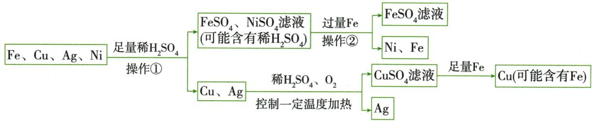

## 讲解

### 判据

工艺图有酸浸、置换、过滤，不能将各步都套同一种反应。

### 流程

依箭头记进入原料、加入试剂和得到固液；先按题给新反应处理Cu在酸与氧条件溶解，再按一般稀酸规则排Cu单独置氢。过滤只分相，不新增物质；每次足量/过量决定余试剂是否必存，终点检查目标金属与杂质去向。

## 例题

### 电路板金属回收流程

> 来源ID Q08-05；第八单元金属和金属材料；101-150/full.md 第703–713行。原答案与解析定位：101-150/full.md 第715–722行。

例3 (2024 山东泰安中考)某种手机电路板中含有 Fe、Cu、Ag、Ni 等金属,如图是某工厂回收部分金属的流程图:

资料信息: $2\mathrm{Cu} + \mathrm{O}_{2} + 2\mathrm{H}_{2}\mathrm{SO}_{4} \xlongequal{\triangle} 2\mathrm{CuSO}_{4} + 2\mathrm{H}_{2}\mathrm{O}$ , 硫酸镍的化学式为 $\mathrm{NiSO}_{4}$ 。

(1)金属中加入足量稀硫酸的目的是\_\_\_\_，操作①的名称是\_\_\_\_。  
(2) 滤液②中所含溶质的化学式为 \_\_\_\_。  
(3)滤渣①中所含金属的化学式为\_\_\_\_。  
(4) 滤液③和铁粉反应的化学方程式为 \_\_\_\_。  
(5) Cu、Ag、Ni 在溶液中的活动性由强到弱依次是 \_\_\_\_。

**原资料答案与解析：**

解析 部分流程图：

(1)金属中加入足量稀硫酸是为了使铁、镍与稀硫酸完全反应或将固体中的铁、镍全部除去,操作①是分离固体、液体的过滤操作;(2)加入足量稀硫酸,铁与稀硫酸反应生成氢气和硫酸亚铁,镍与稀硫酸反应生成氢气和硫酸镍,铜、银与稀硫酸不反应,则充分反应后过滤得到的滤液①中含有硫酸亚铁、硫酸镍,可能含有硫酸,滤渣①中含有铜、银,向滤液①中加入过量铁粉,得到滤液②和铁、镍,说明金属活动性:铁>镍,则滤液②中所含溶质为 $\mathrm{FeSO}_{4}$ ; (3)由上述分析可知,滤渣①中所含金属为Cu、Ag;(4)向滤渣①中加入稀硫酸、氧气,控制一定温度加热,则铜、氧气与稀硫酸在加热条件下反应生成硫酸铜和水,银与稀硫酸不反应,则充分反应后过滤得到的滤液③中含有硫酸铜,滤渣中含有银,向滤液③中加入足量铁粉,铁与硫酸铜反应生成铜和硫酸亚铁,化学方程式为 $\mathrm{Fe}+\mathrm{CuSO}_{4}=\mathrm{FeSO}_{4}+\mathrm{Cu}$ ; (5)由上述分析可知,镍能与硫酸反应生成硫酸镍,说明镍在金属活动性顺序中位于氢之前,则Cu、Ag、Ni在溶液中的活动性由强到弱依次是Ni>Cu>Ag。

答案 (1)使铁、镍与稀硫酸完全反应(或将固体中的铁、镍全部除去) 过滤 (2) $FeSO_{4}$ (3)Cu、Ag
(4) $Fe+CuSO_{4}=FeSO_{4}+Cu$ (5)Ni>Cu>Ag

**展开解析（依据原详解补足理由与步骤）：**

(1)足量稀硫酸让Fe、Ni全部进入溶液，Cu、Ag保留固体；①过滤分固液。(2)滤液①有$FeSO_{4}$、NiSO₄，足量酸可能剩$H_{2}SO_{4}$。过量Fe可消耗酸及置换Ni，所以滤液②仅$FeSO_{4}$，剩Fe和析Ni成固体。(3)初滤渣Cu、Ag。(4)Cu不与稀硫酸单独产氢，但题给$O_{2}$参与且加热的新反应允许Cu成$CuSO_{4}$；后Fe置换$Fe+CuSO_4=FeSO_4+Cu$。足量铁若未说明过量，不必断言固体A一定有剩铁，至少Cu，可能Fe。(5)Ni与稀酸产氢在H前，Cu、Ag在后，又Cu能置换Ag，因此Ni>Cu>Ag。新增反应事实优先采用，不把一般规则盖过题给特殊条件。

### 含铜剩余固体制胆矾

> 来源ID Q15-01；专题四化学工艺流程；151-200/full.md 第1694–1709行。原答案与解析定位：151-200/full.md 第1711–1715行。

例1 (2024 江西中考)研究小组利用炭粉与氧化铜反应后的剩余固体(含 $\mathrm{Cu} 、 \mathrm{Cu}_{2} \mathrm{O} 、 \mathrm{CuO}$ 和 $\mathrm{C}$ )为原料制备胆矾(硫酸铜晶体),操作流程如图:

资料: $\mathrm{Cu}_{2}\mathrm{O}+\mathrm{H}_{2}\mathrm{SO}_{4}=\mathrm{CuSO}_{4}+\mathrm{Cu}+\mathrm{H}_{2}\mathrm{O}$

(1)步骤①中进行反应时用玻璃棒搅拌的目的是  
(2)步骤②中反应的化学方程式为 $\mathrm{Cu}+\mathrm{H}_{2}\mathrm{SO}_{4}+\mathrm{H}_{2}\mathrm{O}_{2}=$ $CuSO_{4}+2X$ ，则 X 的化学式为 \_\_\_\_。  
(3)步骤③中生成蓝色沉淀的化学方程式为\_\_\_\_。

(4)下列分析不正确的是\_\_\_\_（填字母,双选）。

A. 操作 1 和操作 2 的名称是过滤  
B. 固体 N 的成分是炭粉  
C. 步骤④中加入的溶液丙是 $Na_{2}SO_{4}$ 溶液   
D.“一系列操作”中包含降温结晶,说明硫酸铜的溶解度随温度的升高而减小

**原资料答案与解析：**

解析 (1) 反应过程中搅拌的目的是使反应物之间充分接触, 加快反应速率, 使反应更快、更充分。

(2)根据质量守恒定律,化学反应前后原子的种类和个数不变,反应前有6个氧原子、1个铜原子、4个氢原子、1个硫原子,反应后已有4个氧原子、1个铜原子、1个硫原子,所以2X中共有2个氧原子、4个氢原子,故一个X分子中有1个氧原子、2个氢原子,化学式为 $H_{2}O$ 。(3)溶液甲中含有硫酸铜,加入过量氢氧化钠溶液后,氢氧化钠和硫酸铜反应生成氢氧化铜沉淀和硫酸钠,据此书写化学方程式。(4)A(√)通过操作1和操作2均得到溶液和固体,属于固液分离操作,即过滤;B(√)剩余固体中含Cu、 $Cu_{2}O$ 、$CuO$和C,加入过量稀硫酸后得到的固体M中含铜和炭粉,加入过量过氧化氢溶液和过量稀硫酸后,得到的固体N为不反应的炭粉;C(×)步骤③得到的蓝色沉淀为氢氧化铜沉淀,加入适量溶液丙得到硫酸铜溶液,而 $Na_{2}SO_{4}$ 不与氢氧化铜反应,丙应为硫酸,与氢氧化铜反应生成硫酸铜和水;D(×)“一系列操作”中包含降温结晶,可通过降温结晶获得晶体,说明硫酸铜的溶解度随温度的降低而减小。

答案 (1)加快化学反应速率(或使反应更充分等) (2) $H_{2}O$ (3) $CuSO_{4}+2NaOH=Cu(OH)_{2}\downarrow+Na_{2}SO_{4}$ (4)CD

**展开解析（依据原详解补足理由与步骤）：**

(1)玻璃棒搅拌使固液接触更充分，反应更快；不是改变最终理论可制得的铜量。(2)左侧Cu₁、S₁、O₆、H₄，已有$CuSO_{4}$含Cu₁S₁O₄，故2X合含O₂H₄，每个X是$H_{2}O$。补全为$Cu+H_2SO_4+H_2O_2=CuSO_4+2H_2O$。(3)$CuSO_4+2NaOH=Cu(OH)_2\downarrow+Na_2SO_4$，2$NaOH$既供两个OH也供$Na_{2}SO_{4}$的两个Na。(4)A正确，两操作均把液和不溶固体分开，是过滤；B正确，①$CuO$与酸成铜盐，原给定$Cu_{2}O$与酸同时成$CuSO_{4}$及Cu，故M含Cu和C；②铜由酸与$H_{2}O_{2}$转为可溶铜盐，C未反应，N是炭粉。C错误，$Cu(OH)_{2}$需加硫酸转$CuSO_{4}$和水，$Na_{2}SO_{4}$不能完成该反应；D错误，冷却才析晶说明在该区间降温溶解度减小，即升温溶解度增大。题目双选不正确项，选CD。③过量$NaOH$后溶液乙还可能有剩余$NaOH$，不能只列生成的$Na_{2}SO_{4}$；取得沉淀再与适量酸反应，隔开该杂质。

### 铝土矿浸取调pH提取氧化铝

> 来源ID Q15-03；专题四化学工艺流程；151-200/full.md 第1755–1766行。原答案与解析定位：151-200/full.md 第1768–1774行。

例3 (2023 湖北十堰中考)工业上从铝土矿(主要成分为 $\mathrm{Al}_{2} \mathrm{O}_{3}$ , 还含有 $\mathrm{SiO}_{2} 、 \mathrm{Fe}_{2} \mathrm{O}_{3}$ 等)中提取 $\mathrm{Al}_{2} \mathrm{O}_{3}$ 的主要流程如下:

已知:① $SiO_{2}$ 难溶于水,不与盐酸反应。

②当 $pH \geqslant 3.2$ 时, $Fe^{3+}$ 完全转化为 $\mathrm{Fe(OH)}_{3}$ 沉淀。

(1) 操作 1 的名称是 \_\_\_\_。  
(2)在“盐酸浸取”前需将铝土矿粉碎,其目的是\_\_\_\_。  
(3)“煅烧”过程中反应的化学方程式是 $2 \mathrm{Al(OH)}_{3} \xlongequal{\text {高温}} \mathrm{Al}_{2} \mathrm{O}_{3} + 3 \mathrm{X}, \mathrm{X}$ 的化学式是  
(4) 向溶液 2 中加入过量稀氨水,生成沉淀的化学方程式为 \_\_\_\_。

**原资料答案与解析：**

解析（1）经过操作1后物质被分成溶液1和不溶物1两部分，说明操作1起到固液分离的作用，则操作1为过滤；

(2)粉碎固体,可以增大反应物的接触面积,使反应更充分;  
(3)根据质量守恒定律,反应前后原子的种类和数目不变,反应物中有2个Al、6个O、6个H,生成物已有2个Al、3个O,所以3X含有3个O、6个H,X中含有2个H和1个O,则X的化学式为 $H_{2}O$ ;  
(4)溶液2中含 $AlCl_{3}$ ，加入稀氨水， $AlCl_{3}$ 与 $NH_{3}\cdot H_{2}O$ 反应生成 $\mathrm{Al(OH)}_{3}$ 沉淀和 $NH_{4}Cl$ 。

答案 (1) 过滤 (2) 增大与酸的接触面积, 使反应进行更充分 (3) $\mathrm{H}_{2} \mathrm{O}$ (4) $\mathrm{AlCl}_{3} + 3 \mathrm{NH}_{3} \cdot \mathrm{H}_{2} \mathrm{O} = 3 \mathrm{NH}_{4} \mathrm{Cl} + \mathrm{Al(OH)}_{3} \downarrow$

**展开解析（依据原详解补足理由与步骤）：**

(1)液与不溶物分流，操作1过滤。(2)粉碎增大与酸接触面积，利于反应更充分；不增加矿石原有Al总量。(3)$2Al(OH)_3\xlongequal{\text{高温}}Al_2O_3+3H_2O$。反应物Al₂O₆H₆，已知氧化铝占$Al_{2}O_{3}$，3X合O₃H₆，每X为$H_{2}O$。(4)盐酸浸取使$Al_{2}O_{3}$、$Fe_{2}O_{3}$都溶解成氯化物，$SiO_{2}$按已知条件留不溶物1。调pH到3.2按题给条件去$Fe^{3+}$；原流程同时要求铝还留在溶液2，不能自行把pH调到任意更大。加过量稀氨水后$AlCl_3+3NH_3\cdot H_2O=3NH_4Cl+Al(OH)_3\downarrow$；3$NH_3\cdot H_2O$供三个OH，氯转入$NH_{4}Cl$。过滤取得铝沉淀再煅烧。氨水及铝的这组反应属于本题信息和拓展，不要求初中生掌握高中两性机理。

### 含铁银废铜分步回收

> 来源ID Q15-04；专题四化学工艺流程；151-200/full.md 第1776–1786行。原答案与解析定位：151-200/full.md 第1788–1794行。

例4 (2024 四川遂宁中考) 回收利用废旧金属既可以保护环境, 又能节约资源。现有一份废铜料(含有金属铜及少量铁和银), 化学兴趣小组欲回收其中的铜, 设计并进行了如下实验:

已知: $Cu + 2FeCl_{3} = CuCl_{2} + 2FeCl_{2}; Ag + FeCl_{3} = AgCl + FeCl_{2}$

完成下列各题:

(1) 步骤 2 中涉及的操作名称是  
(2)溶液 A 中的溶质是 \_\_\_\_。  
(3) 步骤 4 中反应的化学方程式是

**原资料答案与解析：**

解析 废铜料中有铜、铁、银,稀硫酸可以和铁反应生成硫酸亚铁和氢气,和铜、银不反应。溶液 A 中溶质是过量的硫酸和生成的硫酸亚铁,滤渣 A 中有银和铜。加入适量氯化铁溶液,氯化铁和铜反应生成氯化铜和氯化亚铁,和银反应生成氯化银(不溶于水)和氯化亚铁,所以滤渣 B 为氯化银,溶液 B 中有氯化铜、氯化亚铁,加入试剂 X 得到氯化亚铁和铜,则试剂 X 和氯化铜反应生成氯化亚铁和铜,试剂 X 是铁。

(1) 步骤 2 为固液分离操作, 即过滤;   
(2)根据上述分析知,溶液 A 中溶质是硫酸、硫酸亚铁;  
(3) 步骤 4 是铁与氯化铜反应生成氯化亚铁和铜。

答案 (1) 过滤 (2) 硫酸、硫酸亚铁 (3) $\mathrm{Fe} + \mathrm{CuCl}_{2} = \mathrm{FeCl}_{2} + \mathrm{Cu}$

**展开解析（依据原详解补足理由与步骤）：**

(1)步骤2得滤液和滤渣，过滤；粉碎本身不是过滤。(2)稀硫酸过量，$Fe+H_2SO_4=FeSO_4+H_2\uparrow$，所以溶液A含$FeSO_{4}$与剩余$H_{2}SO_{4}$；Cu、Ag按原条件不被稀酸消耗，留滤渣A。(3)本题特别给定Cu、Ag能与$FeCl_{3}$反应：铜成可溶$CuCl_{2}$，银成不溶$AgCl$，均另产$FeCl_{2}$。步骤3过滤后B有$CuCl_{2}$和$FeCl_{2}$；X应为Fe，用$Fe+CuCl_2=FeCl_2+Cu$取得铜。原“适量”模型让Fe反应后不混入过量铁，不能照抄过量Fe而仍称产物为纯铜。Cu、Ag不与稀硫酸反应，不能推成它们不与任何盐液反应；必须用本题新给资料判断。

### 海水取镁与理论石灰用量

> 来源ID Q15-05；专题四化学工艺流程；151-200/full.md 第1796–1806行。原答案与解析定位：151-200/full.md 第1808–1841行。

例5 (2024 四川巴中中考)海洋是一个巨大的资源宝库。广泛应用于火箭、导弹和飞机制造业的金属镁,就是利用从海水中提取的镁盐制取的。下图是模拟从海水中制取镁的简易流程。

根据流程回答下列问题:

(1)步骤①得到的母液是氯化钠的\_\_\_\_（选填“饱和”或“不饱和”）溶液。  
(2) 步骤②操作中用到的玻璃仪器有烧杯、玻璃棒和\_\_\_\_。  
(3)步骤②中加入氢氧化钠溶液需过量的目的是\_\_\_\_。  
(4)写出步骤③中反应的化学方程式：\_\_\_\_。  
(5)市场调研发现, $\mathrm{Ca(OH)_2}$ 的价格远低于 $\mathrm{NaOH}$ , 更适用于实际工业生产。在步骤②中, 若要制得 $580\mathrm{tMg(OH)_2}$ , 理论上至少需要加入 $\mathrm{Ca(OH)_2}$ 的质量是多少? (写出计算过程)

**原资料答案与解析：**

解析（1）步骤①得到的母液不能继续溶解氯化钠，则为氯化钠的饱和溶液；

(2) 步骤②实现了固液分离, 所以步骤②是过滤, 操作中用到的玻璃仪器有烧杯、玻璃棒和漏斗;  
(3) 步骤②中加入过量的氢氧化钠溶液是为了使氯化镁完全反应；  
(4) 步骤③中氢氧化镁和盐酸反应生成氯化镁和水,化学方程式为 $\mathrm{Mg(OH)}_{2} + 2\mathrm{HCl} = \mathrm{MgCl}_{2} + 2\mathrm{H}_{2}\mathrm{O}$ 。

答案 (1) 饱和

(2) 漏斗   
(3)使 $MgCl_{2}$ 全部反应  
(4) $\mathrm{Mg(OH)}_2 + 2\mathrm{HCl} = \mathrm{MgCl}_2 + 2\mathrm{H}_2\mathrm{O}$   
(5) 解: 设至少需要 $\mathrm{Ca(OH)}_{2}$ 的质量为 $x_{0}$ 。

$$
\mathrm{MgCl} _ {2} + \mathrm{Ca(OH)} _ {2} = \mathrm{CaCl} _ {2} + \mathrm{Mg(OH)} _ {2} \downarrow
$$

74

58

x

580 t

$$
\frac {7 4}{5 8} = \frac {x}{5 8 0 \mathrm{t}}
$$

$$
x = 7 4 0 \mathrm{t}
$$

答: 至少需要 $\mathrm{Ca(OH)}_{2}$ 的质量为 740 t。

**展开解析（依据原详解补足理由与步骤）：**

(1)原步骤①蒸发结晶除去部分$NaCl$，晶体与母液在该条件共存，母液对$NaCl$饱和；不据此称对$MgCl_{2}$也饱和。(2)②产生不溶$Mg(OH)_{2}$并固液分离，过滤需烧杯、玻璃棒、漏斗，空填漏斗。(3)过量$NaOH$保证$MgCl_{2}$尽量完全转成沉淀，不是保证滤液无$NaOH$。(4)$Mg(OH)_2+2HCl=MgCl_2+2H_2O$，两个OH各需一份$HCl$。(5)设理论最少纯$Ca(OH)_{2}$质量为x。$MgCl_2+Ca(OH)_2=CaCl_2+Mg(OH)_2\downarrow$，系数1∶1。$Ca(OH)_{2}$式量$40+2(16+1)=74$，$Mg(OH)_{2}$式量$24+2(16+1)=58$；故反应质量满足$\dfrac{x}{580\,\mathrm{t}}=\dfrac{74}{58}$。等式两侧乘580t：$x=580\,\mathrm{t}\times\dfrac{74}{58}=740\,\mathrm{t}$。这是纯料、完全转化且无损失的理论下限，实际还需计纯度和损耗。④从$MgCl_{2}$溶液到盐须分离脱水；⑤明确熔融再电解，不能把盐水电解套进去。

## 易错

按表面状态、酸或盐的种类和剩余程度核查。
