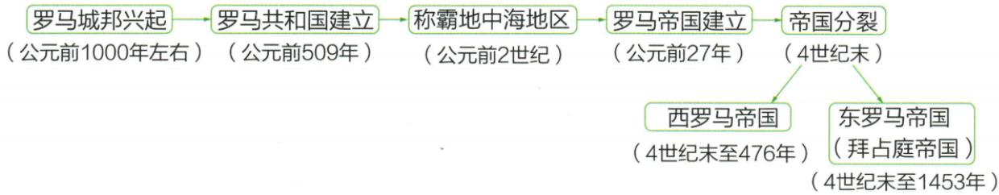

## 错法

原476年罗马灭亡少读一个西字，遂把东罗马同年删除，或说全部居民文化遗产无存。容易用总称罗马代已分裂的具体政权。

## 正解

先看4世纪末图分为东西两支，476只终止西罗马分支，东罗马线继续至1453。政治政权灭亡不等每个人和每件文化成果消失，法律艺术遗产仍可能影响后世；连续影响也不反推原西罗马国家仍在。日期、主体、现象三项一起配。

## 例题

**原危机、分裂与灭亡，未配课内独立衰亡题。**3世纪内有政治经济危机，统治者争斗混战、人民起义、农业萎缩、工商业衰落、民生凋敝，原旁注实质为奴隶制危机；外有375年日耳曼人大举侵入。4世纪末分为东西两帝国，476年西罗马在日耳曼打击下灭亡。原线索图东罗马（拜占庭）分支持续至1453年。

**完整因果。**混战和起义削弱共同治理，生产萎缩使资源财政与生活条件更紧张，统治能力和社会矛盾相互影响；外部入侵施加军事压力，在内部困境上加重冲击，所以原衰亡不是只由一个外族一日到来产生。3世纪危机、375侵入、4世纪末分裂、476西罗马灭亡是不同事件，不能用476代全部开始过程。分裂出现两支，西部灭亡不等东部也在同年灭；原东罗马1453为后续线索，后课再解释具体过程，不把一张时间图当所有因素都已详证。原“奴隶制危机”是制度性概括，应由所列政治经济矛盾具体理解，不能只写标签代原因。

### 来源定位

- WE5-S06：full.md（历史扫描分册251-300），L342–L356，帝国危机日耳曼入侵分裂与西罗马灭亡；5dc2c8da-0729-4435-bf9a-d7b79d1838b6_origin.pdf，实际PDF第5页。
- WE5-S07：full.md（历史扫描分册251-300），L378–L394，罗马历史发展原线索图东西分支与年代；5dc2c8da-0729-4435-bf9a-d7b79d1838b6_origin.pdf，实际PDF第6页。
