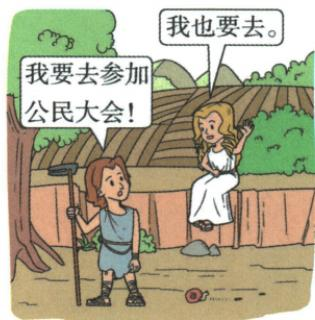
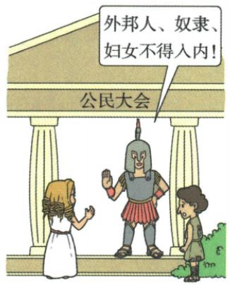

## 错法

看到全体公民可抽签就说雅典所有男女居民都有政治权利，看到几乎抽签便说将军等任何职位无例外。前一步偷换公民身份范围，后一步删除原几乎限定。

## 正解

先确认成年男性公民资格，外邦、奴隶、妇女被排除；再讲资格群体内的抽签轮值津贴。扩大公民机会与居民总体少数民主没有矛盾。原公职几乎抽签只按原限定，不把未给制度细节编成所有职位的统一规则；津贴减经济负担也不改变外邦奴隶妇女资格。

## 例题

**完整原问：雅典民主政治的实质是什么？原答案：奴隶制基础上的少数人的民主，外邦人、奴隶、妇女被排除在民主政治之外。**

**原运作表现与局限完整。**公职人员几乎从全体公民抽签产生，公民有参政机会；代表各地的10个主席团轮流主持日常事务，主席团及主席经抽签；公民大会为最高权力机构，有立法司法等职能；津贴保证贫穷公民参政。绝大多数人口中外邦、奴隶、妇女无政治权利；原还指出一些野心家借民主名义蛊惑争权，甚至使民主沦为暴民政治。

**完整解析。**抽签扩大合资格公民获得公职的机会，轮流主持避免日常事务固定由同一组包办，大会提供直接参与决定的场所，津贴减轻贫穷公民参加公务失去工作收入的负担。这解释参与怎样可能，不只背四名词。但资格门槛先排除大量居民，合资格范围内较多参与与居民总体少数民主可以同时成立。漫画用对话展示这一对照，属后人的教学形象表现，图中人物不是已经证实的古代一次会议实录。原“几乎”不改成任何公职全部抽签；扩大机会也不保证每位公民每次都参加或从不受政治操纵。

**原公民与非公民完整材料，未配独立身份表题。**成年男性公民可参与统治；原表说公民占有土地，一定土地为公民权必要保障；宗教节庆文体竞赛以公民为主体；公民有参军义务。外邦人为自由人，但无政治权利，不能占有土地；奴隶几乎无权利自由。公民与非公民为统治被统治关系，界限分明，转为公民极困难。

**完整解释。**本课“公民”是城邦内特定政治身份，不能套现代“全体居民”的习惯用法。自由人可不受奴隶身份束缚，但未取得城邦政治资格，外邦人因此自由与无参政权并存。土地、军事义务和共同活动将公民与城邦利益联结，说明权利和义务同时存在；原表为希腊城邦概括，不拿它断各城市每位居民生活完全同样。雅典参政还限定成年男性公民，妇女被排除；“全民”若指全居民便越界。

### 来源定位

- WE4-S01：full.md（历史扫描分册251-300），L162–L175，希腊地理影响与城邦特点公民非公民权义完整表；5dc2c8da-0729-4435-bf9a-d7b79d1838b6_origin.pdf，实际PDF第3页。
- WE4-S02：full.md（历史扫描分册251-300），L177–L191，雅典背景高峰民主表现积极评价；5dc2c8da-0729-4435-bf9a-d7b79d1838b6_origin.pdf，实际PDF第3页。
- WE4-Q02：full.md（历史扫描分册251-300），L236–L262，参加与排除两幅原漫画及民主实质原问原答；5dc2c8da-0729-4435-bf9a-d7b79d1838b6_origin.pdf，实际PDF第3–4页。
