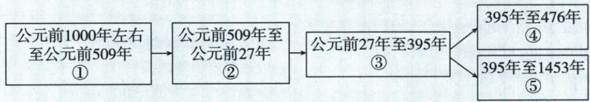

## 讲解

### 是什么

罗马原3世纪陷政治经济危机，375年日耳曼侵入，4世纪末分裂，476年西罗马灭亡。内外因素作用于统治能力，分裂和西部灭亡是不同节点，东罗马仍继续存在。

### 怎么来的

统治者混战削弱协同行动，人民反抗说明矛盾激化，农业工商业衰落减少资源并损害生活；生活困境又能加深社会冲突，内部治理更困难。入侵从外施加军事压力，面对危机的国家动员和防御更受限制，原内因外因需结合而不能相互替代。分裂是共同政治范围变成东西两支，灭亡是其中一个政权不能继续维持，主体范围已不同；所以西部476灭不证明东部同年结束。原奴隶制危机要接这些具体制度矛盾和生产统治问题，不仅重复一句标签；原线索东部1453仅作为后来阶段，不提前编未提供的灭亡战争细节。

### 什么时候能用

辨时间先配危机入侵分裂西灭动作，解释原因按内部组织生产和外部压力；问476对象写西罗马，不用整个文明人群遗产全部消失。

## 例题

**原危机、分裂与灭亡，未配课内独立衰亡题。**3世纪内有政治经济危机，统治者争斗混战、人民起义、农业萎缩、工商业衰落、民生凋敝，原旁注实质为奴隶制危机；外有375年日耳曼人大举侵入。4世纪末分为东西两帝国，476年西罗马在日耳曼打击下灭亡。原线索图东罗马（拜占庭）分支持续至1453年。

**完整因果。**混战和起义削弱共同治理，生产萎缩使资源财政与生活条件更紧张，统治能力和社会矛盾相互影响；外部入侵施加军事压力，在内部困境上加重冲击，所以原衰亡不是只由一个外族一日到来产生。3世纪危机、375侵入、4世纪末分裂、476西罗马灭亡是不同事件，不能用476代全部开始过程。分裂出现两支，西部灭亡不等东部也在同年灭；原东罗马1453为后续线索，后课再解释具体过程，不把一张时间图当所有因素都已详证。原“奴隶制危机”是制度性概括，应由所列政治经济矛盾具体理解，不能只写标签代原因。

### 九上第二单元原题4及逐项完整解析

**单元原新考法时空观念题，原无数字序号，覆盖表记第4题。**罗马历史发展示意图，②④应填（）。

原图①前1000左右—前509；②前509—前27；③前27—395；④395—476；⑤395—1453。③分出④⑤。

A.罗马共和国、东罗马帝国；B.罗马城邦、罗马帝国；C.罗马帝国、拜占庭帝国；D.罗马共和国、西罗马帝国。

**原答案D，完整原解。**前1000左右城邦兴起，前509共和，前27屋大维元首入帝国；395分裂，476西部覆灭，东罗马拜占庭1453灭。故①城邦、②共和、③帝国、④西罗马、⑤东罗马拜占庭。

**逐项解析。**先用②开始前509共和建立、结束前27帝国建立，定②共和国，再用④476终点定西部。A不选，②对但④东部不对，东部终点1453而非476，组合题一项对不够。B不选，城邦为①，③为未分裂帝国，不能将④西部分支再写整个帝国；两项均不符。C不选，帝国为③不是②，拜占庭为⑤不是④，两时间段都错。D正确，两个标签同时配起止与分支主体。395是本原图的具体分裂年，和原课4世纪末不同精度且相容，不只把年代从小到大排序就忘公元前与分支方向。

## 易错

375不是西罗马灭亡年，4世纪末分裂不是476；东罗马持续不等西部未灭，一帝国两分支须保主体。

### 来源定位

- WE5-S06：full.md（历史扫描分册251-300），L342–L356，帝国危机日耳曼入侵分裂与西罗马灭亡；5dc2c8da-0729-4435-bf9a-d7b79d1838b6_origin.pdf，实际PDF第5页。
- WE5-S07：full.md（历史扫描分册251-300），L378–L394，罗马历史发展原线索图东西分支与年代；5dc2c8da-0729-4435-bf9a-d7b79d1838b6_origin.pdf，实际PDF第6页。
- WE-U04：full.md（历史扫描分册251-300），L521–L547，原新考法罗马线索②④原图四項原答完整原解；5dc2c8da-0729-4435-bf9a-d7b79d1838b6_origin.pdf，实际PDF第8页。
