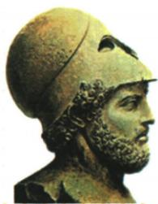

## 讲解

### 判据

原图注伯里克利、原问简要介绍，按人物身份时代作用作答；原全盛表三栏分别回答结果、促成行动和可迁移认识。

### 流程

1. 用图注确定伯里克利是古希腊政治家，图像头盔不代全部政策证据。

2. 原主政时点前5世纪中后期配雅典全盛及民主高峰，约前495–429为生卒不当全部主政起止。

3. 表现分政治经济文化，原因配改革、公民权利和学术教育文艺支持，说明这些改变如何给发展条件。

4. 启示归改革可推动发展、杰出人物有一定作用，不说任何改革必然成功或一人创造一切。

5. 雅典城邦盟主不同亚历山大跨洲帝国，制度高峰与版图大小不是同一判据。

6. 单元原题若问“无关”，真实有关的经济、民主、文化表现应排除，只有不符雅典城邦范围的帝国庞大满足无关要求，先读任务再判断知识。

## 例题

**完整原问：简要介绍图中人物。原答案：伯里克利是古希腊政治家，主政时期雅典达到全盛，奴隶制民主政治发展到高峰。**原图注约前495—前429。

**完整原全盛表。**表现：政治奴隶制民主到高峰；经济奴隶制经济高度繁荣；文化昌盛，重视教育。原因：一系列改革扩大公民权利，鼓励学术研究、重视教育、发展文艺。启示：改革是经济发展社会进步的重要推动力，杰出人物对社会发展有一定推动作用。原雅典经历几次改革建立民主，经济发达国势强，一度为200多个城邦盟主；高峰为前5世纪中后期伯里克利主政。

**完整解释。**扩大公民权利增强政治参与，教育学术文艺支持文化活动，政策与制度可以给经济社会活动提供条件，这些是原表改革推动发展的机制。繁荣为表现，改革为原因，作用的一般认识为启示，不能把“文化昌盛”直接重复当其唯一原因。原不说伯里克利一人从零发明全部民主；盟主是城邦联盟地位，不把雅典改成地跨三洲帝国。人物像与图注帮助定位，改革和历史作用要据原文字，不从头盔造型猜其全部政策。

**完整原问：雅典民主政治的实质是什么？原答案：奴隶制基础上的少数人的民主，外邦人、奴隶、妇女被排除在民主政治之外。**

**原运作表现与局限完整。**公职人员几乎从全体公民抽签产生，公民有参政机会；代表各地的10个主席团轮流主持日常事务，主席团及主席经抽签；公民大会为最高权力机构，有立法司法等职能；津贴保证贫穷公民参政。绝大多数人口中外邦、奴隶、妇女无政治权利；原还指出一些野心家借民主名义蛊惑争权，甚至使民主沦为暴民政治。

**完整解析。**抽签扩大合资格公民获得公职的机会，轮流主持避免日常事务固定由同一组包办，大会提供直接参与决定的场所，津贴减轻贫穷公民参加公务失去工作收入的负担。这解释参与怎样可能，不只背四名词。但资格门槛先排除大量居民，合资格范围内较多参与与居民总体少数民主可以同时成立。漫画用对话展示这一对照，属后人的教学形象表现，图中人物不是已经证实的古代一次会议实录。原“几乎”不改成任何公职全部抽签；扩大机会也不保证每位公民每次都参加或从不受政治操纵。

### 九上第二单元原题1及逐项完整解析

**单元原题1。**伯里克利主政雅典达到全盛，演说自豪称“雅典是希腊的学校”。与他自豪原因**无关**的是（）。

A.经济繁荣；B.帝国庞大；C.民主政治；D.文化昌盛。

**原答案B，完整原解。**雅典为希腊繁盛城邦，伯里克利时经济繁荣文化昌盛、民主至高峰，全盛；但雅典是城邦，不是帝国。

**逐项解析。**本题是找无关的一项，真实且有关的表现应排除。A不选，繁荣为原全盛经济表现，与自豪有关。B应选，原雅典虽为盟主仍是城邦，不能把亚历山大或罗马跨洲帝国放在伯里克利雅典身上，故与原自豪原因无关。C不选，公民参与扩大、民主高峰是其政治表现，有关。D不选，教育学术文艺与文化昌盛为原表现，有关。原学校为文化示范的比喻，不等整个雅典只是一个校园；题问无关而非问哪个知识正确，若只背民主政治便选C，就没回应题干。

## 易错

先前几次改革不能删成伯里克利从零创立；原因表现不是相同句子换标题，200多个保概数。

### 来源定位

- WE4-Q01：full.md（历史扫描分册251-300），L221–L234，伯里克利原像原问原答与原年龄；5dc2c8da-0729-4435-bf9a-d7b79d1838b6_origin.pdf，实际PDF第3页。
- WE4-S02：full.md（历史扫描分册251-300），L177–L191，雅典背景高峰民主表现积极评价；5dc2c8da-0729-4435-bf9a-d7b79d1838b6_origin.pdf，实际PDF第3页。
- WE4-S06：full.md（历史扫描分册251-300），L285–L287，伯里克利全盛表现原因启示完整表；5dc2c8da-0729-4435-bf9a-d7b79d1838b6_origin.pdf，实际PDF第4页。
- WE-U01：full.md（历史扫描分册251-300），L475–L491，伯里克利自豪无关原题四項原答完整原解；5dc2c8da-0729-4435-bf9a-d7b79d1838b6_origin.pdf，实际PDF第7页。
