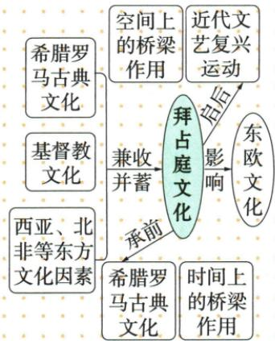

## 讲解

### 是什么

拜占庭文化吸收希腊罗马、基督教及西亚北非等因素，形成特色。保存古籍把较早知识传给后人，影响后来的文艺复兴，体现时间桥梁；跨地区吸收传播及影响东欧体现空间桥梁。政权命运和文化影响并不同步终止。

### 怎么来的

版图和交往涉及多个文化地区，提供接触传统的条件；兼收并蓄指吸收结合，不是将所有文化变成毫无差异。保存文本使早先知识在较晚时期仍可被阅读、学习，因而古典文化经拜占庭保存给文艺复兴以资源。文化交流也跨地域扩散，不只是年代表里的前后相接。区分两个方向可读原图：来源流入拜占庭文化，后者又影响后世及别处，而不是所有箭头都指向同一终点。文化成果能由文本、学习者和后续传播延续，所以1453灭亡不能直接证明古籍及影响全部消失。原图说明联系，不足量化各来源贡献或把文艺复兴完全归因于这一个因素。

### 什么时候能用

原图问桥梁，时间看传承先后，空间看地区联系；问独特文化看多因素结合，问政权灭亡用事件资料，不能以图替代战争原因。

## 例题

**原文化影响图与完整原文，未配独立文化题。**

原图将希腊罗马古典文化、基督教文化、西亚北非等东方因素汇入拜占庭文化，体现“兼收并蓄”；由古典文化的继承到后来文艺复兴，显示时间上的桥梁；不同地区文化汇合及向东欧影响，显示空间上的桥梁。原正文：帝国曾跨欧亚非，对上述传统因素兼收并蓄，形成独具特色文化；保存大量希腊罗马古籍，为西欧文艺复兴提供丰富精神营养。

**完整解释。**统治与交往覆盖不同文化地区，使接触和吸收有条件，但接触不等文化自动相同。吸收后形成特色说明存在选择和重新结合，不是原封不动只复制一方。保存古籍让后人能接触较早知识，跨时间传递构成“承前启后”；传播影响不同地区构成空间联系。后来文艺复兴利用古典知识，方向应是此前传统经保存传播影响后世，而不是文艺复兴先产生再创造古代拜占庭文化。政权1453年灭亡也不意味着保存下来的文本及影响当日全消失。

## 易错

文艺复兴在后，不能反向创造此前拜占庭文化；兼收并蓄不是只吸希腊或所有文化完全相同；跨三洲统治范围与文化影响范围不是同一地图。

### 来源定位

- WF10-S03：full.md（历史扫描分册251-300），L951–L960，阿拉伯十字军与奥斯曼灭亡以及三项帝国文化影响；5dc2c8da-0729-4435-bf9a-d7b79d1838b6_origin.pdf，实际PDF第14页。
- WF10-S04：full.md（历史扫描分册251-300），L916–L938，拜占庭文化来源时间空间桥梁原图；5dc2c8da-0729-4435-bf9a-d7b79d1838b6_origin.pdf，实际PDF第14页。
