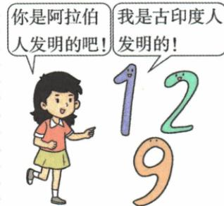

## 讲解

### 是什么

原书将广泛使用的阿拉伯数字创造归古代印度人民。印度起源、经阿拉伯传播及后世习称是不同环节，名字不能单独作为最初创造者的证据。

### 怎么来的

知识可以在一个地区形成，经另一地区接受整理传播而被更多社会使用，后者的传播贡献与前者起源能够同时成立。课程核查说明印度数制广泛经阿拉伯人传向西方，所以名称联系传播环节，并不抹去印度贡献。历史知识传播还可能有加工发展，既不能说传播者毫无贡献，也不能说后世名称中的地域必然创造每一项技术。原本课只给成就一句话，没有每种数符演变图及独立数学题，不能把现代完整写法反投射为某年同一人一次创造全部。

### 什么时候能用

遇起源按原印度，遇称谓解释传播环节；本课未提供具体发明者、日年和全部字形演变，不补作考试条件。

## 例题

**原成就说明，未配独立例题。**古代印度人民创造了世界广泛应用的“阿拉伯数字”。

**完整解释。**“阿拉伯”名称不直接等于印度起源被否定；起源、加工传播和后世称谓是不同环节。[印度国立开放学校的历史课程第2课](https://digital.nios.ac.in/content/213en/Lesson-02.pdf)说明印度数制经阿拉伯人广泛传播，西方因此称它阿拉伯数字。传播者使知识被更多地区认识和使用，可以有整理发展贡献；不能把接受传播写成对创造者的抹去，也不能把现在的全部字形当最早时期就完全相同。该来源用于补命名与传播机制，不充作本书原题。

### 阿拉伯帝国课原数字漫画与发明改造传播完整两答

**原漫画、原问：阿拉伯数字的发明者和改造、传播者分别是谁？**

原话“你是阿拉伯人发明的吧！”与“我是古印度人发明的！”。

**完整原答。**发明者古印度人；改造、传播者阿拉伯人。

**完整解析。**名称“阿拉伯”联系改造传播的重要作用，不能直接由名称猜最初创造者。原文化表说印度0到9计数法被改造，形成后来使用数字，这说明创造、后续发展、传播是三个可由不同群体承担的过程。保印度来源也保阿拉伯贡献，不在两者间只选一个而否定另一方。本漫画是原教学表达，不当某位古人当场说话的真实记录；0到9是数字符号的范围，不是所有数字只到9，也不等今天各种字形自最初起完全不变。本课没有数字演算原题，不另编运算当来源例题。

## 易错

阿拉伯数字名称与两河60进制不同系统，不因都是数字就互换文明；传播不等不加改变地复制。

### 来源定位

- WA3-S01：full.md（历史扫描分册201-250），L2724–L2741，印度地理发源遗址雅利安国家孔雀与成就原表及地域易混；5cc603b4-3c7a-4bc5-b935-8c05069de690_origin.pdf，实际PDF第49页。
- WA12-Q02：full.md（历史扫描分册251-300），L1337–L1356，阿拉伯数字原漫画发明者改造传播者设问原答；5dc2c8da-0729-4435-bf9a-d7b79d1838b6_origin.pdf，实际PDF第19；OCR排序在单元题后，原页仍本课页边页。
- WA12-S04：full.md（历史扫描分册251-300），L1300–L1302，数字代数医学文学代表成就原表；5dc2c8da-0729-4435-bf9a-d7b79d1838b6_origin.pdf，实际PDF第19页。
