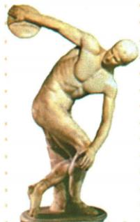

## 讲解

### 判据

原问图片历史信息，按原题名识运动对象，用动作身体表现到审美，再接原社会重视体育，不只报作品名。

### 流程

1. 图注掷铁饼者确定古希腊雕塑及运动对象，自动网球体操描述不采。

2. 原动态姿势与强健形象接投掷瞬间、协调健美和力量，说明作品怎么表现。

3. 体育题材运动审美接社会重视体育与运动之美，完整恢复原答。

4. 限作品表现及本课所学，不推每居民都运动、每雕像原件同年代；问地位不能换宙斯像七大奇迹。

**把三层证据接起来。**题名确认运动对象，身体姿态与力量协调说明作品怎样表现人体，原题对运动之美的解释再将艺术题材联系到社会重视体育的观念。作品名只是识别第一步，不能替代后两层历史信息；社会观念是由题材、表现和所学综合判断，也不能反推每个居民都参加同一种运动。原书把宙斯像与掷铁饼者列为不同作品，七大奇迹的称号应配前者，不能因都属于希腊雕塑就把地位称号互换。

## 例题

**完整原问：图片蕴含什么历史信息？完整原答案。**《掷铁饼者》展现强健男子在投掷过程中最有表现力的瞬间，表现人体和谐、健美与青春力量，体现古希腊社会重视体育运动、崇尚运动之美。

**原雕塑表其余内容。**奥林匹亚神庙宙斯像为古代世界七大奇迹之一，掷铁饼者为希腊雕塑杰作之一，原评价人物雕刻近乎完美。

**完整解析。**题名与动作先定位运动对象，不采用识图生成的网球体操猜测。身体姿态与动作张力说明艺术家表现运动瞬间，体格与协调形式接人体健美、力量的审美；社会意义由这种题材和原所学接重视体育与运动之美。雕像表现不直接提供每个居民实际运动习惯、运动员姓名或比赛名次；“近乎完美”是原艺术评价，不是所有作品尺寸完全一致的测量结论。原照片未给藏品版本和制作年代，不把它冒称古希腊原作实物的完整鉴定。

## 易错

形象表现不等一帧古代生活录像；原艺术评价不能当全国人口和制度统计。

### 来源定位

- WE6-Q01：full.md（历史扫描分册251-300），L408–L422，掷铁饼者原图原问完整原答；5dc2c8da-0729-4435-bf9a-d7b79d1838b6_origin.pdf，实际PDF第6页。
- WE6-S02：full.md（历史扫描分册251-300），L424–L430，希腊文学神话雕塑代表特点价值原表；5dc2c8da-0729-4435-bf9a-d7b79d1838b6_origin.pdf，实际PDF第6页。
