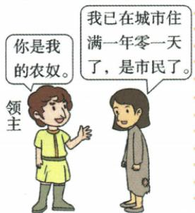

## 错法

看到“城市的空气使人自由”便认为任何城市居民都免一切税、都能选市长，自治意味着国王领主完全失去控制。容易错在把同一日常词“自由”扩成所有领域无限权利。

## 正解

原自由城市限定人身财产和禁止任意侵夺征税，自治进一步有选官及城市法庭，原自治包含自由但自由不一定自治。特许状来自国王或领主，且原城市仍不能完全摆脱控制，说明获部分承认的权利和独立主权不同。漫画的年零一天先改变农奴市民身份，不能代全部自治资格或现代入籍规则。

## 例题

**原漫画及原问：如何理解“城市的空气使人自由”？**

领主说“你是我的农奴”，对方说“我已在城市住满一年零一天了，是市民了”。

**完整原答。**这是中世纪形容城市的谚语，指城市相对自由和自治。兴起初期许多市民进入城市前是农奴，进入城市后在商业活动中逐步发展，获得更广泛的权利。农奴在城市住满一年零一天就能获得市民身份，享有自由，所以当时城市象征文明、自由和进步。

**依据与推理。**漫画冲突的对象是身份：领主想继续把人当农奴，居民以城市居住和市民资格反驳。这不是空气成分改变身体，而是城市制度提供摆脱原农奴身份的条件。结合原居民表，领主无权强迫取得市民身份的人重新成为农奴，故“自由”首先是人身和权利变化。结合自由城市表，财产权受到保护，领主不能非法夺财或任意征税；结合自治表，还可能有选举官员、设城市法庭等权利。但自由城市不一定取得这些自治权，原谚语概括相对自由，不能解释为每个城市立即完全自治、免一切税或脱离王权。原书以“一年零一天”概括其叙述的城市规则，本题按此判断；它不是今天通用的居住入籍规则，也不能单凭这张漫画证明中世纪所有地区、所有时期的细则都一致。

**原城市材料，未另配独立自治选择题。**10世纪起经济恢复发展，旧城复苏、新城产生，手工业商业中心发展更快。城市一般在领主领地，领主任意征税甚至要求居民像佃户履行义务；市民以金钱赎买、武力斗争争自治，法兰西琅城是原代表。自由城市保护市民人身财产，禁止领主非法夺财和任意征税；自治城市能选市长、市政官员、设城市法庭；从国王或领主取得特许状，但仍不能完全脱离控制，城市贵族一般支持国王。

**因果解析。**产品和交易增多，使手工和商业活动集中有益，经济恢复给城市复兴以条件。商人、工匠要经营、交换和维持生活，任意征税或佃户式负担会妨碍经营并使收益不稳定，所以争明确的权利。赎买与斗争是取得权利的手段，特许状是把获准权利固定下来的形式，不能把纸张本身当城市经济突然繁荣的全部原因。人身财产保障与管理城市事务分别是自由和自治两层；原书自治包含自由，但自由不一定包含自治。仍受国王领主控制说明取得部分权利和完全独立并非同一回事。

### 来源定位

- WF9-S01：full.md（历史扫描分册251-300），L775–L814，自由与自治原易混及城市复兴斗争权利局限；5dc2c8da-0729-4435-bf9a-d7b79d1838b6_origin.pdf，实际PDF第12页。
- WF9-Q01：full.md（历史扫描分册251-300），L781–L795，城市空气漫画原问与完整原答；5dc2c8da-0729-4435-bf9a-d7b79d1838b6_origin.pdf，实际PDF第12页。
