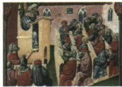

## 讲解

### 是什么

中世纪西欧大学在12世纪兴起。经济发展提供办学资源，城市专业人才需求扩大，古典著作及阿拉伯文化传播提供知识条件。大学自治主要有免赋税、教育自主、司法特权，课程有基础与专业两层，仍受教会影响而同时回应社会需要。

### 怎么来的

办学需支持教师学生和持续教学的资源，商品经济财富增长提供物质条件；城市管理服务越来越多，需要专业知识人员，旧教育数量规模专业不足构成新需求。传播的古典著作和阿拉伯文化扩大可学习内容，知识来源与经济需求共同构成背景。巴黎12世纪学校发展，13世纪教师行会得到教皇国王支持，显示自治权要获得承认，不能解释成大学与所有外部权力完全无关。免赋税减负，教育自主使大学可组织教学，司法特权涉及其受到的特定管辖；都是具体权利，不是任意行为不受规则。基础文法修辞逻辑等训练表达思考，算术几何天文音乐等提供知识准备，法学医学神学为专业学习。课程中神学及教会影响反映局限，专业训练回应城市需要反映进步，评价不必二选一。

### 什么时候能用

材料提资源和专业需求，回答兴起原因；提管理教师课程等权利，回答自治；提教学人才知识，回答作用。12世纪大学兴起与13世纪巴黎教师行会获保障不是同一时间事件。

## 例题

**完整原材料。**“随着贸易和工商业的不断发展，城市需要更多的管理和服务机构，并需要大量具备专业知识和业务素养的从业人员，原有的教育机构不论在数量、规模还是所设专业上都无法满足时代需要。”

**原问：根据材料并结合所学知识，简述中世纪大学兴起的原因。**

**完整原答。**1.快速发展的商品经济增加欧洲财富，也带来可以兴办教育的更多资源。2.随市民阶层兴起，原教会学校不能满足社会对文化教育的多层次需求。

**完整解析。**材料“贸易和工商业不断发展”既对应财富增长，也对应事务增多。财富提供办学所需资源，是供给条件；“更多管理和服务机构”“专业知识和业务素养”说明需要受过训练的人，是需求条件。“数量、规模、专业”三处不足指原教育不能满足新需求，不只是学校房屋小。把两端接起来：有增加的资源，又有不能由旧机构充分满足的人才需求，办学扩大和大学兴起因而有经济社会基础。原表还给古典著作传播、阿拉伯文化传入，说明可学习的知识来源增加，构成文化背景；不能用这一条替换原答案中的资源和需求。材料没有给某校创立者的完整决策或财政账目，不能推每所大学都只因商业、与教会毫无关系。

**原图、原问：中世纪大学的兴起有怎样的积极影响？**

**完整原答。**推动科学和文化知识传播；促进城市发展和繁荣；有利于培养人才。

**完整解析。**大学把教师、学生和课程组织起来，知识能通过持续教学传给更多学习者，故对应传播。基础课程包括文法、修辞、逻辑、算术、几何、天文、音乐，专业课程为法学、医学、神学，系统训练与专业学习给培养人才以依据。城市管理、服务对专业从业者有需求，教育培养的人可参与这些事务，大学因此与城市发展相互支持，而不是只靠一幅画直接证明全城经济数据。图注确认课堂主题，图本身不能证明所有大学都有同样自治程度。课程仍受基督教会影响，但也反映经济社会需要；两项评价可以同时成立，积极作用不等课程已摆脱一切宗教限制。

### 九上第三单元大学自治原题及四项完整解析

**单元原题1，原书标注2024江苏徐州中考，未另核真题身份。**博洛尼亚大学是以学生组成的社团为基础建立起来的，社团得到教会的支持，掌握了学校的管理权，负责任免教师、监督教学计划。对学生成绩的评估和学位的授予，则由资深教授掌控。这说明中世纪大学（）。

A.推广大众教育；B.都由教会建立；C.推动城市兴起；D.有一定自主权。

**原答案D，完整原解。**“掌握了学校的管理权”“由资深教授掌控”说明中世纪欧洲大学拥有一定自主权。

**逐项解析。**A不选，材料说明管理和教学由谁掌握，没有说明教育普及对象、参与比例，不能推出大众教育。B不选，本校由学生社团作基础，得到教会支持不等教会直接建立，更不能由一所推“都”。C不选，材料未讲城市出现先后及大学对城市的推动；本课大学与城市相互支持是总体知识，仍须回应题干管理权的直接证据。D正确，学生社团管理学校、任免教师监督计划，教授评估成绩授学位，事务在校内组织手中，支持一定自主权；教会支持仍在，不能升级为完全独立。先识材料说明的权利，再选能覆盖主要信息的结论。

## 易错

不要把免赋税特权扩为全体市民免税，把司法特权扩为可无视法律，把受教会影响说成没有任何新知识和社会作用。

### 来源定位

- WF9-S03：full.md（历史扫描分册251-300），L829–L843，大学背景兴起巴黎发展自治课程及评价完整表；5dc2c8da-0729-4435-bf9a-d7b79d1838b6_origin.pdf，实际PDF第13页。
- WF9-Q02：full.md（历史扫描分册251-300），L833–L847，中世纪大学课堂原图及积极影响原问原答；5dc2c8da-0729-4435-bf9a-d7b79d1838b6_origin.pdf，实际PDF第13页。
- WF9-Q03：full.md（历史扫描分册251-300），L861–L870，大学兴起原因原材料设问和两项原答；5dc2c8da-0729-4435-bf9a-d7b79d1838b6_origin.pdf，实际PDF第13页。
- WF-U01：full.md（历史扫描分册251-300），L974–L982，博洛尼亚大学原题四选项原答完整原解；5dc2c8da-0729-4435-bf9a-d7b79d1838b6_origin.pdf，实际PDF第15；答案L1000–1002同页页。
